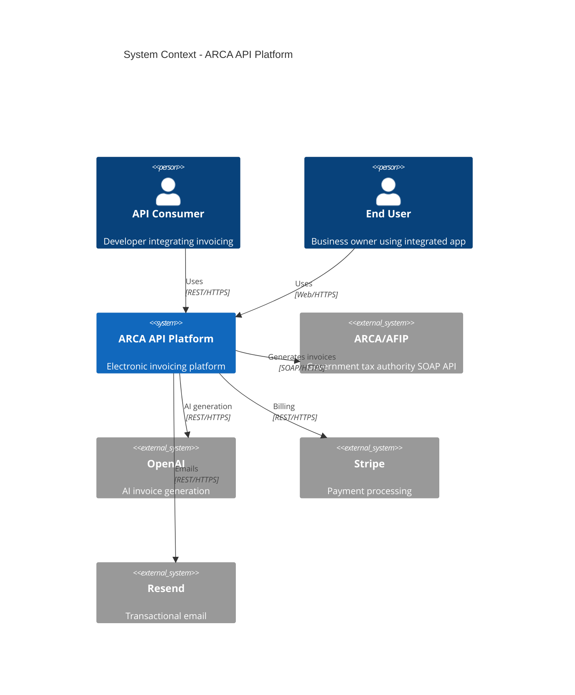

# Task: Write Core Architecture Documents

## Description

Create the foundational architecture documentation for ARCA API platform, including system overview, C4 Level 1 diagram (System Context), and the first 3 Architecture Decision Records (ADRs). These documents establish the architectural vision and key technical decisions.

This task uses the **template-driven approach** - leverage the comprehensive examples and templates from the PRD rather than writing from scratch. The PRD contains production-ready templates for all these documents.

**Critical for:** Google Engineering review, team alignment, parallel development enablement.

## Acceptance Criteria

- [ ] `docs/architecture/00-overview.md` completed with ARCA API system goals and quality attributes
- [ ] `docs/architecture/01-system-context.md` completed with C4 Level 1 Mermaid diagram
- [ ] `docs/architecture/adrs/001-database-postgresql.md` completed (adapt PRD example)
- [ ] `docs/architecture/adrs/002-authentication.md` completed (JWT + API keys)
- [ ] `docs/architecture/adrs/003-deployment-platform.md` completed (AWS ECS vs Railway)
- [ ] All Mermaid diagrams render correctly in GitHub
- [ ] System context diagram shows all 8 services and external dependencies (ARCA API, OpenAI, Stripe, etc.)
- [ ] Quality attributes specified (99.95% uptime, P95 latency <200ms, cost <$0.02/invoice)
- [ ] Each ADR follows standard format: Context, Decision, Rationale, Alternatives, Consequences

## Technical Details

### Document 1: Architecture Overview (`00-overview.md`)

**Source Template**: PRD lines 925-963 (System Context template)

**Content to Include:**
- Executive summary of ARCA API platform
- System goals: Developer-first invoicing API, AI-powered, SOAP-to-REST wrapper
- Quality attributes:
  - **Availability**: 99.95% uptime (HA multi-AZ deployment)
  - **Performance**: P95 latency <200ms (excluding ARCA latency)
  - **Scalability**: Support 100K invoices/day (Year 1 target: 300K/month)
  - **Security**: ISO 27001 compliant, GDPR compliant, encrypted at rest/transit
  - **Cost**: <$0.02 per invoice processed
- Technology philosophy: Spec-driven, API-first, cloud-native
- Non-functional requirements summary

**Estimated Time**: 1.5 hours

### Document 2: System Context (`01-system-context.md`)

**Source Template**: PRD lines 934-952 (C4 Context diagram in Mermaid)

**Mermaid Diagram to Create:**

**Narrative to Include:**
- Description of each external actor
- Interaction patterns
- External dependencies and their SLAs
- Data flow at system boundary

**Estimated Time**: 2 hours (1 hour diagram customization, 1 hour narrative)

### Document 3: ADR-001 Database Selection

**Source Template**: PRD lines 1559-1727 (complete PostgreSQL ADR example)

**Approach**: Copy PRD template, customize with ARCA API specifics

**Sections to Complete:**
- **Context**: Invoice data storage requirements (transactional, JSONB, full-text search)
- **Decision**: PostgreSQL 15 on AWS RDS or Supabase
- **Rationale**: ACID guarantees, JSONB support, built-in full-text search, cost-effective
- **Alternatives Considered**: MongoDB (no ACID in sharded), MySQL (weaker JSON), DynamoDB (no joins)
- **Consequences**: Vertical scaling limits, eventual need for read replicas, careful index management
- **Cost Estimation**: $50-60/month Year 1, $200/month Year 2
- **Review Triggers**: P95 latency >500ms, cost >20% infrastructure budget, data >500GB

**Estimated Time**: 1.5 hours (mostly adapting existing template)

### Document 4: ADR-002 Authentication Strategy

**New ADR** (no direct PRD template, but follows standard format)

**Sections to Include:**
- **Context**: Need to authenticate API consumers and manage ARCA certificates securely
- **Decision**:
  - API consumers: Bearer token (API keys) with bcrypt hashing
  - ARCA integration: Certificate-based with auto-renewal (cached tokens, 11-hour expiry)
  - Rate limiting per tier (100 req/min free, 1000 req/min pro)
- **Rationale**: API keys simple for developers, certificate auto-renewal reduces friction
- **Alternatives**: OAuth 2.0 (overkill), Basic Auth (insecure), JWT (stateless but complex rotation)
- **Consequences**: Need Redis for token caching, certificate encryption at rest (AES-256)
- **Security Considerations**: Never expose certificates in logs, API key prefix visible for debugging

**Estimated Time**: 2 hours

### Document 5: ADR-003 Deployment Platform

**New ADR**

**Sections to Include:**
- **Context**: Need scalable, cost-effective deployment for Node.js/Python services
- **Decision**: Start with Railway (speed), migrate to AWS ECS Fargate if needed (scale)
- **Rationale**: Railway faster for MVP ($5-20/month), ECS better at scale (auto-scaling, HA)
- **Alternatives**: Heroku (expensive), GCP Cloud Run (vendor lock-in), bare VPS (operational overhead)
- **Consequences**: Railway limits (eventual migration needed), but enables fast iteration
- **Migration Plan**: Design for Docker from day one (portable across platforms)
- **Cost**: Railway $20/month (MVP), AWS ECS $100-200/month (scale)

**Estimated Time**: 1.5 hours

### Implementation Approach

1. **Start with ADR-001** (template exists, easiest)
2. **Write overview** (synthesize from product PRD + epic goals)
3. **Create system context diagram** (customize PRD Mermaid example)
4. **Write ADR-002 and ADR-003** (new content, follow format)
5. **Test Mermaid rendering** (use https://mermaid.live/ or GitHub preview)
6. **Cross-reference documents** (link overview → context, context → ADRs)

### Files Affected

- Create/Update: `docs/architecture/00-overview.md`
- Create/Update: `docs/architecture/01-system-context.md`
- Create: `docs/architecture/adrs/001-database-postgresql.md`
- Create: `docs/architecture/adrs/002-authentication.md`
- Create: `docs/architecture/adrs/003-deployment-platform.md`
- Update: `docs/architecture/README.md` (link to new docs)
- Update: `docs/architecture/adrs/README.md` (index of ADRs)

## Dependencies

**Depends On:**
- Task 001 (needs directory structure)

**Blocks:**
- Task 003 (OpenAPI spec references architecture decisions)
- Task 004 (services depend on architecture foundation)
- Task 005 (flows illustrate architecture)
- Google Engineering Review (needs complete architecture to review)

**External:**
- Product PRD (source of requirements) ✅ Available
- Technology stack decisions (may need to decide Node.js vs alternatives) ⏳ Pending

## Effort Estimate

- **Size**: M
- **Hours**: 8-10 hours over 2 days
- **Parallel**: false (blocks multiple downstream tasks)
- **Breakdown**:
  - Overview: 1.5 hours
  - System context diagram + narrative: 2 hours
  - ADR-001 (database): 1.5 hours (template adaptation)
  - ADR-002 (authentication): 2 hours
  - ADR-003 (deployment): 1.5 hours
  - Review, cross-linking, Mermaid testing: 1 hour

## Definition of Done

- [ ] All 5 documents completed and committed to Git
- [ ] System context Mermaid diagram renders in GitHub (verified)
- [ ] All 3 ADRs follow standard format (Context, Decision, Rationale, Alternatives, Consequences)
- [ ] Quality attributes quantified in overview (uptime %, latency ms, cost $)
- [ ] External dependencies documented (ARCA, OpenAI, Stripe, Resend)
- [ ] ADRs reference each other where relevant (e.g., auth ADR mentions DB for key storage)
- [ ] Documents linked from `docs/architecture/README.md`
- [ ] Zero broken internal links (verified with markdown link checker)
- [ ] Peer review completed (at least 1 engineer reviews architecture docs)
- [ ] Documents meet "Google Engineering standards" checklist (from PRD Appendix C)

## Notes

**Why this is critical:**
- Establishes architectural foundation for all development
- Enables Google Engineering review (gating milestone)
- Documents key decisions before implementation (prevents rework)
- Provides mental model for new engineers (onboarding accelerator)

**Template Leverage:**
- PRD contains 900+ lines of architecture examples - copy don't rewrite!
- ADR-001 template is production-ready, just customize for ARCA API

**Success Indicator:**
- Any engineer can read these 5 docs and explain ARCA API architecture in <30 minutes

**References:**
- PRD Section: "Architecture Documentation Template (C4 Model)" (lines 924-1048)
- PRD Appendix A: "Example Architecture Decision Record" (lines 1559-1727)
- PRD Appendix B: "Mermaid Diagram Examples" (lines 1731-1892)
