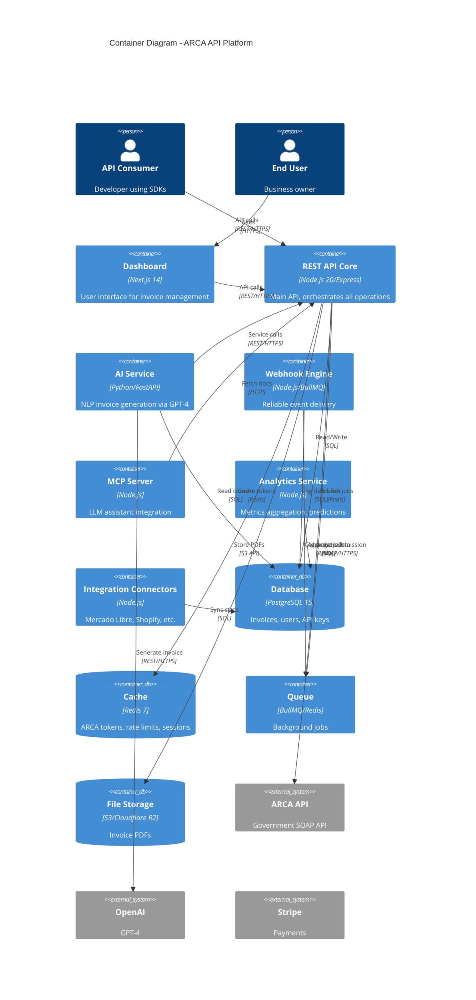

# Task: Document Service Architecture (C4 Level 2)

## Description

Create detailed service architecture documentation including C4 Level 2 (Container) diagram showing all 8 ARCA API services, their interactions, and data stores. Also document service-to-service contracts for AI service and Webhook service.

This builds on the System Context (C4 Level 1) from Task 002 by zooming into the ARCA API system boundary and showing internal architecture.

**Critical for:** Backend team understanding service boundaries, DevOps planning infrastructure, understanding scaling strategies.

## Acceptance Criteria

- [ ] `docs/architecture/02-services.md` completed with C4 Level 2 Container diagram
- [ ] All 8 services documented: REST API Core, Dashboard, AI Service, MCP Server, Webhook Engine, Analytics, Integration Connectors, ARCA SOAP Client
- [ ] Data stores documented: PostgreSQL (primary), Redis (cache/sessions), S3/R2 (PDFs)
- [ ] Service interactions shown with protocols (REST/HTTPS, SOAP/HTTPS, Redis protocol)
- [ ] `docs/specifications/services/ai-service-contract.md` created (invoice generation interface)
- [ ] `docs/specifications/services/webhook-service-contract.md` created (event delivery interface)
- [ ] Mermaid diagram renders correctly in GitHub
- [ ] Each service has: responsibility, technology, scaling strategy, data access pattern

## Technical Details

### The 8 Services to Document

From product PRD and epic analysis:

1. **REST API Core** (Node.js/Express)
   - Responsibility: Handle all client requests, orchestrate business logic
   - Technology: Node.js 20 + Express/Fastify + TypeScript
   - Scaling: Horizontal (auto-scale on CPU >70%)
   - Data: Read/write PostgreSQL, cache in Redis, publish to queue

2. **Dashboard** (Next.js)
   - Responsibility: User interface for invoice management
   - Technology: Next.js 14 + TypeScript + Tailwind CSS
   - Scaling: Static site (CDN), API calls to REST API Core
   - Data: No direct DB access (via API only)

3. **AI Service** (Python/FastAPI)
   - Responsibility: Natural language → structured invoice generation
   - Technology: Python + FastAPI + OpenAI GPT-4
   - Scaling: Horizontal (queue-based, async processing)
   - Data: Read-only PostgreSQL (user context), calls OpenAI API

4. **Webhook Engine** (Node.js)
   - Responsibility: Reliable webhook delivery with retries
   - Technology: Node.js + BullMQ
   - Scaling: Horizontal (queue consumers)
   - Data: Read/write PostgreSQL (delivery logs), consume Redis queue

5. **MCP Server** (Node.js)
   - Responsibility: Provide API docs to LLM assistants (Claude Code, Cursor)
   - Technology: Node.js + Anthropic MCP protocol
   - Scaling: Vertical (low volume)
   - Data: Read-only docs, OpenAPI spec, examples

6. **Analytics Service** (Node.js or Python)
   - Responsibility: Aggregate invoice metrics, revenue predictions
   - Technology: Node.js/Python + background jobs
   - Scaling: Vertical (batch processing)
   - Data: Read PostgreSQL, write to daily_stats table

7. **Integration Connectors** (Node.js)
   - Responsibility: Sync with Mercado Libre, Shopify, Tienda Nube
   - Technology: Node.js + platform-specific SDKs
   - Scaling: Horizontal (per-integration workers)
   - Data: Read/write PostgreSQL (integration state)

8. **ARCA SOAP Client** (Node.js library)
   - Responsibility: SOAP/XML communication with ARCA API
   - Technology: Node.js + node-soap library
   - Scaling: Embedded in REST API Core (not separate service)
   - Data: Redis (token caching), PostgreSQL (certificate storage)

### C4 Level 2 Container Diagram (Mermaid)

**Source Template**: PRD lines 965-997 (Container diagram example)



### Service Contract Documents

#### AI Service Contract (`ai-service-contract.md`)

**Interface:**
```
POST /internal/ai/generate-invoice
Authorization: Internal-Service-Token

Request:
{
  "description": "Factura para Juan Pérez por 3 horas de consultoría a $5000/hora",
  "user_context": {
    "user_id": "uuid",
    "previous_invoices": [...],
    "preferences": {...}
  }
}

Response (200):
{
  "invoice": {
    "tipo_comprobante": 1,
    "cliente": {...},
    "items": [...],
    "tributos": [...],
    "confidence": 0.95
  },
  "ai_metadata": {
    "model": "gpt-4",
    "tokens_used": 450,
    "processing_time_ms": 1200
  }
}

Error (400):
{
  "type": "https://arcaapi.com/errors/ai-generation-failed",
  "title": "AI Generation Failed",
  "status": 400,
  "detail": "Description too vague, need more details"
}
```

**Behavior:**
- Timeout: 5 seconds (AI calls can be slow)
- Retry: No retries (REST API Core handles retries)
- Fallback: If AI service down, REST API returns 500 suggesting "use advanced mode"

#### Webhook Service Contract (`webhook-service-contract.md`)

**Interface:**
```
Webhook Engine consumes jobs from Redis queue:

Job Format:
{
  "event": "invoice.created" | "invoice.approved" | "invoice.failed" | "compliance.alert",
  "webhook_url": "https://customer.com/webhooks/arca",
  "payload": {...},
  "signature_secret": "webhook_secret_xyz",
  "retry_count": 0,
  "max_retries": 3
}

Delivery:
POST {webhook_url}
X-ARCA-Signature: HMAC-SHA256(payload, secret)
X-ARCA-Event: invoice.created
Content-Type: application/json

{payload}

Response Handling:
- 2xx: Success, mark delivered
- 4xx: Client error, mark failed (no retry)
- 5xx or timeout: Retry with exponential backoff (1min, 5min, 15min)
- After 3 failures: Mark as failed, alert user
```

**Behavior:**
- Retry strategy: Exponential backoff (1min, 5min, 15min)
- Signature: HMAC-SHA256 for webhook verification
- Logging: All deliveries logged to PostgreSQL (webhook_deliveries table)

### Implementation Approach

1. **Create C4 Level 2 Mermaid diagram** (customize from PRD template)
2. **Write narrative for `02-services.md`**:
   - Overview of service architecture
   - Each service section (responsibility, tech, scaling, data)
   - Communication patterns (sync REST, async queue)
   - Data flow between services
3. **Document AI service contract** (request/response schemas, error handling, timeouts)
4. **Document Webhook service contract** (queue job format, delivery protocol, retry logic)
5. **Test Mermaid rendering** (GitHub preview or mermaid.live)
6. **Link from architecture README**

### Files Affected

- Create: `docs/architecture/02-services.md` (C4 Level 2 + narrative)
- Create: `docs/specifications/services/ai-service-contract.md`
- Create: `docs/specifications/services/webhook-service-contract.md`
- Update: `docs/architecture/README.md` (link to services doc)
- Update: `docs/specifications/services/README.md` (index service contracts)

## Dependencies

**Depends On:**
- Task 001 (needs directory structure)
- Task 002 (builds on System Context from C4 Level 1)

**Blocks:**
- Backend implementation (needs service boundaries)
- DevOps infrastructure setup (needs to know what services to deploy)

**Can Run in Parallel With:**
- Task 003 (OpenAPI spec) - different files
- Task 005 (flows) - different files
- Task 006 (dev guides) - different files

## Effort Estimate

- **Size**: M
- **Hours**: 10-12 hours over 1.5 days
- **Parallel**: true (can work alongside Tasks 3, 5, 6)
- **Breakdown**:
  - C4 Level 2 Mermaid diagram: 2 hours
  - Services narrative (8 services × 30min each): 4 hours
  - AI service contract doc: 2 hours
  - Webhook service contract doc: 2 hours
  - Testing, cross-linking, review: 1 hour

## Definition of Done

- [ ] `02-services.md` completed with C4 Container diagram showing all 8 services
- [ ] Mermaid diagram renders in GitHub (verified)
- [ ] Each service documented with: responsibility, technology, scaling strategy, data access
- [ ] AI service contract documented (request/response schemas, timeouts, error handling)
- [ ] Webhook service contract documented (queue format, delivery protocol, retry logic)
- [ ] Communication patterns explained (REST for sync, BullMQ/Redis for async)
- [ ] Data stores documented (PostgreSQL, Redis, S3/R2)
- [ ] Service dependencies clear (e.g., Webhook Engine depends on Queue)
- [ ] Documents linked from architecture README
- [ ] Peer review completed (backend team validates service boundaries)

## Notes

**Why this is critical:**
- Defines service boundaries (prevents monolith sprawl)
- Enables backend team to split work across services
- Informs infrastructure decisions (which services need scaling, HA, etc.)
- Documents internal APIs (AI and Webhook contracts)

**Parallelization Opportunity:**
- Can work on this while someone else works on OpenAPI spec (Task 003)
- Different files, no conflicts

**Template Leverage:**
- PRD has complete C4 Container diagram example - customize don't create
- Service descriptions can reference product PRD feature list

**Success Indicator:**
- Backend engineer can look at diagram and know which service owns which feature
- DevOps can estimate infrastructure costs (8 services, 3 data stores)

**References:**
- PRD Section: "Container Diagram" (lines 965-1008)
- Product PRD: Phase 1-3 features (defines what each service does)
- C4 Model: https://c4model.com/
