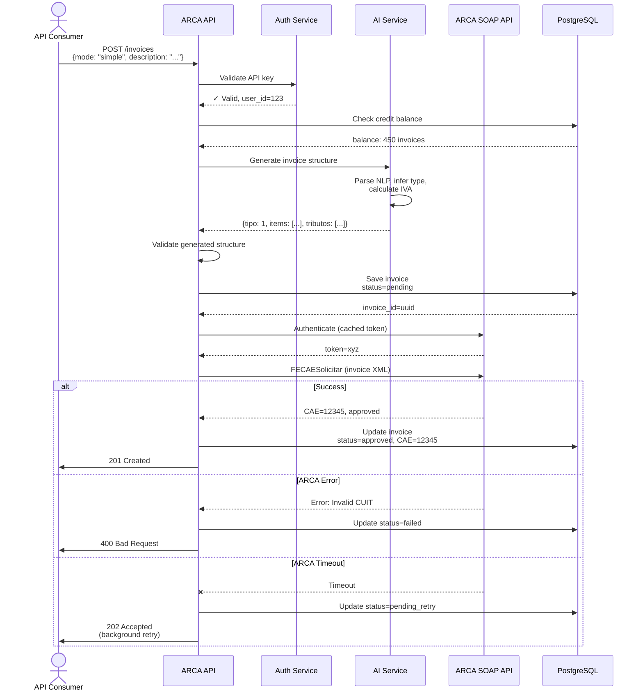
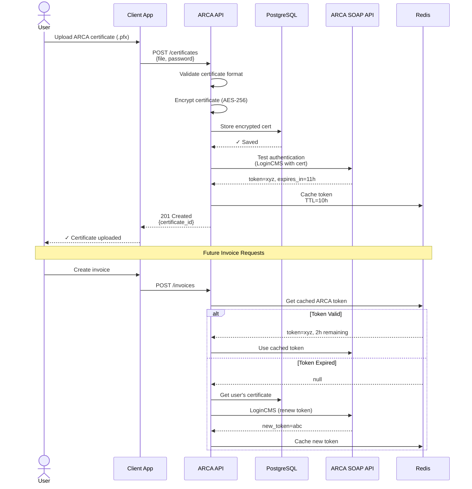
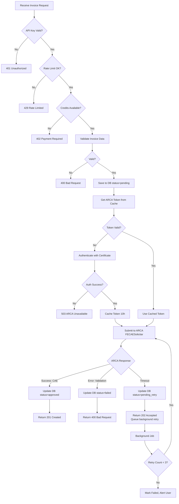
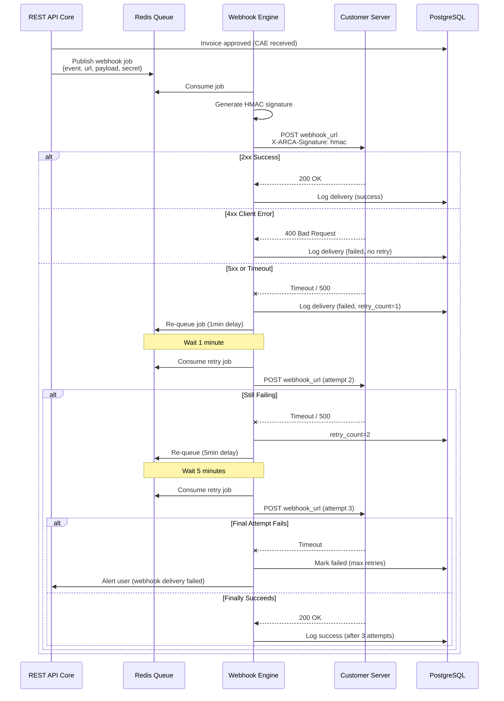

# Task: Create Critical Flow Diagrams

## Description

Document the 5 most critical user and system flows using Mermaid sequence and flowchart diagrams. These visual flows illustrate how ARCA API works end-to-end, complementing the architecture documentation.

Leverage the **comprehensive flow examples** from the PRD (lines 1245-1406) - they contain production-ready Mermaid diagrams for authentication, invoice creation, error handling, and data lifecycle. Our job is to customize these for ARCA API specifics.

**Critical for:** Team onboarding, understanding error scenarios, debugging production issues, external stakeholder communication.

## Acceptance Criteria

- [ ] `docs/flows/user-flows.md` created with 3 user flow diagrams
- [ ] `docs/flows/system-flows.md` created with 2 system flow diagrams
- [ ] All 5 flows documented with Mermaid diagrams + step-by-step narrative
- [ ] Flows cover: invoice creation (simple mode), invoice creation (advanced mode), authentication, ARCA integration, error handling
- [ ] All Mermaid diagrams render correctly in GitHub
- [ ] Each flow includes: overview, actors, preconditions, diagram, step-by-step explanation, error scenarios, performance targets
- [ ] Error paths documented (what happens when ARCA API down, validation fails, timeout, etc.)

## Technical Details

### Flow 1: User Flow - Invoice Creation (Simple Mode)

**Source Template**: PRD lines 1245-1406 (complete sequence diagram example)

**Mermaid Sequence Diagram:**

**Narrative Sections:**
- Overview: User creates invoice with natural language
- Actors: API Consumer, ARCA API services, OpenAI, ARCA/AFIP
- Preconditions: Valid API key, uploaded certificate, credit balance
- Step-by-step (9 steps from auth → AI generation → ARCA submission)
- Error handling table (401, 429, 400, 500, 503)
- Performance targets: P95 <4s total latency

**Estimated Time**: 2 hours (diagram 1h, narrative 1h)

### Flow 2: User Flow - Invoice Creation (Advanced Mode)

**Simplified version of Flow 1** - skip AI generation step, direct validation

**Key Differences:**
- No AI service call (user provides structured data)
- Faster (1-2s vs 2-4s latency)
- More control (user specifies exact IVA rates, tributos)

**Estimated Time**: 1 hour (reuse Flow 1 diagram, remove AI step)

### Flow 3: User Flow - Certificate Upload & Authentication Setup

**Mermaid Sequence Diagram:**

**Narrative Focus:**
- One-time setup vs every-request authentication
- Certificate encryption and storage
- Token caching strategy (11-hour expiry, 10-hour TTL)
- Auto-renewal when token expires

**Estimated Time**: 2 hours

### Flow 4: System Flow - ARCA Integration & Error Handling

**Mermaid Flowchart:**

**Narrative Focus:**
- All error scenarios and HTTP status codes
- Retry logic for transient failures
- Background job processing for timeouts
- Circuit breaker pattern (if ARCA down >3 times, stop retrying)

**Estimated Time**: 2 hours

### Flow 5: System Flow - Webhook Delivery with Retries

**Mermaid Sequence Diagram:**

**Narrative Focus:**
- Reliable delivery pattern (at-least-once)
- Exponential backoff (1min, 5min, 15min)
- HMAC signature for security
- Distinguishing client errors (no retry) vs server errors (retry)

**Estimated Time**: 2 hours

### Flow Organization

**`docs/flows/user-flows.md`**:
- Flow 1: Invoice Creation (Simple Mode)
- Flow 2: Invoice Creation (Advanced Mode)
- Flow 3: Certificate Upload & Authentication Setup

**`docs/flows/system-flows.md`**:
- Flow 4: ARCA Integration & Error Handling
- Flow 5: Webhook Delivery with Retries

### Implementation Approach

1. **Copy PRD flow template** (lines 1245-1406) as starting point
2. **Customize Flow 1** (invoice creation simple mode) - most complex
3. **Derive Flow 2** from Flow 1 (remove AI step)
4. **Create Flow 3** (authentication) - new diagram
5. **Create Flow 4** (error handling flowchart) - new diagram
6. **Create Flow 5** (webhook delivery) - new diagram
7. **Write narratives** for each (overview, actors, steps, errors, performance)
8. **Test all Mermaid diagrams** (mermaid.live or GitHub preview)
9. **Cross-reference architecture docs** (link flows to services from Task 004)

### Files Affected

- Create: `docs/flows/user-flows.md` (Flows 1-3)
- Create: `docs/flows/system-flows.md` (Flows 4-5)
- Update: `docs/flows/README.md` (index of flows)

## Dependencies

**Depends On:**
- Task 001 (needs `flows/` directory)
- Task 002 (flows illustrate architecture from Task 002)

**Blocks:**
- None (doesn't block other tasks)

**Can Run in Parallel With:**
- Task 003 (OpenAPI spec)
- Task 004 (service architecture)
- Task 006 (dev guides)

## Effort Estimate

- **Size**: S-M
- **Hours**: 8-10 hours over 1 day
- **Parallel**: true (different files from other tasks)
- **Breakdown**:
  - Flow 1 (invoice simple): 2 hours
  - Flow 2 (invoice advanced): 1 hour
  - Flow 3 (authentication): 2 hours
  - Flow 4 (error handling): 2 hours
  - Flow 5 (webhooks): 2 hours
  - Testing diagrams, cross-linking: 1 hour

## Definition of Done

- [ ] 5 flows completed with Mermaid diagrams + narratives
- [ ] All diagrams render in GitHub (verified)
- [ ] Each flow has: overview, actors, preconditions, diagram, step-by-step, error scenarios
- [ ] Error paths documented (timeouts, validation failures, ARCA down)
- [ ] Performance targets specified (latency expectations per flow)
- [ ] Flows cross-reference architecture docs (link to services)
- [ ] Documents linked from flows README
- [ ] Peer review completed (team verifies flows match expected behavior)

## Notes

**Why this is critical:**
- **Onboarding**: New engineers understand system behavior visually
- **Debugging**: Production issues traced using flow diagrams
- **Stakeholders**: Non-technical stakeholders understand system at high level
- **Error handling**: Clear documentation of all failure scenarios

**Template Leverage:**
- PRD has 160+ line flow example with complete diagram and narrative - don't start from scratch!
- Error handling table template provided

**Parallelization Opportunity:**
- Can work on this while someone else works on OpenAPI spec or service architecture
- No file conflicts

**Success Indicator:**
- Support engineer can debug invoice creation issue using flow diagrams
- New engineer can explain how authentication works after reading Flow 3

**Mermaid Testing:**
- Use https://mermaid.live/ to test diagrams before committing
- GitHub native rendering means diagrams appear in README previews

**References:**
- PRD Section: "Flow Documentation Template" (lines 1244-1406)
- Mermaid Sequence Diagrams: https://mermaid.js.org/syntax/sequenceDiagram.html
- Mermaid Flowcharts: https://mermaid.js.org/syntax/flowchart.html
