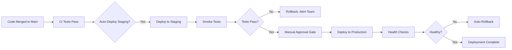

# Task: Create Operational Documentation

## Description

Create essential operational documentation for deploying, monitoring, and troubleshooting ARCA API in production. Focus on deployment guide, monitoring strategy, and the first 2 critical runbooks.

**Critical for:** Production readiness, incident response, DevOps enablement, on-call engineers.

## Acceptance Criteria

- [ ] `docs/operations/deployment-guide.md` completed with staging and production deployment steps
- [ ] `docs/operations/monitoring.md` completed with metrics, logging, and alerting strategy
- [ ] `docs/operations/runbooks/arca-api-down.md` completed (what to do when ARCA unavailable)
- [ ] `docs/operations/runbooks/database-issues.md` completed (connection pool, slow queries)
- [ ] Deployment guide tested in staging environment (actual deployment works)
- [ ] Monitoring strategy includes: RED metrics (Rate, Errors, Duration), logging standards, alert definitions
- [ ] Runbooks include: symptoms, diagnosis steps, resolution, verification, escalation

## Technical Details

### Document 1: Deployment Guide (`deployment-guide.md`)

**Goal**: Enable deployment to staging and production with zero ambiguity

**Sections to Include:**

#### Prerequisites
- AWS CLI configured (or Railway CLI)
- Docker installed
- Access to GitHub repository (for CI/CD triggers)
- Environment variables documented

#### Environment Setup

**Staging:**
```bash
# Railway deployment (recommended for MVP)
railway login
railway link  # Select staging project
railway up  # Deploy

# Or AWS ECS (if using AWS)
aws ecs update-service \
  --cluster arca-staging \
  --service arca-api \
  --force-new-deployment
```

**Production:**
```bash
# Production deployment (requires approval)
git tag v1.0.0
git push origin v1.0.0

# Triggers GitHub Actions workflow
# Manual approval required in Actions UI
```

#### Database Migrations

**CRITICAL: Always run migrations before deploying code**

```bash
# Staging
pnpm db:migrate --env staging

# Production (requires backup first)
pnpm db:backup --env production
pnpm db:migrate --env production

# Rollback if migration fails
pnpm db:migrate:rollback --env production
```

#### Deployment Workflow



#### Health Checks

**Endpoints to verify:**
```bash
# API health
curl https://api.arcaapi.com/health
# Expected: {"status":"ok","database":"connected","redis":"connected"}

# ARCA connection test
curl https://api.arcaapi.com/health/arca
# Expected: {"status":"ok","arca_reachable":true}
```

#### Rollback Procedure

```bash
# Immediate rollback (reverts to previous version)
railway rollback  # Railway

# Or AWS ECS
aws ecs update-service \
  --cluster arca-production \
  --service arca-api \
  --task-definition arca-api:PREVIOUS_VERSION
```

**Estimated Time**: 3 hours

### Document 2: Monitoring Strategy (`monitoring.md`)

**Goal**: Observability strategy ensuring issues detected before users complain

#### RED Metrics (Rate, Errors, Duration)

**Metrics to Collect:**

**Rate (Throughput):**
- `http_requests_total` (counter by endpoint, method, status)
- `invoices_created_total` (counter by status: approved, failed, pending)
- `arca_api_calls_total` (counter by operation: authenticate, create_invoice)

**Errors (Error Rate):**
- `http_requests_failed_total` (counter by endpoint, error_type)
- `arca_api_errors_total` (counter by error_code)
- `database_errors_total` (counter by query_type)

**Duration (Latency):**
- `http_request_duration_seconds` (histogram by endpoint)
- `arca_api_duration_seconds` (histogram by operation)
- `database_query_duration_seconds` (histogram by query_type)

**Implementation:**
```typescript
// Example with Prometheus client
import { Counter, Histogram, register } from 'prom-client';

const httpRequests = new Counter({
  name: 'http_requests_total',
  help: 'Total HTTP requests',
  labelNames: ['method', 'path', 'status']
});

const httpDuration = new Histogram({
  name: 'http_request_duration_seconds',
  help: 'HTTP request duration',
  labelNames: ['method', 'path'],
  buckets: [0.1, 0.3, 0.5, 1, 2, 5]  // P50, P90, P95, P99
});
```

**Metrics Endpoint:**
```bash
# Prometheus scrape endpoint
curl https://api.arcaapi.com/metrics
```

#### Logging Standards

**Structured JSON Logs:**
```json
{
  "timestamp": "2025-10-15T03:50:56Z",
  "level": "info",
  "service": "arca-api",
  "trace_id": "abc123",
  "user_id": "uuid",
  "message": "Invoice created successfully",
  "invoice_id": "uuid",
  "cae": "12345678901234",
  "duration_ms": 1234
}
```

**Log Levels:**
- `error`: Production issues requiring immediate attention
- `warn`: Potential issues (e.g., ARCA slow response, retry triggered)
- `info`: Business events (invoice created, user registered)
- `debug`: Detailed traces (only in staging/development)

**Log Aggregation:**
- Tool: Better Stack (formerly Logtail) or Datadog
- Retention: 30 days production, 7 days staging
- Search: Full-text search on all fields

#### Distributed Tracing

**OpenTelemetry Setup:**
- Trace ID propagated across all services
- Spans: HTTP request, database query, ARCA API call, AI service call
- Sampling: 100% errors, 10% success (reduce volume)

**Trace Example:**
```
Trace ID: abc123
├─ Span: POST /invoices (2.4s)
   ├─ Span: Validate API key (50ms)
   ├─ Span: AI service call (1.2s)
   ├─ Span: Database INSERT invoice (40ms)
   ├─ Span: ARCA authenticate (100ms)
   └─ Span: ARCA FECAESolicitar (1s)
```

#### Alerting Rules

**Critical Alerts (PagerDuty):**
- Error rate >5% (1min window) → Page on-call
- P95 latency >5s (5min window) → Page on-call
- ARCA API down (3 consecutive failures) → Page on-call
- Database connection pool exhausted → Page on-call

**Warning Alerts (Slack):**
- Error rate >2% (5min window) → Slack #alerts
- P95 latency >3s (10min window) → Slack #alerts
- ARCA API slow (>3s avg) → Slack #alerts
- Disk space >80% → Slack #alerts

**SLO/SLI Definitions:**
- **Availability**: 99.95% uptime (21.6 min downtime/month)
- **Latency**: P95 <200ms (excluding ARCA latency)
- **Error Rate**: <0.1% (999 success per 1000 requests)

**Estimated Time**: 2.5 hours

### Document 3: Runbook - ARCA API Down (`arca-api-down.md`)

**Goal**: Step-by-step incident response when ARCA government API is unavailable

**Template Structure:**

#### Symptoms
- Alerts: "ARCA API down (3 consecutive failures)"
- User reports: Invoices failing with "503 Service Unavailable"
- Logs show: "ARCA timeout" or "ARCA connection refused"

#### Diagnosis
1. **Verify ARCA status:**
   ```bash
   curl https://wswhomo.afip.gov.ar/wsfev1/service.asmx
   # If timeout or 500 error, ARCA is down
   ```

2. **Check ARCA status page:**
   - https://www.afip.gob.ar/sitio/externos/default.asp (official)
   - Twitter: @AFIPcomunica (unofficial but fast updates)

3. **Distinguish ARCA down vs our authentication issue:**
   ```bash
   # Test with known-good certificate
   pnpm test:arca-connection
   # If fails → ARCA down
   # If succeeds → our auth issue (see runbook: certificate-expired.md)
   ```

#### Resolution

**If ARCA is down (confirmed):**

1. **Enable circuit breaker** (stop attempting ARCA calls):
   ```bash
   # Temporary feature flag
   railway run --env production \
     pnpm config:set ARCA_CIRCUIT_BREAKER=true
   ```

2. **Queue all invoice requests** (don't fail immediately):
   - Invoices saved with `status=pending_arca_retry`
   - Return `202 Accepted` to clients (not 503)
   - Message: "ARCA temporarily unavailable, invoice queued for processing"

3. **Update status page:**
   ```bash
   # Post to status.arcaapi.com
   "ARCA government API experiencing issues. Invoices queued and will process when service restores."
   ```

4. **Monitor ARCA recovery:**
   ```bash
   # Automated check every 5 minutes
   pnpm monitor:arca-health
   ```

5. **When ARCA recovers:**
   ```bash
   # Disable circuit breaker
   pnpm config:set ARCA_CIRCUIT_BREAKER=false

   # Process queued invoices
   pnpm jobs:process-pending-invoices
   ```

#### Verification
- Circuit breaker enabled (check logs: "Circuit breaker: OPEN")
- New invoices returning 202 (not 503)
- Queued invoices count increasing (not failing)
- Status page updated

#### Escalation
- If ARCA down >4 hours: Email ARCA support (servicios@afip.gob.ar)
- If customer complaints >50/hour: Escalate to CEO (business impact)
- If issue persists >24 hours: Consider manual invoice processing workaround

#### Post-Incident
- Document incident in post-mortem
- Update ARCA downtime metrics
- Consider SLA credits for affected customers

**Estimated Time**: 2 hours

### Document 4: Runbook - Database Issues (`database-issues.md`)

**Goal**: Diagnose and resolve common database problems (connection pool, slow queries)

**Symptoms:**
- Alerts: "Database connection pool exhausted"
- Logs: "Error: too many clients already"
- Slow API responses (>2s for simple queries)

**Diagnosis:**

1. **Check connection pool stats:**
   ```sql
   -- PostgreSQL active connections
   SELECT count(*) FROM pg_stat_activity WHERE state = 'active';
   -- If >90% of max_connections, pool exhausted
   ```

2. **Identify slow queries:**
   ```sql
   -- Queries running >5 seconds
   SELECT pid, now() - query_start AS duration, query
   FROM pg_stat_activity
   WHERE state = 'active' AND now() - query_start > interval '5 seconds'
   ORDER BY duration DESC;
   ```

3. **Check for locks:**
   ```sql
   -- Blocked queries
   SELECT blocked_locks.pid AS blocked_pid,
          blocking_locks.pid AS blocking_pid,
          blocked_activity.query AS blocked_query
   FROM pg_locks blocked_locks
   JOIN pg_stat_activity blocked_activity ON blocked_locks.pid = blocked_activity.pid
   JOIN pg_locks blocking_locks ON blocked_locks.locktype = blocking_locks.locktype
   WHERE NOT blocked_locks.granted;
   ```

**Resolution:**

**Connection Pool Exhausted:**
```bash
# Immediate: Restart API service (releases connections)
railway restart --service arca-api

# Long-term: Increase pool size
# Update DATABASE_POOL_SIZE from 20 to 50 in environment variables
railway variables --set DATABASE_POOL_SIZE=50
```

**Slow Queries:**
```sql
-- Add missing index (example)
CREATE INDEX CONCURRENTLY idx_invoices_user_created
ON invoices(user_id, created_at DESC);
-- CONCURRENTLY avoids locking table
```

**Database Locks:**
```sql
-- Terminate blocking query (use with caution!)
SELECT pg_terminate_backend(blocking_pid);
```

**Verification:**
- Connection pool usage <70%
- No queries running >5s
- API latency P95 <200ms

**Escalation:**
- If issue persists >30min: Page database administrator
- If data corruption suspected: Page CTO immediately (do not touch)

**Estimated Time**: 2 hours

### Implementation Approach

1. **Start with deployment guide** - most critical for production
2. **Test deployment in staging** - verify every command works
3. **Document monitoring strategy** - define metrics and alerts
4. **Write runbook: ARCA down** - most likely incident
5. **Write runbook: Database issues** - second most likely
6. **Cross-reference documents** (deployment guide → monitoring → runbooks)

### Files Affected

- Create: `docs/operations/deployment-guide.md`
- Create: `docs/operations/monitoring.md`
- Create: `docs/operations/runbooks/arca-api-down.md`
- Create: `docs/operations/runbooks/database-issues.md`
- Update: `docs/operations/README.md` (index of ops docs)
- Update: `docs/operations/runbooks/README.md` (runbook index)

## Dependencies

**Depends On:**
- Task 001 (needs `operations/` directory)
- Task 002 (references architecture decisions, infrastructure)

**Blocks:**
- Production deployment (can't deploy without deployment guide)
- On-call rotation (can't respond to incidents without runbooks)

**Can Run in Parallel With:**
- Task 003 (OpenAPI spec)
- Task 004 (service architecture)
- Task 005 (flows)
- Task 006 (dev guides)

## Effort Estimate

- **Size**: M
- **Hours**: 10-12 hours over 1.5 days
- **Parallel**: true (different files from other tasks)
- **Breakdown**:
  - Deployment guide: 3 hours
  - Testing deployment in staging: 1.5 hours
  - Monitoring strategy: 2.5 hours
  - Runbook: ARCA down: 2 hours
  - Runbook: Database issues: 2 hours
  - Cross-linking, review: 1 hour

## Definition of Done

- [ ] Deployment guide completed with staging and production steps
- [ ] Deployment tested in staging (actual deployment succeeds)
- [ ] Monitoring strategy documented (RED metrics, logging, alerting)
- [ ] Metrics collection code examples provided
- [ ] 2 runbooks completed (ARCA down, database issues)
- [ ] Runbooks follow template: symptoms, diagnosis, resolution, verification, escalation
- [ ] Health check endpoints documented and tested
- [ ] Rollback procedure documented and tested
- [ ] Alert definitions specified with thresholds
- [ ] Documents linked from operations README
- [ ] Peer review completed (DevOps engineer verifies deployment guide works)

## Notes

**Why this is critical:**
- **Production readiness**: Can't deploy without deployment guide
- **Incident response**: On-call engineers need runbooks for 3AM incidents
- **Observability**: Monitoring prevents issues from escalating
- **Business continuity**: ARCA downtime is inevitable, must have mitigation plan

**Testing Deployment:**
- Must actually test in staging, not just write theoretical steps
- Common gotcha: Missing environment variables, database migration ordering

**Runbook Quality:**
- Test runbooks during fire drills (simulate incidents)
- Update runbooks after every production incident
- Runbooks should be copy-paste executable (no "figure it out")

**Success Indicators:**
- Staging deployment succeeds following guide (timed <15 minutes)
- On-call engineer resolves simulated ARCA outage using runbook (timed <10 minutes)
- Monitoring dashboard shows all RED metrics

**Quick Wins:**
- Add deployment checklist (prevents skipping migration step)
- Automate health checks in CI/CD
- Create Slack bot for common ops commands

**References:**
- Railway Deployment Docs: https://docs.railway.app/deploy/deployments
- Prometheus Best Practices: https://prometheus.io/docs/practices/
- Google SRE Book (Runbook Templates): https://sre.google/workbook/on-call/
