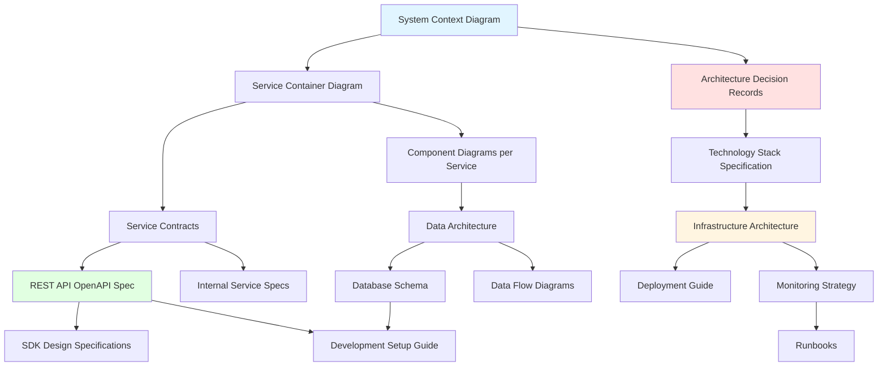
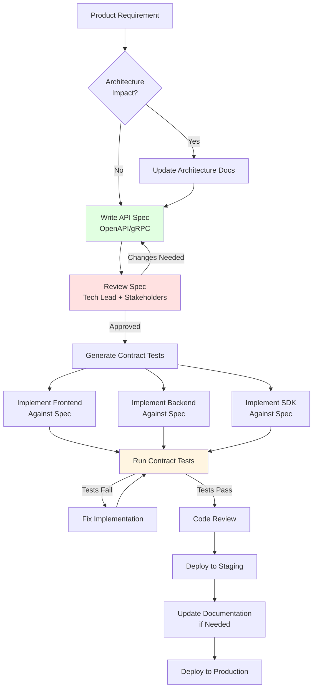
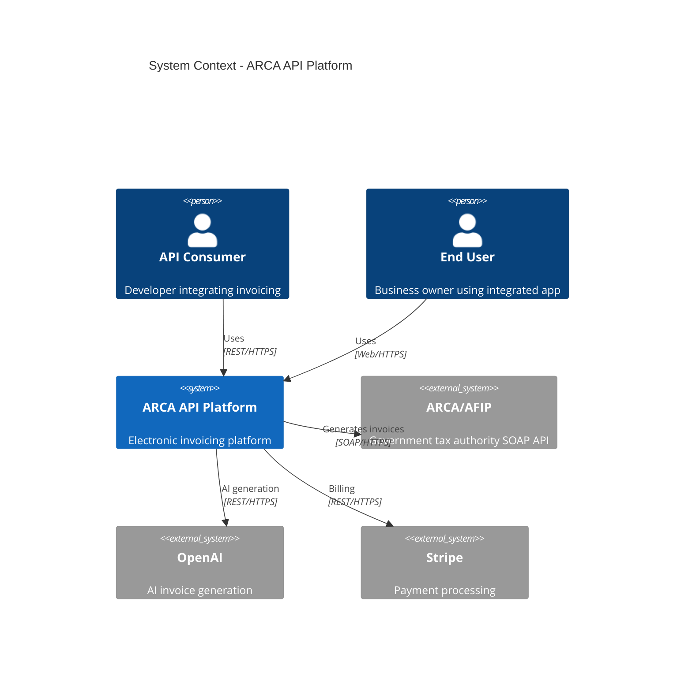
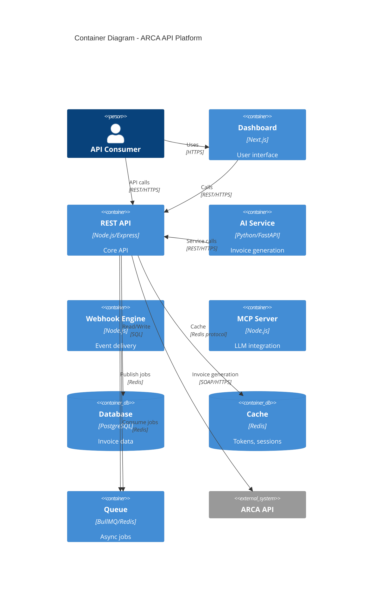
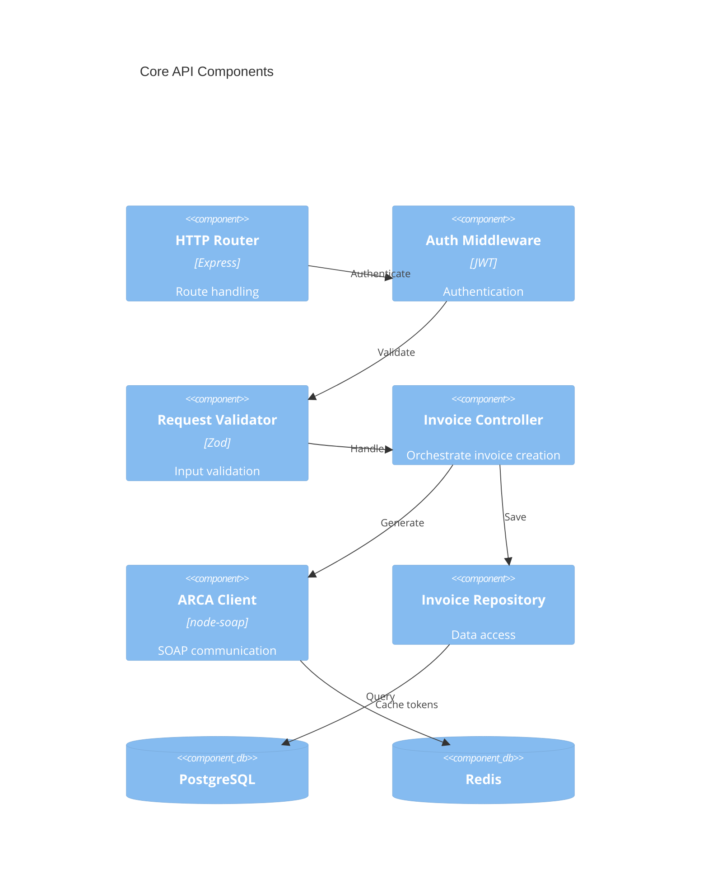
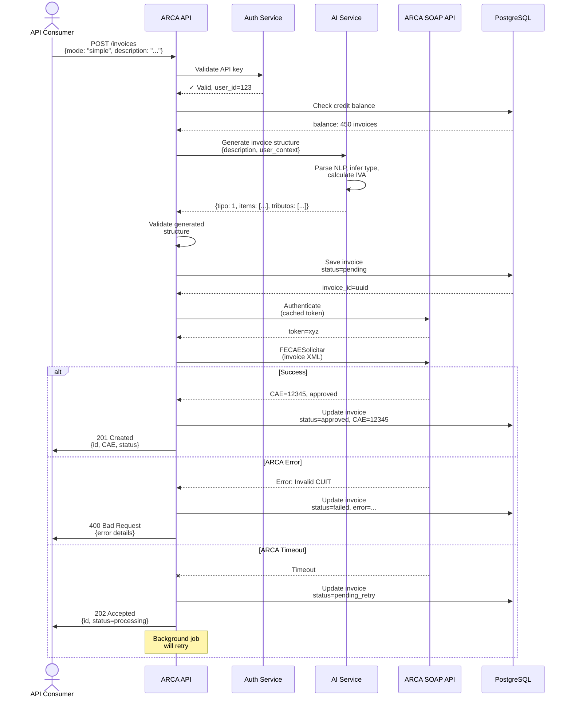
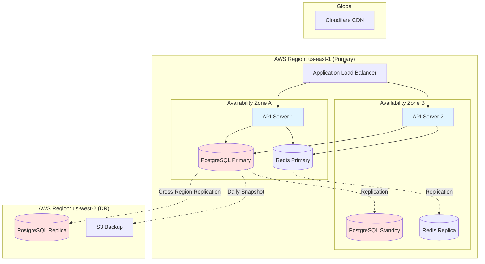
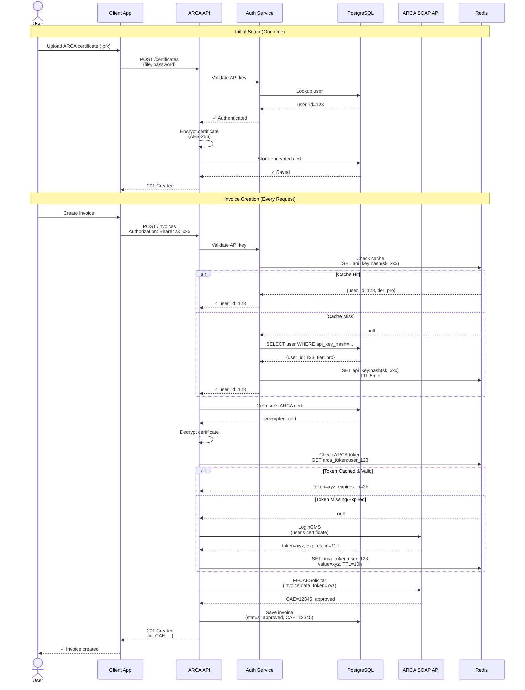
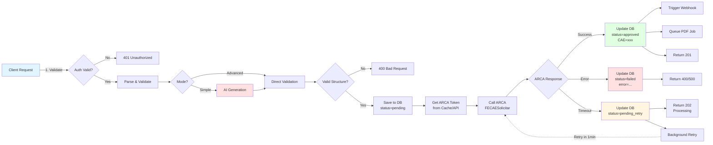

# PRD: Engineering Documentation System

## Executive Summary

This PRD defines the **Engineering Documentation System** for the ARCA API platform - a comprehensive, technology-agnostic documentation framework designed to support a complex, multi-service SaaS product from inception through scale.

The documentation system will enable a **spec-driven development** (SDD) approach with emphasis on architecture-first thinking, ensuring high availability, scalability, and cost optimization from day one. All documentation will be markdown-based, version-controlled alongside code, and structured to meet Google Engineering standards for quality and rigor.

**Key Objectives:**
- Define system architecture for high-availability, scalable, cost-effective platform
- Establish spec-driven development workflow with clear contracts between services
- Create comprehensive technical specifications for 8+ interconnected services
- Provide visual system flows using Mermaid diagrams
- Enable engineering team collaboration with clear, discoverable documentation
- Maintain technology-agnostic approach allowing flexibility in implementation choices

**Success Criteria:**
- Documentation approved by Google Engineering team standards
- Zero ambiguity in service contracts and API specifications
- New engineers can understand complete system architecture within 2 days
- All system flows documented with visual diagrams
- Documentation stays current through automated validation

---

## Problem Statement

### What Problem Are We Solving?

Building ARCA API requires coordinating **8+ interconnected services** (REST API, Dashboard, SDKs, AI services, MCP server, integrations, webhooks, analytics) with complex interactions, external dependencies (ARCA SOAP API), and stringent requirements for availability, security, and compliance.

**Without comprehensive engineering documentation:**

1. **Architecture Drift**: Services built without cohesive architectural vision lead to scalability issues, security gaps, and technical debt
2. **Integration Failures**: Undefined service contracts cause broken integrations, deployment failures, and production incidents
3. **Knowledge Silos**: Critical system knowledge trapped in individual developers' heads creates bus factor risks
4. **Inconsistent Patterns**: Different approaches to common problems (auth, error handling, logging) across services
5. **Slow Onboarding**: New engineers take weeks to understand system, delaying velocity
6. **Regulatory Risk**: Undocumented security/compliance decisions create audit failures and legal exposure
7. **Cost Overruns**: Unplanned architecture leads to over-provisioning or emergency scaling

### Why Is This Important Now?

We are at **Day Zero** of the ARCA API platform. This is the **critical window** where architectural decisions have maximum leverage and minimum cost to implement correctly.

**Timing is critical because:**
- Pre-code phase: Can define optimal architecture without refactoring costs
- Spec-driven development: Write contracts before implementation prevents rework
- Team formation: Documentation establishes shared mental models from day one
- Regulatory compliance: GDPR, AFIP requirements must be architected in, not bolted on
- Investor confidence: Professional documentation demonstrates execution maturity

### Current State

**What exists:**
- `prd-idea.md`: Comprehensive product vision (27K tokens) covering business requirements, features, market analysis
- `.claude/context/*.md`: High-level context files (product, tech, vision, patterns)
- Zero architecture documentation
- Zero technical specifications
- Zero service contracts
- Zero deployment plans

**Gap:** We have **what to build** (product PRD) but lack **how to build it** (engineering documentation).

---

## User Stories

### Primary Persona: "Engineering Team Member"

**Demographics:**
- Role: Backend/Frontend/DevOps Engineer, Tech Lead, Solutions Architect
- Experience: Mid to senior level (3-10 years)
- Context: Joining ARCA API project, needs to understand system and contribute quickly

#### User Story 1: System Architecture Understanding
**As a** new engineer joining the team
**I want to** understand the complete system architecture in under 2 days
**So that** I can start contributing to my assigned service without blocking on knowledge gaps

**Acceptance Criteria:**
- [ ] Single architecture document with system overview exists
- [ ] Visual diagrams show all services and their interactions
- [ ] Technology choices are explained with rationale
- [ ] Data flow through system is clearly documented
- [ ] External dependencies (ARCA API, OpenAI, etc.) are mapped
- [ ] Non-functional requirements (HA, scalability, cost) are specified

#### User Story 2: Service Contract Definition
**As a** backend engineer building the Invoice API
**I want to** know exact request/response schemas for all endpoints
**So that** frontend and SDK developers can work in parallel without waiting for my implementation

**Acceptance Criteria:**
- [ ] OpenAPI 3.1 specification exists for REST API
- [ ] All endpoints documented with examples
- [ ] Error response formats standardized
- [ ] Authentication flows specified
- [ ] Rate limiting behavior documented
- [ ] Versioning strategy defined

#### User Story 3: Cross-Service Integration
**As a** engineer building the AI Invoice Generator service
**I want to** understand how to authenticate with the Core API and handle errors
**So that** I can implement reliable service-to-service communication

**Acceptance Criteria:**
- [ ] Service authentication patterns documented
- [ ] Error handling and retry strategies specified
- [ ] Circuit breaker patterns defined
- [ ] Logging and tracing standards established
- [ ] Service discovery mechanism explained

#### User Story 4: Infrastructure Deployment
**As a** DevOps engineer setting up production infrastructure
**I want to** know required resources, scaling policies, and disaster recovery procedures
**So that** I can provision cost-effective, highly-available infrastructure

**Acceptance Criteria:**
- [ ] Infrastructure architecture diagram exists
- [ ] Resource requirements per service specified
- [ ] Auto-scaling policies defined
- [ ] Backup and disaster recovery procedures documented
- [ ] Cost estimation and optimization strategies provided
- [ ] Multi-region failover strategy documented

#### User Story 5: Security and Compliance
**As a** security engineer reviewing the platform
**I want to** verify all security controls and compliance requirements are implemented
**So that** I can approve the architecture for production deployment

**Acceptance Criteria:**
- [ ] Security architecture document exists
- [ ] Data encryption (at-rest, in-transit) specified
- [ ] Authentication and authorization flows documented
- [ ] Secrets management strategy defined
- [ ] GDPR compliance measures documented
- [ ] Audit logging requirements specified
- [ ] Penetration testing plan exists

#### User Story 6: Development Workflow
**As a** developer fixing a bug affecting multiple services
**I want to** understand the testing and deployment pipeline
**So that** I can safely test and deploy my changes without breaking production

**Acceptance Criteria:**
- [ ] CI/CD pipeline architecture documented
- [ ] Testing strategy (unit, integration, E2E) defined
- [ ] Deployment workflow (staging → production) specified
- [ ] Rollback procedures documented
- [ ] Feature flag strategy explained
- [ ] Database migration process defined

### Secondary Persona: "Technical Stakeholder"

**Demographics:**
- Role: CTO, Technical Advisor, Google Engineering Reviewer
- Context: Evaluating architectural soundness before investment/approval

#### User Story 7: Architecture Review
**As a** technical advisor conducting architecture review
**I want to** assess system design against best practices for scalability, security, and cost
**So that** I can approve the architecture or provide improvement recommendations

**Acceptance Criteria:**
- [ ] Architecture follows well-known patterns (microservices, event-driven, etc.)
- [ ] Scalability bottlenecks identified and mitigated
- [ ] Security follows principle of least privilege
- [ ] Cost projections are realistic with growth scenarios
- [ ] Technology choices justified with trade-off analysis
- [ ] Observability strategy (logging, monitoring, alerting) defined

---

## Requirements

### Functional Requirements

#### FR-1: System Architecture Documentation

**FR-1.1: High-Level Architecture**
- Document overall system architecture using C4 model (Context, Container, Component, Code)
- Define all services: REST API Core, Dashboard, AI Services, MCP Server, Webhook Engine, Analytics, Integration Connectors, ARCA SOAP Client
- Map service interactions with sequence diagrams
- Specify technology stack per service (language, framework, runtime)
- Define deployment topology (containerization, orchestration)

**FR-1.2: Architecture Decision Records (ADRs)**
- Document all significant architectural decisions
- Format: Context, Decision, Consequences, Alternatives Considered
- Cover: Database choice, authentication strategy, caching layer, message queue, deployment platform
- Version control all ADRs with timestamp and author

**FR-1.3: Data Architecture**
- Database schema documentation with ER diagrams
- Data flow diagrams showing information movement
- Caching strategy and cache invalidation patterns
- Data retention and archival policies
- Backup and disaster recovery specifications

#### FR-2: Service Specifications (Spec-Driven Development)

**FR-2.1: REST API Specification**
- OpenAPI 3.1 specification for all endpoints
- Request/response schemas with examples
- Authentication and authorization requirements per endpoint
- Rate limiting policies
- Error response standardization
- Versioning strategy (URL-based: /v1/, /v2/)

**FR-2.2: Internal Service Contracts**
- gRPC or REST contracts for service-to-service communication
- Message queue event schemas (CloudEvents standard)
- Database stored procedure interfaces
- Webhook payload schemas

**FR-2.3: SDK Design Specifications**
- API surface design for each SDK (JS, Python, PHP, Ruby, Go, .NET)
- Error handling patterns per language
- Authentication flow per SDK
- Retry and timeout configurations
- Idiomatic patterns per language (Promises in JS, context managers in Python, etc.)

**FR-2.4: AI Service Specifications**
- Input/output contracts for AI Invoice Generator
- Prompt engineering documentation
- Model selection criteria and fallback strategies
- Token usage optimization strategies
- Compliance prediction model specifications

#### FR-3: Flow Documentation with Mermaid Diagrams

**FR-3.1: User Flows**
- User registration and onboarding flow
- Certificate upload and authentication setup
- Invoice creation flow (simple mode vs advanced mode)
- AI invoice generation flow
- Webhook configuration and delivery flow

**FR-3.2: System Flows**
- Request lifecycle: Client → API → ARCA → Response
- Authentication flow: Certificate → Token → Renewal
- Webhook delivery flow with retry logic
- Background job processing (PDF generation, email sending)
- Error handling and circuit breaker activation

**FR-3.3: Data Flows**
- Invoice data persistence pipeline
- Analytics aggregation pipeline
- Compliance alert generation flow
- Audit log collection and storage

**FR-3.4: Deployment Flows**
- CI/CD pipeline: Commit → Test → Build → Deploy
- Database migration flow
- Feature flag rollout process
- Rollback procedure

#### FR-4: Development Workflow Documentation

**FR-4.1: Development Standards**
- Code style guides per language
- Git branching strategy (GitFlow, trunk-based, etc.)
- Commit message conventions
- Pull request template and review process
- Code coverage requirements

**FR-4.2: Testing Strategy**
- Unit testing guidelines and coverage targets (80%+)
- Integration testing approach
- End-to-end testing framework
- Load testing scenarios and acceptance criteria
- Security testing (SAST, DAST, dependency scanning)

**FR-4.3: Local Development Setup**
- Prerequisites installation guide
- Environment configuration
- Docker Compose setup for local services
- Seed data and test certificates
- Debugging configuration

#### FR-5: Operational Documentation

**FR-5.1: Deployment Guide**
- Infrastructure provisioning (IaC with Terraform/CloudFormation)
- Environment configuration (dev, staging, production)
- Secrets management setup
- Database migration execution
- Service deployment procedures
- Health check and smoke test validation

**FR-5.2: Monitoring and Observability**
- Metrics to collect per service (RED: Rate, Errors, Duration)
- Logging standards (structured JSON logs)
- Distributed tracing setup (OpenTelemetry)
- Dashboard templates (Grafana, Datadog)
- Alert definitions and escalation procedures
- SLO/SLI definitions

**FR-5.3: Incident Response**
- Incident severity classification
- On-call rotation and escalation paths
- Runbook for common issues (ARCA API down, database connection pool exhausted, etc.)
- Post-mortem template and process
- Root cause analysis framework

**FR-5.4: Disaster Recovery**
- Backup procedures and schedules
- Recovery Time Objective (RTO) and Recovery Point Objective (RPO) per service
- Failover procedures
- Data restoration testing schedule

#### FR-6: Security and Compliance Documentation

**FR-6.1: Security Architecture**
- Network architecture and firewall rules
- Encryption specifications (TLS 1.3, AES-256)
- Secrets management (AWS Secrets Manager, HashiCorp Vault)
- API key lifecycle management
- Certificate storage and rotation
- DDoS protection strategy

**FR-6.2: Compliance Requirements**
- GDPR compliance checklist and implementation
- Data residency requirements
- User consent management
- Right to deletion implementation
- Data export functionality
- Audit log requirements (who, what, when, where)

**FR-6.3: Security Testing**
- Penetration testing schedule (quarterly)
- Vulnerability scanning automation
- Bug bounty program guidelines
- Security incident response plan
- Third-party security audit requirements

#### FR-7: Documentation Organization and Discoverability

**FR-7.1: Directory Structure**
```
docs/
├── architecture/
│   ├── 00-overview.md
│   ├── 01-system-context.md
│   ├── 02-services.md
│   ├── 03-data-architecture.md
│   ├── 04-infrastructure.md
│   └── adrs/
│       ├── 001-database-choice.md
│       ├── 002-authentication-strategy.md
│       └── ...
├── specifications/
│   ├── api/
│   │   ├── openapi.yaml
│   │   └── README.md
│   ├── services/
│   │   ├── ai-service-contract.md
│   │   ├── webhook-service-contract.md
│   │   └── ...
│   └── sdks/
│       ├── javascript-design.md
│       ├── python-design.md
│       └── ...
├── flows/
│   ├── user-flows.md
│   ├── system-flows.md
│   ├── data-flows.md
│   └── deployment-flows.md
├── development/
│   ├── setup.md
│   ├── coding-standards.md
│   ├── testing-strategy.md
│   └── contribution-guide.md
├── operations/
│   ├── deployment-guide.md
│   ├── monitoring.md
│   ├── incident-response.md
│   └── runbooks/
│       ├── arca-api-down.md
│       ├── database-issues.md
│       └── ...
├── security/
│   ├── security-architecture.md
│   ├── compliance/
│   │   ├── gdpr.md
│   │   └── iso27001.md
│   └── security-testing.md
└── README.md (documentation index)
```

**FR-7.2: Documentation Standards**
- Every document has metadata: title, author, last updated, status
- Cross-references use relative links
- Diagrams embedded as Mermaid code (version controllable)
- Examples use consistent formatting (code blocks with language tags)
- Glossary of terms and acronyms
- Table of contents for documents >500 lines

**FR-7.3: Search and Navigation**
- README.md serves as documentation hub with links to all sections
- Each major section has its own README linking to subsections
- Consistent heading hierarchy for easy navigation
- Tags/labels for categorization (e.g., #security, #api, #deployment)

### Non-Functional Requirements

#### NFR-1: Documentation Quality (Google Engineering Standards)

**NFR-1.1: Completeness**
- Zero ambiguity in specifications: all edge cases documented
- No "TBD" or placeholder content in approved documents
- All diagrams have accompanying text explanations
- Examples provided for all abstract concepts
- Rationale documented for all architectural decisions

**NFR-1.2: Accuracy**
- Documentation matches implementation (verified via automated tests)
- Version numbers clearly indicate document currency
- Outdated documents explicitly marked as deprecated
- Change log maintained for specification updates

**NFR-1.3: Clarity**
- Written for audience: engineers with 3+ years experience
- Jargon minimized, defined when used
- Active voice preferred over passive
- Consistent terminology (no synonyms for same concept)
- Sentence length <25 words average

**NFR-1.4: Visual Communication**
- All flows have Mermaid diagrams
- Complex systems have multiple views (logical, physical, deployment)
- Color coding consistent across diagrams
- Legend provided for all symbols

#### NFR-2: Maintainability

**NFR-2.1: Version Control**
- All documentation in Git alongside code
- Changes reviewed via pull requests
- Documentation updates required for code changes (enforced via CI)
- Semantic versioning for major spec changes

**NFR-2.2: Automated Validation**
- OpenAPI specs validated with Spectral or similar
- Broken links detected via automated checks
- Mermaid diagram syntax validated
- Code examples tested in CI pipeline
- Spelling and grammar checked (vale.sh or similar)

**NFR-2.3: Update Frequency**
- Architecture documents reviewed quarterly
- Runbooks updated within 24 hours of incidents
- API specs updated before implementation
- ADRs created within 1 week of decision

#### NFR-3: Accessibility

**NFR-3.1: Onboarding Time**
- New engineer can understand high-level architecture in <4 hours
- Complete system understanding (all services) in <2 days
- First code contribution possible within 1 week

**NFR-3.2: Findability**
- Any topic locatable within 3 clicks from README.md
- Search results (grep/GitHub search) return relevant docs in top 5 results
- Documentation hub has visual sitemap

**NFR-3.3: Multi-Level Detail**
- Executive summaries for high-level understanding
- Detailed specifications for implementation
- Quick reference guides for common tasks

#### NFR-4: Technology Agnosticism

**NFR-4.1: Implementation Flexibility**
- Architecture documents describe "what" and "why", not "how" (technology-specific)
- Technology choices documented separately with rationale
- Alternative technologies listed with trade-off analysis
- Easy to swap technologies without architectural redesign

**NFR-4.2: Pattern-Based Design**
- Standard patterns used (Repository, Factory, Observer, Circuit Breaker, etc.)
- Patterns documented with language-agnostic descriptions
- Implementation examples provided for multiple languages

#### NFR-5: Scalability of Documentation System

**NFR-5.1: Growth Support**
- Documentation structure supports 50+ services
- Hierarchical organization prevents flat file chaos
- Template-based approach for new service documentation
- Automated generation where possible (API docs from OpenAPI)

**NFR-5.2: Multi-Team Collaboration**
- Clear ownership model (RACI matrix for documents)
- Parallel editing supported (Git merge strategies)
- Review process scales with team size

---

## Success Criteria

### Immediate Success (Week 1-2)

**SC-1: Documentation Structure Approved**
- [ ] Directory structure created and approved by team
- [ ] Documentation templates created for all document types
- [ ] README.md hub established with navigation

**SC-2: Architecture Foundation Complete**
- [ ] System context diagram (C4 Level 1) created
- [ ] Service container diagram (C4 Level 2) created
- [ ] All 8 services identified and described
- [ ] External dependencies mapped (ARCA API, OpenAI, databases, etc.)

### Short-Term Success (Month 1)

**SC-3: Core Specifications Defined**
- [ ] REST API OpenAPI specification 80% complete
- [ ] Database schema documented with ER diagrams
- [ ] Authentication flow documented with sequence diagrams
- [ ] First 5 Architecture Decision Records (ADRs) created

**SC-4: Development Enablement**
- [ ] Local development setup guide tested by 2 engineers
- [ ] Coding standards defined for primary languages
- [ ] Git workflow and PR process documented
- [ ] Testing strategy defined

**SC-5: Google Engineering Review Passed**
- [ ] Architecture documentation reviewed and approved
- [ ] Security architecture meets standards
- [ ] No critical gaps identified in specifications
- [ ] Feedback incorporated and re-reviewed

### Medium-Term Success (Month 3)

**SC-6: Complete Specification Coverage**
- [ ] All REST API endpoints documented in OpenAPI
- [ ] All service-to-service contracts defined
- [ ] All user flows documented with Mermaid diagrams
- [ ] All system flows documented
- [ ] SDK design specs completed for JS, Python, PHP

**SC-7: Operational Readiness**
- [ ] Deployment guide tested in staging environment
- [ ] Monitoring and alerting setup documented and implemented
- [ ] First 10 runbooks created for common scenarios
- [ ] Incident response plan tested with tabletop exercise

**SC-8: Documentation Automation**
- [ ] CI pipeline validates OpenAPI specs
- [ ] Broken link detection running
- [ ] Code examples tested automatically
- [ ] Documentation coverage metrics tracked

### Long-Term Success (Month 6-12)

**SC-9: Team Adoption Metrics**
- [ ] 100% of pull requests reference relevant documentation
- [ ] <2 day onboarding time for new engineers (measured)
- [ ] <5 minutes to find any technical topic (measured)
- [ ] Zero "undocumented behavior" bugs in production

**SC-10: Living Documentation**
- [ ] Documentation updated within 1 sprint of code changes
- [ ] Architecture reviews conducted quarterly
- [ ] Documentation NPS score >8/10 from engineering team
- [ ] All runbooks tested and accurate

**SC-11: Compliance Achievement**
- [ ] ISO 27001 audit passes (documentation completeness)
- [ ] GDPR compliance verified with documentation trail
- [ ] Security penetration test findings all documented
- [ ] Audit log covers all compliance-required events

### Key Performance Indicators (KPIs)

| Metric | Target | Measurement |
|--------|--------|-------------|
| **Time to First Commit** (new engineer) | <5 days | Onboarding survey |
| **Time to System Understanding** | <2 days | Quiz/interview |
| **Documentation Coverage** | 100% of services | Automated scan |
| **Spec-Code Consistency** | >95% | Contract testing |
| **Documentation Staleness** | <30 days | Git last-modified |
| **Incident Runbook Hit Rate** | >80% | Incident post-mortems |
| **Architecture Review Frequency** | Quarterly | Calendar |
| **Documentation NPS** | >8/10 | Quarterly survey |
| **Google Review Approval** | Pass | External review |

---

## Constraints & Assumptions

### Constraints

**C-1: Technology Constraints**
- Documentation must be markdown-based (no proprietary formats)
- Diagrams must be Mermaid (code-based, version controllable)
- Must work with standard Git workflows (no specialized tools required)
- Must be viewable in GitHub web interface without additional rendering

**C-2: Team Constraints**
- Small team (2-5 engineers initially): documentation must be maintainable without dedicated tech writer
- Remote/distributed team: documentation is primary source of truth (no hallway conversations)
- Async communication: documentation must be self-explanatory

**C-3: Timeline Constraints**
- Core architecture documentation must be complete before first code written
- API specifications must be finalized before SDK development starts
- Infrastructure documentation must be ready before production deployment (Month 3)

**C-4: Compliance Constraints**
- GDPR compliance must be documented with evidence trail
- Security controls must be specified before implementation
- Audit logging requirements must be defined upfront
- Must support external security audits (documentation readability for third parties)

**C-5: Budget Constraints**
- Zero budget for documentation tools (use free/open-source only)
- No dedicated technical writer (engineers write and maintain)
- Automation must use existing CI/CD infrastructure

### Assumptions

**A-1: Team Assumptions**
- Engineers have experience with markdown and Git
- Engineers familiar with architecture patterns (microservices, REST, etc.)
- Team willing to adopt spec-driven development workflow
- At least one engineer has experience with OpenAPI/Swagger

**A-2: Tooling Assumptions**
- GitHub or GitLab used for version control
- CI/CD pipeline exists (GitHub Actions, GitLab CI, etc.)
- Team uses code editor with markdown preview (VS Code, IntelliJ, etc.)
- Mermaid rendering available (GitHub, GitLab, or local plugin)

**A-3: Process Assumptions**
- Pull request review process enforced
- Documentation updates required for code changes (policy)
- Architecture review cadence established (quarterly minimum)
- Incident post-mortems include documentation updates

**A-4: Quality Assumptions**
- Google Engineering review available for architecture validation
- External security review will be conducted
- Team committed to documentation-first culture
- Documentation quality as important as code quality

**A-5: Scope Assumptions**
- Initial documentation covers 8 services (as defined in product PRD)
- Documentation structure designed to scale to 50+ services
- SDK documentation covers 6 languages (JS, Python, PHP, Ruby, Go, .NET)
- Mobile SDKs (Swift, Kotlin) documented in Phase 3 (Month 7+)

---

## Out of Scope

### Explicitly NOT Included in This PRD

**OS-1: Implementation Code**
- This PRD defines documentation requirements, not implementation
- Technology-specific implementation guides are separate deliverables
- Code examples in documentation are illustrative, not production code

**OS-2: End-User Documentation**
- API consumer documentation (developer portal, tutorials) is separate
- Marketing content (landing pages, blog posts) not covered
- Customer support documentation (FAQ, troubleshooting) separate

**OS-3: Product Documentation**
- Product feature descriptions for non-technical users
- Sales enablement materials
- Product roadmap and release notes

**OS-4: Specific Technology Choices**
- This PRD is technology-agnostic
- Actual technology selection (e.g., PostgreSQL vs MySQL) documented in ADRs
- Framework-specific guides (e.g., Next.js documentation) not covered here

**OS-5: Project Management Artifacts**
- Sprint planning and tracking (Jira, Linear, etc.)
- Resource allocation and capacity planning
- Budget and cost tracking
- HR/hiring documentation

**OS-6: Legal and Business Documentation**
- Terms of Service, Privacy Policy
- Contracts and SLAs
- Business continuity plan (non-technical aspects)
- Financial projections

**OS-7: Training Materials**
- Formal training courses or certification programs
- Video tutorials or webinars
- Interactive learning platforms

**OS-8: Specific Deployment Environments**
- AWS/GCP/Azure-specific deployment guides (documented separately)
- Kubernetes configuration details (separate IaC repository)
- Production environment credentials or secrets

---

## Dependencies

### Internal Dependencies

**ID-1: Product Requirements**
- **Dependency**: Finalized product PRD (`prd-idea.md`) with feature requirements
- **Status**: ✅ Complete
- **Impact**: Architecture must support all Phase 1-3 features
- **Mitigation**: Product roadmap frozen for MVP scope

**ID-2: Team Formation**
- **Dependency**: Core engineering team hired (Tech Lead, 2-3 engineers)
- **Status**: ⏳ In progress
- **Impact**: Documentation authors and reviewers needed
- **Mitigation**: Tech Lead can bootstrap initial documentation solo

**ID-3: Development Environment**
- **Dependency**: Git repository, CI/CD pipeline, development tooling
- **Status**: ⏳ Pending
- **Impact**: Documentation validation and testing requires CI
- **Mitigation**: Core docs can be written in parallel with setup

**ID-4: Technology Stack Decisions**
- **Dependency**: High-level technology choices (backend language, database, cloud provider)
- **Status**: ⏳ Pending
- **Impact**: Some ADRs and infrastructure docs blocked
- **Mitigation**: Architecture-agnostic docs can proceed; ADRs follow decisions

### External Dependencies

**ED-1: ARCA/AFIP API Documentation**
- **Dependency**: Official ARCA SOAP API documentation and WSDL files
- **Status**: ✅ Available (public)
- **Impact**: ARCA integration specifications require official docs
- **Risk**: ARCA docs may be incomplete or outdated
- **Mitigation**: Reverse-engineer from WSDL, engage ARCA community for clarifications

**ED-2: Google Engineering Review**
- **Dependency**: Availability of Google Engineering team for architecture review
- **Status**: ⏳ Scheduled
- **Impact**: Architecture cannot be finalized without approval
- **Risk**: Review may require significant revisions
- **Mitigation**: Front-load architecture work, allow 2-week buffer for revisions

**ED-3: OpenAPI Tooling**
- **Dependency**: OpenAPI validators, generators, documentation renderers
- **Status**: ✅ Available (open source: Spectral, Swagger UI, Redocly)
- **Impact**: API specification quality depends on validation
- **Risk**: Tool compatibility issues
- **Mitigation**: Use widely-adopted tools with active maintenance

**ED-4: Mermaid Rendering**
- **Dependency**: Mermaid.js support in GitHub/GitLab
- **Status**: ✅ Available (GitHub native, GitLab native)
- **Impact**: Diagrams must render in code repository interface
- **Risk**: Complex diagrams may not render or look poor
- **Mitigation**: Test diagram rendering early, keep diagrams simple, use multiple diagrams instead of one complex

**ED-5: Third-Party API Documentation**
- **Dependency**: Documentation for OpenAI, Stripe (billing), Resend (email), etc.
- **Status**: ✅ Available (public)
- **Impact**: Integration specifications require third-party API understanding
- **Risk**: Third-party APIs change without notice
- **Mitigation**: Version-pin integrations, document API versions used

### Documentation Dependencies (Order of Creation)



**Critical Path:**
1. System Context Diagram (Day 1)
2. Service Container Diagram (Day 2-3)
3. Core ADRs: Database, Auth, Deployment (Week 1)
4. REST API OpenAPI Spec (Week 2-3)
5. Infrastructure Architecture (Week 3)
6. Development Setup Guide (Week 4)

---

## Proposed Solution: Spec-Driven Development Framework

### Development Methodology: Spec-Driven Development (SDD)

**Definition**: Spec-Driven Development is an approach where detailed specifications (contracts, schemas, interfaces) are written **before** implementation code, serving as executable contracts that drive development, testing, and validation.

**Why SDD for ARCA API?**

1. **Parallel Development**: Frontend, backend, and SDK teams can work simultaneously using specs as contracts
2. **Contract Testing**: APIs tested against specs before and after implementation
3. **Documentation as Code**: Specs are both documentation and validation artifacts
4. **Change Management**: Spec changes trigger impact analysis before code changes
5. **Clear Handoffs**: Designers → Spec → Implementation → Testing all reference same source of truth

### SDD Workflow



### Documentation Layers

#### Layer 1: Architecture (Strategic)
- **Audience**: CTO, Tech Lead, Senior Engineers, External Reviewers
- **Update Frequency**: Quarterly or on major architectural changes
- **Content**: System context, service boundaries, technology choices, ADRs
- **Format**: Markdown + C4 diagrams (Mermaid)

**Key Documents:**
- `architecture/00-overview.md`: Executive summary, system goals, quality attributes
- `architecture/01-system-context.md`: C4 Level 1 - external actors and systems
- `architecture/02-services.md`: C4 Level 2 - all services and interactions
- `architecture/03-data-architecture.md`: Database strategy, caching, data flows
- `architecture/04-infrastructure.md`: Deployment, scaling, disaster recovery
- `architecture/adrs/*.md`: All architectural decisions

#### Layer 2: Specifications (Tactical)
- **Audience**: All Engineers, QA, Technical Product Managers
- **Update Frequency**: Every sprint, before implementation
- **Content**: API contracts, service interfaces, data schemas
- **Format**: OpenAPI (YAML), JSON Schema, Markdown

**Key Documents:**
- `specifications/api/openapi.yaml`: Complete REST API specification
- `specifications/services/*.md`: Service-to-service contracts
- `specifications/sdks/*.md`: SDK design per language
- `specifications/events/*.json`: Event schemas for webhooks and queues

#### Layer 3: Implementation Guides (Operational)
- **Audience**: Engineers, DevOps, On-call
- **Update Frequency**: As needed, within 24h of process changes
- **Content**: How to set up, deploy, debug, troubleshoot
- **Format**: Markdown + code examples

**Key Documents:**
- `development/setup.md`: Local development environment
- `development/testing-strategy.md`: How to write and run tests
- `operations/deployment-guide.md`: How to deploy
- `operations/runbooks/*.md`: How to fix specific issues
- `security/compliance/*.md`: How to maintain compliance

#### Layer 4: Flow Documentation (Educational)
- **Audience**: New engineers, auditors, stakeholders
- **Update Frequency**: After major feature launches
- **Content**: Visual representation of how system works
- **Format**: Mermaid diagrams + explanatory text

**Key Documents:**
- `flows/user-flows.md`: How users interact with the system
- `flows/system-flows.md`: How services interact internally
- `flows/data-flows.md`: How data moves through the system
- `flows/deployment-flows.md`: How code gets to production

### Architecture Documentation Template (C4 Model)

#### Level 1: System Context
```markdown
# System Context: ARCA API Platform

## Overview
[1-2 paragraph description of entire system]

## Context Diagram


## External Actors
[Description of each external system/user]

## Quality Attributes
- **Availability**: 99.95% uptime
- **Performance**: P95 latency <200ms
- **Scalability**: Support 100K invoices/day
- **Security**: ISO 27001, GDPR compliant
- **Cost**: <$0.02 per invoice processed
```

#### Level 2: Container Diagram
```markdown
# Service Architecture: ARCA API Platform

## Container Diagram


## Services

### Core API Service
- **Responsibility**: Handle all client requests, orchestrate business logic
- **Technology**: Node.js 20 + Express/Fastify + TypeScript
- **Scaling**: Horizontal (auto-scale on CPU >70%)
- **Data**: Read/write PostgreSQL, cache in Redis

[Continue for each service...]
```

#### Level 3: Component Diagram (per service)
```markdown
# Core API Service Components



## Components

### Invoice Controller
- **Responsibility**: Orchestrate invoice creation workflow
- **Dependencies**: ARCA Client, Invoice Repository, Queue Client
- **Inputs**: Validated invoice request DTO
- **Outputs**: Invoice response DTO or error
- **Error Handling**: Retry on transient ARCA errors, fail-fast on validation errors

[Continue for each component...]
```

### API Specification Template (OpenAPI)

```yaml
openapi: 3.1.0
info:
  title: ARCA API
  version: 1.0.0
  description: |
    Electronic invoicing API for Argentina (ARCA/AFIP).

    ## Authentication
    Use Bearer token authentication with API key.

    ## Rate Limiting
    - Free tier: 100 requests/minute
    - Pro tier: 1000 requests/minute

    ## Errors
    All errors follow RFC 7807 Problem Details format.

  contact:
    email: support@arcaapi.com
  license:
    name: MIT

servers:
  - url: https://api.arcaapi.com/v1
    description: Production
  - url: https://sandbox.arcaapi.com/v1
    description: Sandbox

security:
  - BearerAuth: []

paths:
  /invoices:
    post:
      summary: Create invoice
      description: |
        Create a new electronic invoice with ARCA.

        Supports two modes:
        - **Simple**: Provide natural language description, AI generates structured invoice
        - **Advanced**: Provide complete invoice structure

      operationId: createInvoice
      tags:
        - Invoices
      requestBody:
        required: true
        content:
          application/json:
            schema:
              oneOf:
                - $ref: '#/components/schemas/SimpleInvoiceRequest'
                - $ref: '#/components/schemas/AdvancedInvoiceRequest'
            examples:
              simple:
                summary: Simple mode (AI-powered)
                value:
                  mode: simple
                  description: "Factura para Juan Pérez por 3 horas de consultoría a $5000/hora"
              advanced:
                summary: Advanced mode (full control)
                value:
                  mode: advanced
                  tipo_comprobante: 1
                  punto_venta: 1
                  cliente:
                    documento_tipo: 80
                    documento_numero: "20123456789"
                    razon_social: "Juan Pérez"
                  items:
                    - descripcion: "Consultoría"
                      cantidad: 3
                      precio_unitario: 5000
      responses:
        '201':
          description: Invoice created successfully
          content:
            application/json:
              schema:
                $ref: '#/components/schemas/Invoice'
        '400':
          $ref: '#/components/responses/BadRequest'
        '401':
          $ref: '#/components/responses/Unauthorized'
        '429':
          $ref: '#/components/responses/RateLimited'
        '500':
          $ref: '#/components/responses/InternalError'

components:
  securitySchemes:
    BearerAuth:
      type: http
      scheme: bearer
      bearerFormat: API Key

  schemas:
    SimpleInvoiceRequest:
      type: object
      required:
        - mode
        - description
      properties:
        mode:
          type: string
          enum: [simple]
        description:
          type: string
          minLength: 10
          maxLength: 1000
          description: Natural language invoice description
          example: "Factura a Juan Pérez por 3 laptops Dell a $100000 cada una"

    AdvancedInvoiceRequest:
      type: object
      required:
        - mode
        - tipo_comprobante
        - punto_venta
        - cliente
        - items
      properties:
        mode:
          type: string
          enum: [advanced]
        tipo_comprobante:
          type: integer
          description: ARCA invoice type code
          enum: [1, 6, 11]  # A, B, C
        # ... [continue with all fields]

    Invoice:
      type: object
      properties:
        id:
          type: string
          format: uuid
        numero:
          type: integer
        cae:
          type: string
          description: Electronic authorization code from ARCA
        vencimiento_cae:
          type: string
          format: date
        # ... [continue]

  responses:
    BadRequest:
      description: Validation error
      content:
        application/json:
          schema:
            $ref: '#/components/schemas/ProblemDetails'
          example:
            type: "https://arcaapi.com/errors/validation"
            title: "Validation Error"
            status: 400
            detail: "Invalid invoice type"
            instance: "/invoices"
            errors:
              - field: "tipo_comprobante"
                message: "Must be 1, 6, or 11"

    # ... [continue with other responses]

    ProblemDetails:
      type: object
      description: RFC 7807 Problem Details
      required:
        - type
        - title
        - status
      properties:
        type:
          type: string
          format: uri
        title:
          type: string
        status:
          type: integer
        detail:
          type: string
        instance:
          type: string
        errors:
          type: array
          items:
            type: object
```

### Flow Documentation Template

```markdown
# User Flow: Invoice Creation (Simple Mode)

## Overview
User creates invoice using natural language description, AI generates structured invoice, system submits to ARCA.

## Actors
- **API Consumer**: Developer's application
- **ARCA API**: Our platform
- **OpenAI**: AI service
- **ARCA/AFIP**: Government tax system

## Preconditions
- User authenticated with valid API key
- User has uploaded ARCA certificate
- User has credit balance or active subscription

## Flow Diagram



## Step-by-Step

### 1. Authentication (50ms)
- API gateway validates Bearer token format
- Auth service lookups API key hash in database
- Returns user_id and rate limit tier
- **Failure**: 401 Unauthorized if invalid

### 2. Rate Limiting Check (10ms)
- Check Redis counter for user's requests in current minute
- Free tier: 100 req/min, Pro: 1000 req/min
- Increment counter with 60s TTL
- **Failure**: 429 Rate Limited if exceeded

### 3. Credit Balance Check (20ms)
- Query user's remaining invoice credits
- Free tier: 500/month, paid tiers unlimited
- **Failure**: 402 Payment Required if exhausted

### 4. AI Invoice Generation (500-1500ms)
- Send description + user context (past invoices, preferences) to AI service
- AI service calls OpenAI GPT-4 with specialized prompt
- Parse response into structured invoice
- Apply business rules (IVA rates, defaults)
- **Failure**: 500 Internal Error if AI service down → fallback to manual mode

### 5. Structure Validation (30ms)
- Validate generated structure against JSON schema
- Check CUIT format, invoice type validity
- Verify totals match items
- **Failure**: 400 Bad Request if validation fails

### 6. Database Persistence (40ms)
- Insert invoice record with status=pending
- Store AI-generated metadata for auditing
- Return invoice UUID
- **Failure**: 500 Internal Error if DB down

### 7. ARCA Authentication (100ms, cached)
- Check Redis for valid ARCA token
- If missing/expired: request new token with user's certificate
- Cache token for 11 hours with 10-hour TTL
- **Failure**: Retry 3x with exponential backoff → 503 Service Unavailable

### 8. ARCA Invoice Submission (1000-3000ms)
- Convert structured invoice to SOAP XML
- Call ARCA FECAESolicitar endpoint
- Parse XML response
- **Failure scenarios**:
  - **Validation error**: 400 Bad Request (client's fault)
  - **ARCA down**: 503 Service Unavailable (retry later)
  - **Timeout**: 202 Accepted (background retry)

### 9. Response & Webhook (50ms)
- Update invoice status in database
- Trigger webhook if configured
- Return response to client
- **Async**: PDF generation, email sending queued

## Success Criteria
- Invoice created with status=approved
- CAE received from ARCA
- Response time P95 <3 seconds (including ARCA latency)

## Error Handling
| Error | Status Code | Retry? | User Action |
|-------|-------------|--------|-------------|
| Invalid API key | 401 | No | Check API key |
| Rate limited | 429 | Yes | Wait 60s or upgrade tier |
| Invalid input | 400 | No | Fix request |
| AI service down | 500 | No | Use advanced mode |
| ARCA validation error | 400 | No | Check CUIT, invoice data |
| ARCA timeout | 202 | Yes (auto) | Poll invoice status |
| ARCA down | 503 | Yes | Retry in 5min |

## Performance Targets
- **Total latency**: P50 <2s, P95 <4s, P99 <6s
- **Breakdown**:
  - Auth + validation: 100ms
  - AI generation: 1s (P50), 2s (P95)
  - ARCA call: 1s (P50), 2s (P95)
  - Other: 100ms

## Monitoring
- **Metrics**:
  - Invoice creation rate (per minute)
  - Success rate (% with CAE)
  - AI generation latency (histogram)
  - ARCA call latency (histogram)
  - Error rate by type (counter)
- **Alerts**:
  - Error rate >5% (1min window) → page on-call
  - P95 latency >6s (5min window) → investigate
  - ARCA down (3 failures) → status page update
```

---

## Implementation Roadmap

### Phase 1: Foundation (Weeks 1-2)

**Week 1: Structure & Architecture**
- [ ] Day 1-2: Create documentation directory structure
- [ ] Day 2-3: Write System Context diagram (C4 Level 1)
- [ ] Day 3-5: Write Service Container diagram (C4 Level 2)
- [ ] Day 5: First architecture review with team

**Week 2: Core Specifications**
- [ ] Day 1-3: REST API OpenAPI spec (80% coverage)
- [ ] Day 3-4: Database schema documentation
- [ ] Day 4-5: Authentication flow specification
- [ ] Day 5: Create first 3 ADRs (database, auth, deployment)

**Deliverables:**
- [ ] `docs/README.md` (documentation hub)
- [ ] `docs/architecture/00-overview.md`
- [ ] `docs/architecture/01-system-context.md`
- [ ] `docs/architecture/02-services.md`
- [ ] `docs/architecture/03-data-architecture.md`
- [ ] `docs/specifications/api/openapi.yaml` (v0.1)
- [ ] `docs/architecture/adrs/001-database-choice.md`
- [ ] `docs/architecture/adrs/002-authentication-strategy.md`
- [ ] `docs/architecture/adrs/003-deployment-platform.md`

**Success Criteria:**
- [ ] Google Engineering review scheduled
- [ ] Team can explain system architecture end-to-end

### Phase 2: Detailed Specs (Weeks 3-4)

**Week 3: Service Contracts**
- [ ] Complete REST API OpenAPI (100% MVP endpoints)
- [ ] AI Service contract specification
- [ ] Webhook service contract specification
- [ ] Event schemas for message queues
- [ ] Database schema ER diagrams

**Week 4: Flows & Guides**
- [ ] Document 5 critical user flows with Mermaid diagrams
- [ ] Document 5 critical system flows
- [ ] Write local development setup guide
- [ ] Write coding standards (TypeScript, Python)
- [ ] Create pull request template

**Deliverables:**
- [ ] `docs/specifications/api/openapi.yaml` (v1.0 - MVP complete)
- [ ] `docs/specifications/services/ai-service-contract.md`
- [ ] `docs/specifications/services/webhook-service-contract.md`
- [ ] `docs/specifications/events/webhook-events.json`
- [ ] `docs/flows/user-flows.md` (5 flows)
- [ ] `docs/flows/system-flows.md` (5 flows)
- [ ] `docs/development/setup.md`
- [ ] `docs/development/coding-standards.md`
- [ ] `.github/pull_request_template.md`

**Success Criteria:**
- [ ] Developers can start implementation from specs
- [ ] Frontend and backend can work in parallel

### Phase 3: Operations & Quality (Weeks 5-6)

**Week 5: Infrastructure & Deployment**
- [ ] Infrastructure architecture documentation
- [ ] Deployment guide (staging + production)
- [ ] Monitoring and observability strategy
- [ ] Security architecture documentation
- [ ] GDPR compliance checklist

**Week 6: Runbooks & Automation**
- [ ] Create first 5 incident runbooks
- [ ] Setup CI validation for OpenAPI specs
- [ ] Setup broken link detection
- [ ] Setup code example testing
- [ ] Incident response plan

**Deliverables:**
- [ ] `docs/architecture/04-infrastructure.md`
- [ ] `docs/operations/deployment-guide.md`
- [ ] `docs/operations/monitoring.md`
- [ ] `docs/security/security-architecture.md`
- [ ] `docs/security/compliance/gdpr.md`
- [ ] `docs/operations/runbooks/arca-api-down.md`
- [ ] `docs/operations/runbooks/database-connection-pool.md`
- [ ] `docs/operations/runbooks/rate-limit-exceeded.md`
- [ ] `docs/operations/runbooks/certificate-expired.md`
- [ ] `docs/operations/runbooks/deployment-rollback.md`
- [ ] `.github/workflows/docs-validation.yml`

**Success Criteria:**
- [ ] Infrastructure can be provisioned from documentation
- [ ] On-call engineer can resolve incidents using runbooks
- [ ] Google Engineering review completed and approved

### Phase 4: SDK & Advanced (Weeks 7-8)

**Week 7: SDK Specifications**
- [ ] JavaScript/TypeScript SDK design spec
- [ ] Python SDK design spec
- [ ] PHP SDK design spec
- [ ] SDK testing strategy

**Week 8: Advanced Docs**
- [ ] Data flow diagrams (3+)
- [ ] Deployment flow diagrams
- [ ] Advanced troubleshooting guides
- [ ] Performance optimization guide
- [ ] Documentation style guide

**Deliverables:**
- [ ] `docs/specifications/sdks/javascript-design.md`
- [ ] `docs/specifications/sdks/python-design.md`
- [ ] `docs/specifications/sdks/php-design.md`
- [ ] `docs/flows/data-flows.md`
- [ ] `docs/flows/deployment-flows.md`
- [ ] `docs/operations/troubleshooting.md`
- [ ] `docs/operations/performance-optimization.md`
- [ ] `docs/DOCUMENTATION-STYLE-GUIDE.md`

**Success Criteria:**
- [ ] SDK developers can implement from specs
- [ ] All critical paths documented with diagrams
- [ ] Documentation NPS >7/10 from team

### Ongoing: Maintenance & Evolution

**Every Sprint:**
- [ ] Update API specs before implementation
- [ ] Create ADRs for significant decisions
- [ ] Update flows for new features
- [ ] Review and update runbooks based on incidents

**Quarterly:**
- [ ] Architecture review meeting
- [ ] Documentation audit (find outdated/missing docs)
- [ ] Team survey on documentation quality
- [ ] External review (Google Engineering or similar)

**Metrics Dashboard:**
- Documentation coverage (% of services documented)
- Staleness (days since last update per doc)
- Onboarding time (new engineer survey)
- Incident resolution (% resolved with runbook)
- Documentation NPS (quarterly survey)

---

## Appendix A: Example Architecture Decision Record

```markdown
# ADR-001: Database Selection for ARCA API

**Status**: Accepted
**Date**: 2025-10-15
**Author**: Tech Lead
**Reviewers**: Engineering Team, Google Engineering Advisor

## Context

ARCA API requires a primary database for storing invoice data, user accounts, API keys, and operational metadata. The database must support:

- **Transactional integrity**: Invoice creation is multi-step (save → ARCA call → update)
- **Full-text search**: Users search invoices by customer name, description
- **JSON storage**: Flexible metadata and ARCA response storage
- **High availability**: 99.95% uptime target
- **Scalability**: Support 1M+ invoices in Year 1, 10M+ in Year 3
- **Cost-effectiveness**: Optimize for startup budget

## Decision

We will use **PostgreSQL 15** as the primary database.

**Deployment**: Managed service (AWS RDS or Supabase) with automated backups, read replicas, and point-in-time recovery.

## Rationale

### Why PostgreSQL?

**Strengths:**
1. **ACID compliance**: Guarantees data integrity for financial transactions
2. **Rich feature set**: JSONB, full-text search (tsvector), array types, CTEs
3. **Proven scalability**: Handles billions of rows with proper indexing and partitioning
4. **Strong ecosystem**: Mature ORMs (Prisma, TypeORM, SQLAlchemy), tools, monitoring
5. **Cost-effective**: Open source, managed options from $20/month (Supabase) to $50/month (RDS)
6. **Full-text search**: Built-in tsvector avoids need for separate search service initially
7. **JSON support**: JSONB for flexible metadata and ARCA responses

**Alignment with requirements:**
- ✅ ACID for invoice integrity
- ✅ Full-text search with tsvector (Spanish language support)
- ✅ JSONB for flexible fields
- ✅ 99.95% uptime with RDS Multi-AZ or Supabase high-availability
- ✅ Horizontal read scaling with read replicas
- ✅ Cost: $50-200/month for Year 1 scale

### Alternatives Considered

#### Alternative 1: MongoDB
**Pros:**
- Flexible schema
- Horizontal sharding built-in
- Good for rapid prototyping

**Cons:**
- ❌ No multi-document ACID transactions in sharded clusters (critical for invoices)
- ❌ Full-text search less mature than PostgreSQL
- ❌ Higher cost at scale (Atlas pricing)
- ❌ Financial/compliance use cases favor relational

**Verdict**: Schema flexibility not worth losing ACID guarantees for financial data.

#### Alternative 2: MySQL
**Pros:**
- ACID compliant
- Wide adoption
- Cost-effective

**Cons:**
- ❌ Weaker JSON support than PostgreSQL (JSON not JSONB)
- ❌ Full-text search less powerful (no advanced language support)
- ❌ Less rich feature set (no CTEs until MySQL 8, no array types)

**Verdict**: PostgreSQL's superior JSON and full-text search outweigh MySQL's simplicity.

#### Alternative 3: DynamoDB
**Pros:**
- Fully managed, serverless
- Infinite scalability
- Low latency

**Cons:**
- ❌ No joins: complex queries require application-level logic
- ❌ No full-text search: requires separate OpenSearch
- ❌ More expensive at low scale (read/write capacity units)
- ❌ ACID only within single partition: invoice integrity harder

**Verdict**: Premature optimization for scale we don't need yet; SQL flexibility critical early.

### Technology Stack Alignment
- **Backend (Node.js)**: Excellent PostgreSQL support via `pg` driver, Prisma ORM
- **AI Service (Python)**: Strong support via `psycopg3`, SQLAlchemy, asyncpg
- **TypeScript**: Prisma provides best-in-class type safety

## Consequences

### Positive
- ✅ Single database for all relational data (no polyglot persistence initially)
- ✅ Built-in full-text search avoids Elasticsearch cost/complexity
- ✅ JSONB allows schema evolution without migrations for metadata
- ✅ Strong consistency guarantees for financial data
- ✅ Mature backup/recovery (point-in-time recovery)
- ✅ Read replicas for scaling reads (analytics, reporting)

### Negative
- ⚠️ Vertical scaling limits (though ~1M transactions/day achievable on single instance)
- ⚠️ Full-text search not as powerful as Elasticsearch (may need to migrate in Year 2-3 at scale)
- ⚠️ Requires careful index management for performance

### Mitigation Strategies

**Scaling concerns:**
- Start with connection pooling (PgBouncer) to maximize single-instance efficiency
- Partition invoices table by user_id or time after 10M records
- Add read replicas for analytics/reporting queries
- Evaluate sharding or move to Citus/Yugabyte if single-node limits reached (Year 3+)

**Full-text search limitations:**
- Monitor search query performance
- If search becomes bottleneck (>500ms P95), migrate to Elasticsearch/Typesense
- Design search schema to be Elasticsearch-compatible from day one (easy migration)

**Operational complexity:**
- Use managed service (RDS/Supabase) to avoid operational burden
- Automate backups, monitoring, alerting from day one
- Budget for DBA consultation if performance issues arise

## Compliance & Security

- **GDPR**: PostgreSQL supports row-level security for data isolation, encryption at rest
- **Audit logs**: Triggers for change data capture
- **Backup**: Automated daily backups with 30-day retention (RDS) meets compliance

## Cost Estimation

**Year 1 (0-2K users, 300K invoices/month):**
- Supabase Pro: $25/month + usage = ~$50/month
- AWS RDS db.t4g.small: ~$30/month instance + $20/month storage + backups = ~$60/month

**Year 2 (5K users, 1M invoices/month):**
- AWS RDS db.t4g.medium + read replica: ~$200/month

**Year 3 (20K users, 5M invoices/month):**
- AWS RDS db.r6g.large + 2 read replicas: ~$800/month

## Review & Revisit

**Review triggers:**
- Query latency P95 exceeds 500ms consistently
- Database cost exceeds 20% of infrastructure budget
- Full-text search inadequate for user needs
- Data volume exceeds 500GB (consider partitioning)

**Scheduled review**: End of Year 1 (Month 12)

## References

- [PostgreSQL Documentation](https://www.postgresql.org/docs/15/)
- [AWS RDS PostgreSQL Best Practices](https://docs.aws.amazon.com/AmazonRDS/latest/UserGuide/CHAP_BestPractices.html)
- [Supabase Database Guide](https://supabase.com/docs/guides/database)
- Internal: Invoice schema design (`docs/architecture/03-data-architecture.md`)

---

**Approved by**: [Name], [Date]
**Next review**: 2026-10-15
```

---

## Appendix B: Mermaid Diagram Examples

### Example 1: High-Availability Infrastructure



### Example 2: Authentication Flow



### Example 3: Data Flow - Invoice Lifecycle



---

## Appendix C: Documentation Quality Checklist

Use this checklist to review documentation before approval.

### Architecture Documents

**Completeness:**
- [ ] All services identified and described
- [ ] All external dependencies mapped
- [ ] All data stores identified
- [ ] Technology stack specified per component
- [ ] Non-functional requirements quantified (latency, uptime, etc.)
- [ ] Scaling strategy defined
- [ ] Cost estimation provided

**Clarity:**
- [ ] C4 diagrams present (Context, Container, Component as needed)
- [ ] Diagrams have legends and are readable
- [ ] Technical jargon defined or avoided
- [ ] Rationale provided for architectural choices
- [ ] Trade-offs acknowledged

**Accuracy:**
- [ ] Diagram matches described architecture
- [ ] No contradictions between documents
- [ ] Version numbers match current state
- [ ] Last updated date is current

### API Specifications (OpenAPI)

**Completeness:**
- [ ] All endpoints documented
- [ ] All request parameters documented
- [ ] All response codes documented (including errors)
- [ ] Authentication specified
- [ ] Rate limiting documented
- [ ] Examples provided for complex schemas
- [ ] Versioning strategy clear

**Validity:**
- [ ] OpenAPI spec passes validation (Spectral, Swagger Editor)
- [ ] Examples are valid against schemas
- [ ] Referenced schemas exist
- [ ] No orphaned definitions

**Usability:**
- [ ] Descriptions are clear and concise
- [ ] Error responses follow consistent format
- [ ] Common patterns abstracted (components/schemas)
- [ ] Tags used for logical grouping

### Flow Diagrams

**Completeness:**
- [ ] All actors/systems identified
- [ ] All steps in flow shown
- [ ] Error paths documented
- [ ] Retry/timeout logic shown
- [ ] Performance targets specified

**Clarity:**
- [ ] Mermaid syntax renders correctly
- [ ] Diagram is not too complex (split if >20 nodes)
- [ ] Text explanations accompany diagram
- [ ] Step-by-step breakdown provided

### Runbooks

**Completeness:**
- [ ] Symptoms clearly described
- [ ] Root cause explained
- [ ] Step-by-step resolution provided
- [ ] Verification steps included
- [ ] Escalation path defined

**Actionability:**
- [ ] Commands are copy-paste ready
- [ ] No ambiguous instructions
- [ ] Prerequisites stated
- [ ] Expected output shown
- [ ] Rollback procedure included

**Accuracy:**
- [ ] Tested on staging environment
- [ ] Updated after last incident
- [ ] References correct system names/URLs
- [ ] Contact information current

### General Quality

**Writing Quality:**
- [ ] No spelling errors (run spell checker)
- [ ] Grammar correct (run grammar checker)
- [ ] Active voice used
- [ ] Sentences concise (<25 words average)
- [ ] Consistent terminology (no synonyms)

**Navigation:**
- [ ] Table of contents for long documents
- [ ] Cross-references use relative links
- [ ] Linked documents exist
- [ ] Breadcrumb navigation clear

**Metadata:**
- [ ] Title present
- [ ] Author identified
- [ ] Last updated date current
- [ ] Status clear (draft, review, approved, deprecated)

**Maintenance:**
- [ ] Ownership assigned (RACI)
- [ ] Review schedule defined
- [ ] Change log maintained
- [ ] Deprecation date if outdated

---

## Appendix D: Tools & Resources

### Recommended Tools (All Free/Open Source)

**Documentation Authoring:**
- **VS Code** with extensions:
  - Markdown All in One
  - Mermaid Markdown Syntax Highlighting
  - markdownlint
  - Code Spell Checker
- **Obsidian**: For interconnected documentation (optional)

**Diagram Creation:**
- **Mermaid Live Editor**: https://mermaid.live/ (test diagrams before commit)
- **Draw.io**: For complex diagrams if Mermaid insufficient
- **PlantUML**: Alternative to Mermaid (requires Java)

**API Specification:**
- **Swagger Editor**: https://editor.swagger.io/ (validate OpenAPI)
- **Stoplight Studio**: Free tier for API design
- **Spectral**: Linter for OpenAPI specs (CLI)
- **Redocly**: Beautiful API documentation rendering

**Documentation Validation:**
- **vale.sh**: Prose linter for style consistency
- **markdownlint-cli**: Enforce markdown standards
- **markdown-link-check**: Detect broken links
- **OpenAPI Validator**: Validate specs in CI

**Visualization:**
- **Graphviz**: For complex graph rendering
- **Excalidraw**: Hand-drawn style diagrams

### Reference Documentation

**Architecture Patterns:**
- C4 Model: https://c4model.com/
- Microsoft Azure Architecture Center: https://learn.microsoft.com/en-us/azure/architecture/
- AWS Well-Architected Framework: https://aws.amazon.com/architecture/well-architected/

**API Design:**
- OpenAPI Specification: https://spec.openapis.org/oas/latest.html
- Google API Design Guide: https://cloud.google.com/apis/design
- Microsoft REST API Guidelines: https://github.com/microsoft/api-guidelines

**Documentation Standards:**
- Google Developer Documentation Style Guide: https://developers.google.com/style
- Write the Docs: https://www.writethedocs.org/guide/
- Diátaxis Framework: https://diataxis.fr/

**Markdown:**
- CommonMark Spec: https://commonmark.org/
- GitHub Flavored Markdown: https://github.github.com/gfm/
- Mermaid Documentation: https://mermaid.js.org/

**Architecture Decision Records:**
- ADR Template: https://github.com/joelparkerhenderson/architecture-decision-record
- When to use ADRs: https://adr.github.io/

### Example Projects (Inspiration)

**Well-Documented Open Source Projects:**
- **Stripe API Docs**: https://stripe.com/docs/api (gold standard)
- **Kubernetes**: https://kubernetes.io/docs/home/ (complex system, clear docs)
- **PostgreSQL**: https://www.postgresql.org/docs/ (comprehensive)
- **Django**: https://docs.djangoproject.com/ (excellent structure)

**Architecture Documentation Examples:**
- **GitLab Architecture**: https://docs.gitlab.com/ee/development/architecture.html
- **Shopify Architecture**: https://shopify.engineering/
- **Netflix Tech Blog**: https://netflixtechblog.com/

---

## Final Notes

This PRD defines a **comprehensive engineering documentation system** designed to support ARCA API from Day Zero through scale. The documentation framework emphasizes:

1. **Spec-Driven Development**: Specifications written before code, serving as executable contracts
2. **Technology Agnosticism**: Architecture-first thinking independent of implementation technologies
3. **Visual Communication**: Mermaid diagrams for all flows, architecture, and data movement
4. **High Availability & Scale**: Documentation of HA patterns, scaling strategies, and cost optimization
5. **Google Engineering Standards**: Rigor, completeness, and clarity meeting enterprise review standards

The system is designed to be:
- **Maintainable**: By small team without dedicated tech writers
- **Scalable**: Support growth from 8 services to 50+
- **Discoverable**: Any topic findable within 3 clicks
- **Automated**: Validated via CI/CD pipelines
- **Living**: Updated continuously alongside code

**Success means:**
- New engineers productive in <5 days
- Zero production incidents due to undocumented behavior
- Google Engineering review approval
- Documentation NPS >8/10 from team
- Architecture supporting 100K invoices/day from Day 1

**Remember**: Documentation is not a phase, it's a practice. The best time to document is before writing code. The second best time is now.

---

**Questions or Feedback**: Engage engineering team for continuous improvement of documentation practices.
