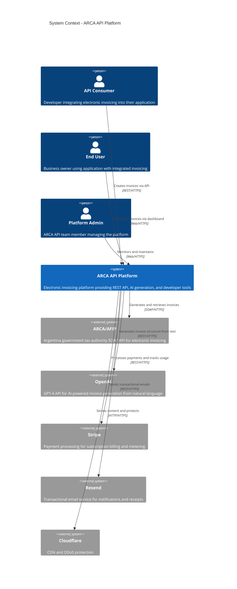

# System Context Diagram (C4 Level 1)

> **Status**: Active
> **Last Updated**: 2025-10-15
> **Author**: ARCA API Engineering Team
> **Next Review**: 2026-01-15

## Overview

The ARCA API Platform sits at the center of Argentina's electronic invoicing ecosystem, bridging the gap between modern applications and the government's legacy SOAP-based tax authority system. The platform abstracts away the complexity of ARCA/AFIP interactions while providing AI-powered intelligence, payment processing, and comprehensive developer tools.

This document defines the **System Context** (C4 Level 1), showing the ARCA API Platform as a black box and all external actors and systems it interacts with.

## Context Diagram

## External Actors

### API Consumer (Developer)

**Description**: Software developers and engineering teams integrating electronic invoicing functionality into their applications, e-commerce platforms, or business management systems.

**Demographics**:
- Role: Full-stack developers, backend engineers, freelance developers
- Location: Primarily Argentina (Buenos Aires, Córdoba, Rosario)
- Tech stack: Node.js, Python, PHP, Ruby, Go, .NET

**Interaction with ARCA API**:
- **Primary**: REST API via SDKs or direct HTTP calls
- **Authentication**: Bearer token (API key)
- **Rate limits**: 100 requests/minute (free tier), 1000 requests/minute (paid tiers)
- **Use cases**:
  - Create invoices (simple mode with AI or advanced mode with full control)
  - Retrieve invoice details and CAE (electronic authorization code)
  - Search and filter invoices
  - Configure webhooks for invoice events
  - Download PDF invoices

**Expected behavior**:
- Read API documentation
- Test in sandbox environment
- Integrate SDK into application
- Handle errors and retry logic
- Monitor usage and limits

### End User (Business Owner)

**Description**: Business owners, accountants, and administrative staff who use applications integrated with ARCA API to manage their electronic invoicing.

**Demographics**:
- Role: Small business owner, e-commerce merchant, freelancer
- Location: Argentina (all provinces)
- Tech level: Low to medium (uses web applications, not technical)

**Interaction with ARCA API**:
- **Primary**: Web dashboard (browser-based UI)
- **Authentication**: Username/password with optional 2FA
- **Use cases**:
  - View invoice history
  - Download PDF invoices
  - Export data for accounting
  - View compliance alerts (e.g., approaching monotributo limits)
  - Manage ARCA certificates

**Expected behavior**:
- Log in to dashboard
- Browse invoices visually
- Export reports for accountant
- Respond to compliance alerts

### Platform Admin

**Description**: ARCA API engineering team members and support staff responsible for platform operation, monitoring, and customer support.

**Demographics**:
- Role: DevOps engineer, support engineer, product manager
- Location: Distributed team
- Access level: Full administrative access

**Interaction with ARCA API**:
- **Primary**: Admin dashboard, infrastructure tools, monitoring systems
- **Authentication**: SSO with MFA
- **Use cases**:
  - Monitor system health and performance
  - View user activity and usage metrics
  - Troubleshoot customer issues
  - Manage feature flags
  - Review audit logs

**Expected behavior**:
- Monitor alerts and dashboards
- Respond to incidents
- Provide customer support
- Deploy updates and hotfixes

## External Systems

### ARCA/AFIP (Government Tax Authority)

**Description**: Argentina's government tax authority system (Agencia de Recaudación y Control Aduanero, formerly AFIP) that provides the official electronic invoicing service via a SOAP-based web service.

**Type**: External system (government-owned)

**Technology**: SOAP/XML over HTTPS

**Interaction patterns**:
- **Authentication**: Certificate-based (user uploads .pfx file)
- **Token management**: 11-hour token expiry, cached by ARCA API
- **Primary operations**:
  - `LoginCMS`: Authenticate with certificate, receive token
  - `FECAESolicitar`: Submit invoice for authorization, receive CAE
  - `FECAEConsultar`: Query invoice status
  - `FEParamTiposCbte`: Get invoice type catalog

**SLA**: None (government system, best-effort)

**Known issues**:
- Frequent downtime (especially month-end)
- Slow response times (1-3 seconds typical)
- Unclear error messages
- Regulatory changes with short notice

**Mitigation strategies**:
- Queue invoices for retry on failure
- Cache tokens aggressively (10-hour TTL)
- Async processing with status polling
- Comprehensive error translation to user-friendly messages

**Data exchanged**:
- **Outbound**: Invoice data (customer info, line items, taxes, payment details)
- **Inbound**: CAE (electronic authorization code), invoice number, approval status, error codes

### OpenAI (AI Service)

**Description**: OpenAI's GPT-4 API used for natural language processing to convert invoice descriptions into structured invoice data.

**Type**: External system (commercial SaaS)

**Technology**: REST API over HTTPS

**Interaction patterns**:
- **Authentication**: API key (Bearer token)
- **Primary operations**:
  - Chat completions with structured output (JSON mode)
- **Rate limits**: 10,000 tokens/minute (tier-dependent)

**SLA**: 99.9% uptime (commercial SLA)

**Use cases**:
- Parse natural language invoice description
- Infer invoice type (A, B, C) based on customer
- Calculate IVA (VAT) and other taxes
- Extract line items and quantities
- Suggest product codes

**Costs**:
- GPT-4: ~$0.03 per invoice (average)
- Target: <$500/month total OpenAI spend

**Mitigation strategies**:
- Prompt caching for common patterns
- Fallback to manual mode if API unavailable
- Token usage monitoring and caps
- Cost alerts at $400/month

**Data exchanged**:
- **Outbound**: Natural language description, user context (past invoices, preferences)
- **Inbound**: Structured JSON with invoice fields, confidence scores

### Stripe (Payment Processing)

**Description**: Payment processing platform handling subscription billing, metered usage, and payment methods for ARCA API customers.

**Type**: External system (commercial SaaS)

**Technology**: REST API over HTTPS

**Interaction patterns**:
- **Authentication**: Secret API key
- **Primary operations**:
  - Create customer
  - Create subscription
  - Record usage (metered billing)
  - Process payments
  - Handle webhooks (payment events)

**SLA**: 99.99% uptime

**Use cases**:
- Subscribe users to paid plans
- Meter invoice usage (beyond free tier)
- Process monthly billing
- Handle payment failures and retries
- Send invoices to customers

**Costs**:
- 2.9% + $0.30 per transaction
- Target: <5% of revenue

**Mitigation strategies**:
- Webhook replay for missed events
- Idempotency keys for retries
- Local cache of subscription status

**Data exchanged**:
- **Outbound**: Customer data, usage metrics, subscription changes
- **Inbound**: Payment status, subscription events, invoices

### Resend (Email Service)

**Description**: Transactional email service for sending invoice PDFs, notifications, and alerts to end users.

**Type**: External system (commercial SaaS)

**Technology**: REST API over HTTPS

**Interaction patterns**:
- **Authentication**: API key
- **Primary operations**:
  - Send email with attachments
  - Batch email sending
  - Email event tracking (delivered, opened, bounced)

**SLA**: 99.9% uptime

**Use cases**:
- Send invoice PDFs to customers
- Send compliance alerts (e.g., approaching limits)
- Send onboarding emails
- Send password reset emails

**Costs**:
- $0.001 per email
- Target: <$50/month

**Mitigation strategies**:
- Queue emails for retry on failure
- Batch sending for efficiency
- Fallback to alternative provider (SendGrid) if needed

**Data exchanged**:
- **Outbound**: Email content, recipients, attachments (PDFs)
- **Inbound**: Delivery status, open/click tracking

### Cloudflare (CDN and Security)

**Description**: Content delivery network and DDoS protection service for the ARCA API Platform.

**Type**: External system (commercial SaaS)

**Technology**: HTTP/HTTPS proxy

**Interaction patterns**:
- **Configuration**: DNS and proxy settings
- **Primary operations**:
  - Serve static assets from edge locations
  - Cache API responses (where appropriate)
  - DDoS protection and rate limiting
  - SSL/TLS termination

**SLA**: 100% uptime guarantee (per Cloudflare SLA)

**Use cases**:
- Cache dashboard static assets (JS, CSS, images)
- Protect API from DDoS attacks
- Rate limit abusive traffic
- Provide SSL certificates

**Costs**:
- Free tier: $0/month (sufficient for Year 1)
- Pro tier: $20/month (if advanced features needed)

**Mitigation strategies**:
- Multi-CDN strategy if needed (Fastly as backup)
- Origin server health checks
- Bypass cache for dynamic API calls

**Data exchanged**:
- **Inbound**: All HTTP/HTTPS requests
- **Outbound**: Cached content, proxied requests to origin

## System Boundaries

### What's Inside ARCA API Platform

The ARCA API Platform (shown as a single box in the context diagram) internally contains:

- REST API services
- Web dashboard
- AI invoice generator
- ARCA SOAP client adapter
- Webhook delivery engine
- Background job processors
- Databases (PostgreSQL, Redis)
- Message queues

For detailed internal architecture, see [02-services.md](./02-services.md) (C4 Level 2).

### What's External

All systems outside the ARCA API Platform boundary:

- ARCA/AFIP government system (not controlled by us)
- OpenAI API (commercial dependency)
- Stripe payment processing (commercial dependency)
- Email services (commercial dependency)
- CDN and security (commercial dependency)

### Integration Protocols

| Connection | Protocol | Authentication | Direction |
|------------|----------|----------------|-----------|
| Developer → ARCA API | REST/HTTPS | Bearer token (API key) | Inbound |
| End User → ARCA API | Web/HTTPS | Session cookie | Inbound |
| ARCA API → ARCA/AFIP | SOAP/HTTPS | Certificate + token | Outbound |
| ARCA API → OpenAI | REST/HTTPS | API key | Outbound |
| ARCA API → Stripe | REST/HTTPS | Secret key | Bidirectional (webhooks) |
| ARCA API → Resend | REST/HTTPS | API key | Outbound |
| All traffic → Cloudflare | HTTP/HTTPS | None (proxy) | Inbound |

## Data Flow at System Boundary

### Invoice Creation Flow (Simplified)

1. **Developer** sends invoice request to **ARCA API** via REST API
2. **ARCA API** validates request and authenticates developer
3. If simple mode: **ARCA API** calls **OpenAI** to generate invoice structure
4. **ARCA API** calls **ARCA/AFIP** to submit invoice and get CAE
5. **ARCA API** stores invoice in database
6. **ARCA API** triggers webhook to notify developer
7. **ARCA API** sends email with PDF via **Resend**
8. **ARCA API** records usage to **Stripe** for billing

### Payment Flow

1. **End User** subscribes to paid plan via dashboard
2. **ARCA API** creates subscription in **Stripe**
3. **Stripe** processes payment monthly
4. **Stripe** sends webhook to **ARCA API** with payment status
5. **ARCA API** updates user subscription status
6. If payment fails: **ARCA API** sends alert via **Resend**

### Certificate Management Flow

1. **End User** uploads ARCA certificate (.pfx file) via dashboard
2. **ARCA API** encrypts certificate with AES-256
3. **ARCA API** stores encrypted certificate in database
4. When needed: **ARCA API** decrypts certificate and authenticates with **ARCA/AFIP**
5. **ARCA API** caches ARCA token in Redis (10-hour TTL)

## Quality Attributes at System Level

### Availability

**Target**: 99.95% uptime

**Dependencies**:
- ARCA/AFIP: Best-effort (frequent downtime, no SLA)
- OpenAI: 99.9% SLA
- Stripe: 99.99% SLA
- Resend: 99.9% SLA
- Cloudflare: 100% SLA guarantee

**Strategy**: Design for ARCA downtime
- Queue invoices when ARCA unavailable
- Return 202 Accepted (processing) instead of 500 error
- Retry with exponential backoff
- Status polling endpoint for async results

### Performance

**Target**: P95 latency <200ms (excluding ARCA calls)

**Breakdown**:
- ARCA API internal processing: <100ms P95
- ARCA/AFIP call: 1-3 seconds (not counted in SLA)
- OpenAI call: 500-1500ms (simple mode only)

**Optimization**:
- Cache ARCA tokens aggressively
- Async processing for slow operations
- CDN caching for static assets
- Database query optimization

### Scalability

**Target**: 100,000 invoices/day (Year 1)

**External limits**:
- ARCA/AFIP: No documented rate limits (but frequent throttling)
- OpenAI: 10,000 tokens/minute (upgradable)
- Stripe: No practical limits for our scale
- Resend: 100 emails/second

**Strategy**:
- Horizontal scaling of ARCA API services
- Rate limiting to protect external APIs
- Queue-based throttling for ARCA calls

### Security

**Threat model**:
- Developer API keys stolen → API key rotation and rate limiting
- ARCA certificates stolen → Encryption at rest, audit logs
- DDoS attack → Cloudflare protection, rate limiting
- Data breach → Encryption at rest and transit, GDPR compliance

**Controls**:
- TLS 1.3 for all external communication
- API key hashing (bcrypt cost 12)
- Certificate encryption (AES-256)
- Audit logging for all data access

### Cost

**External costs** (Year 1 estimate):
- ARCA/AFIP: $0 (free government service)
- OpenAI: $300-500/month ($0.03 per AI-generated invoice)
- Stripe: 2.9% of revenue (if $20K MRR = ~$580/month)
- Resend: $20-50/month
- Cloudflare: $0/month (free tier)

**Total external API costs**: ~$900-1,100/month

## External Dependency SLAs

| Service | Uptime SLA | Response Time | Rate Limits | Cost |
|---------|------------|---------------|-------------|------|
| **ARCA/AFIP** | None (best-effort) | 1-3s typical, can be 10s+ | Undocumented (frequent throttling) | Free |
| **OpenAI** | 99.9% | 500-1500ms | 10K tokens/min | $0.03/invoice |
| **Stripe** | 99.99% | <100ms | No practical limit | 2.9% + $0.30 |
| **Resend** | 99.9% | <100ms | 100 emails/sec | $0.001/email |
| **Cloudflare** | 100% | <50ms (edge) | No limit | Free |

## Related Documentation

- **[Architecture Overview](./00-overview.md)**: System goals, quality attributes, and architectural approach
- **[Service Architecture](./02-services.md)**: Detailed service design (C4 Level 2)
- **[Data Architecture](./03-data-architecture.md)**: Database design and data flows
- **[Infrastructure](./04-infrastructure.md)**: Deployment and scaling
- **[API Specification](../specifications/api/openapi.yaml)**: REST API contract
- **[System Flows](../flows/system-flows.md)**: Detailed flow diagrams

---

**Review Schedule**: Quarterly
**Approval**: Tech Lead + Google Engineering Advisor
**Status**: Active
