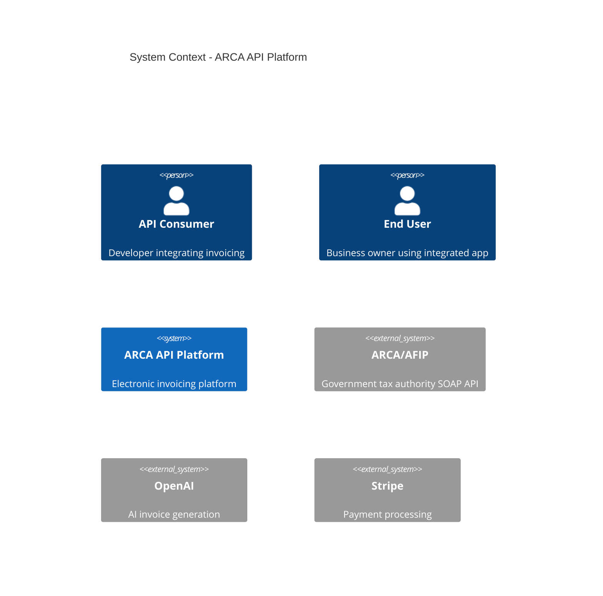

# System Context Diagram (C4 Level 1)

> **Status**: TODO - Pending completion in Task #3
>
> **Purpose**: Document system context showing ARCA API platform and all external actors/systems

## TODO

This document will be completed in **Task #3: Write Core Architecture Documents** and will include:

### Planned Content

1. **System Context Diagram**
   - Mermaid C4Context diagram showing:
     - API Consumer (developers)
     - End Users (business owners)
     - ARCA API Platform (our system)
     - External systems (ARCA/AFIP, OpenAI, Stripe, etc.)
     - All interactions and protocols

2. **External Actors**
   - API Consumers: Developers integrating invoicing
   - End Users: Business owners using integrated apps
   - Internal Users: Dashboard users

3. **External Systems**
   - ARCA/AFIP: Government SOAP API
   - OpenAI: AI invoice generation
   - Stripe: Payment processing
   - Email providers: Transactional emails
   - Cloudflare: CDN and security

4. **System Boundaries**
   - What's inside ARCA API platform
   - What's external dependencies
   - Integration protocols (REST, SOAP, webhooks)

5. **Quality Attributes at System Level**
   - Availability: 99.95% uptime
   - Performance: P95 latency <200ms
   - Scalability: 100K invoices/day
   - Security: End-to-end encryption

## Template Reference

See PRD Appendix: "Architecture Documentation Template (C4 Model)" - Level 1
- Location: `.claude/prds/engineering-documentation.md` lines 927-963

Example structure:
```markdown
## Context Diagram

```

---

**Status**: Draft/Placeholder
**Assigned To**: Task #3
**Expected Completion**: Week 1 (Days 2-3)
