# Service Architecture (C4 Level 2 - Container Diagram)

> Last Updated: 2025-10-15
> Status: Active
> Version: 1.0

## Overview

ARCA API is built as a distributed microservices platform, where each service (container) has a specific, well-defined responsibility. This document provides the C4 Level 2 (Container) view, showing the internal architecture of the ARCA API system, including all services, data stores, and their interactions.

The architecture follows these principles:
- **Single Responsibility**: Each service owns one domain or capability
- **Loose Coupling**: Services communicate via REST APIs and message queues
- **Independent Scalability**: Each service can scale independently based on load
- **Technology Flexibility**: Services use the optimal technology stack for their purpose
- **Resilience**: Circuit breakers and retry mechanisms for external dependencies

## Container Diagram

The following diagram shows all containers (services, applications, and data stores) within the ARCA API system boundary, along with external systems and actors.

```mermaid
C4Container
    title Container Diagram - ARCA API Platform

    Person(developer, "API Consumer", "Developer using SDKs or direct API calls")
    Person(enduser, "End User", "Business owner managing invoices")
    Person(assistant, "AI Assistant", "Claude Code, Cursor, or other LLM tools")

    Container_Boundary(arca_system, "ARCA API Platform") {
        Container(dashboard, "Dashboard", "Next.js 14 + React", "User interface for invoice management, analytics, and account settings")
        Container(api, "REST API Core", "Node.js 20 + Express + TypeScript", "Main API gateway, orchestrates business logic, handles all client requests")
        Container(ai, "AI Service", "Python 3.11 + FastAPI", "Natural language to structured invoice generation using GPT-4")
        Container(webhooks, "Webhook Engine", "Node.js + BullMQ", "Reliable event delivery with retries and exponential backoff")
        Container(mcp, "MCP Server", "Node.js + Anthropic MCP", "LLM assistant integration, provides API docs and tools")
        Container(analytics, "Analytics Service", "Node.js", "Metrics aggregation, revenue predictions, usage statistics")
        Container(integrations, "Integration Connectors", "Node.js", "Third-party platform sync (Mercado Libre, Shopify, Tienda Nube)")

        ContainerDb(postgres, "Primary Database", "PostgreSQL 15", "Invoices, users, API keys, certificates, transactions")
        ContainerDb(redis, "Cache & Queue", "Redis 7", "ARCA tokens, rate limits, sessions, job queue")
        ContainerDb(storage, "File Storage", "S3/Cloudflare R2", "Invoice PDFs, user uploads, generated documents")
    }

    System_Ext(arca, "ARCA API", "Argentine government SOAP API for electronic invoicing")
    System_Ext(openai, "OpenAI", "GPT-4 API for AI invoice generation")
    System_Ext(stripe, "Stripe", "Payment processing for subscriptions")
    System_Ext(email, "Email Service", "SendGrid/Resend for transactional emails")
    System_Ext(marketplaces, "E-commerce Platforms", "Mercado Libre, Shopify, Tienda Nube APIs")

    Rel(developer, api, "API calls", "REST/HTTPS")
    Rel(enduser, dashboard, "Uses", "HTTPS")
    Rel(assistant, mcp, "Requests tools", "MCP/HTTPS")

    Rel(dashboard, api, "API calls", "REST/HTTPS")
    Rel(mcp, api, "Fetch docs/examples", "HTTP")

    Rel(api, arca, "Invoice submission", "SOAP/HTTPS + X.509 cert")
    Rel(api, postgres, "Read/Write", "SQL/TCP")
    Rel(api, redis, "Cache tokens, rate limits", "Redis protocol")
    Rel(api, redis, "Publish jobs", "Redis/BullMQ")
    Rel(api, storage, "Store/retrieve PDFs", "S3 API")
    Rel(api, ai, "Generate invoice", "REST/HTTPS")
    Rel(api, stripe, "Process payments", "REST/HTTPS")
    Rel(api, email, "Send notifications", "SMTP/API")

    Rel(ai, openai, "NLP processing", "REST/HTTPS")
    Rel(ai, postgres, "Read user context", "SQL/TCP (read-only)")

    Rel(webhooks, redis, "Consume jobs", "Redis/BullMQ")
    Rel(webhooks, postgres, "Log deliveries", "SQL/TCP")
    Rel(webhooks, developer, "POST events", "HTTPS webhook")

    Rel(analytics, postgres, "Aggregate data", "SQL/TCP (read replica)")
    Rel(analytics, redis, "Cache results", "Redis protocol")

    Rel(integrations, marketplaces, "Sync orders", "REST/HTTPS")
    Rel(integrations, postgres, "Store integration state", "SQL/TCP")
    Rel(integrations, api, "Trigger invoice creation", "REST/HTTPS")

UpdateLayoutConfig($c4ShapeInRow="3", $c4BoundaryInRow="1")
```



## Service Catalog

### 1. REST API Core

**Responsibility**: Central orchestration service that handles all external API requests, implements business logic, and coordinates between other services.

**Technology Stack**:
- Runtime: Node.js 20 LTS
- Framework: Express.js or Fastify (TypeScript)
- Key Libraries:
  - `node-soap` - ARCA SOAP client
  - `jsonwebtoken` - Authentication
  - `zod` - Request validation
  - `winston` - Structured logging

**Scaling Strategy**:
- **Type**: Horizontal (stateless)
- **Auto-scaling**: CPU > 70% or Request Rate > 1000 req/min
- **Target**: 3-10 instances depending on load
- **Load Balancing**: Application Load Balancer with health checks

**Data Access Patterns**:
- **PostgreSQL**: Read/write all tables (invoices, users, api_keys, certificates)
- **Redis**:
  - Cache ARCA tokens (12-hour TTL)
  - Rate limiting counters (per IP/user)
  - Session storage (JWT refresh tokens)
- **S3/R2**: Upload PDFs, fetch for email delivery
- **Queue**: Publish jobs for webhooks, PDF generation, email notifications

**API Surface**:
- Public REST API (`/v1/*`)
- Authentication endpoints (`/v1/auth/*`)
- Invoice management (`/v1/invoices/*`)
- Point of sale management (`/v1/pos/*`)
- Analytics endpoints (`/v1/analytics/*`)

**Performance Targets**:
- P95 latency: <200ms (excluding ARCA calls)
- P95 ARCA submission: <5s
- Throughput: 1,200 req/min peak (100K invoices/day)

---

### 2. Dashboard

**Responsibility**: Web-based user interface for managing invoices, API keys, team members, and viewing analytics.

**Technology Stack**:
- Framework: Next.js 14 (App Router)
- UI Library: React 18
- Styling: Tailwind CSS + shadcn/ui components
- State Management: Zustand + React Query
- Forms: React Hook Form + Zod validation

**Scaling Strategy**:
- **Type**: Static site deployment (CDN)
- **Hosting**: Vercel or Cloudflare Pages
- **Edge Caching**: All static assets cached globally
- **No server-side scaling needed** (API calls handled by REST API Core)

**Data Access Patterns**:
- **No direct database access** - all data via REST API Core
- Client-side caching with React Query (5-minute stale time)
- Optimistic updates for better UX

**Key Features**:
- Invoice list with search, filters, pagination
- Invoice creation wizard (simple mode + advanced mode)
- API key generation and management
- Usage analytics dashboard (charts, metrics)
- Account settings and billing
- Team member management (paid tiers)

**Performance Targets**:
- First Contentful Paint: <1.5s
- Time to Interactive: <3s
- Lighthouse Score: >90

---

### 3. AI Service

**Responsibility**: Transform natural language descriptions into structured, AFIP-compliant invoice data using large language models.

**Technology Stack**:
- Runtime: Python 3.11+
- Framework: FastAPI (async)
- AI: OpenAI GPT-4 API
- Validation: Pydantic models
- Caching: Redis (repeated queries)

**Scaling Strategy**:
- **Type**: Horizontal (async workers)
- **Processing**: Queue-based (BullMQ jobs)
- **Auto-scaling**: Queue depth > 100 jobs
- **Target**: 2-5 instances depending on AI load

**Data Access Patterns**:
- **PostgreSQL**: Read-only access to:
  - User preferences (default client info, tax settings)
  - Previous invoices (context for better suggestions)
  - Product catalog (for item matching)
- **OpenAI API**: REST calls with rate limiting and retry logic
- **Redis**: Cache repeated queries (same description = same result)

**API Contract**:
```typescript
POST /internal/ai/generate-invoice
Authorization: Internal-Service-Token

Request:
{
  "description": "Factura para Juan Pérez por 3 horas de consultoría a $5000/hora",
  "user_id": "uuid",
  "context": { /* user preferences */ }
}

Response (200):
{
  "invoice": {
    "tipo_comprobante": 1,
    "cliente": { /* AFIP client data */ },
    "items": [ /* invoice items */ ],
    "tributos": [ /* calculated taxes */ ],
    "confidence": 0.95
  },
  "ai_metadata": {
    "model": "gpt-4",
    "tokens_used": 450,
    "processing_time_ms": 1200
  }
}
```

**Performance Targets**:
- P95 latency: <3s
- Timeout: 5s (fail gracefully)
- Confidence threshold: >0.85 (otherwise return error)

---

### 4. Webhook Engine

**Responsibility**: Reliable delivery of webhook events to customer endpoints with automatic retries and exponential backoff.

**Technology Stack**:
- Runtime: Node.js 20
- Queue: BullMQ (Redis-backed)
- HTTP Client: Axios with retry logic
- Signature: HMAC-SHA256 for webhook verification

**Scaling Strategy**:
- **Type**: Horizontal (queue consumers)
- **Workers**: 2-8 instances depending on event volume
- **Concurrency**: 10 jobs per worker
- **Auto-scaling**: Queue latency > 30 seconds

**Data Access Patterns**:
- **Redis Queue**: Consume webhook jobs
- **PostgreSQL**:
  - Read webhook subscriptions (URL, secret, events)
  - Write delivery logs (timestamp, status, response)
- **Customer endpoints**: HTTPS POST requests

**Job Format**:
```typescript
{
  "event": "invoice.created" | "invoice.approved" | "invoice.failed",
  "webhook_url": "https://customer.com/webhooks/arca",
  "payload": { /* event data */ },
  "signature_secret": "webhook_secret_xyz",
  "retry_count": 0,
  "max_retries": 3
}
```

**Delivery Protocol**:
```
POST {webhook_url}
X-ARCA-Signature: HMAC-SHA256(payload, secret)
X-ARCA-Event: invoice.created
X-ARCA-Delivery-ID: uuid
Content-Type: application/json

{payload}
```

**Retry Strategy**:
- **2xx response**: Success, mark delivered
- **4xx response**: Client error, mark failed (no retry)
- **5xx response or timeout**: Retry with exponential backoff
  - Retry 1: After 1 minute
  - Retry 2: After 5 minutes
  - Retry 3: After 15 minutes
- **After 3 failures**: Mark as permanently failed, notify user via email

**Performance Targets**:
- Delivery latency: <30s for immediate events
- Success rate: >99% (excluding client errors)
- Queue processing: 100 events/second

---

### 5. MCP Server

**Responsibility**: Provide API documentation and tools to LLM assistants (Claude Code, Cursor) via the Model Context Protocol.

**Technology Stack**:
- Runtime: Node.js 20
- Protocol: Anthropic MCP specification
- Data Sources:
  - OpenAPI spec (from REST API Core)
  - Example code snippets
  - Integration guides

**Scaling Strategy**:
- **Type**: Vertical (low volume)
- **Instances**: 1-2 (redundancy only)
- **No auto-scaling needed** (developer tool, low traffic)

**Data Access Patterns**:
- **Read-only**: Fetches documentation from REST API Core
- **No database access** (stateless documentation server)
- Serves static OpenAPI specs and examples

**MCP Tools Exposed**:
```json
{
  "tools": [
    {
      "name": "search_api_docs",
      "description": "Search ARCA API documentation",
      "parameters": { "query": "string" }
    },
    {
      "name": "get_endpoint_details",
      "description": "Get detailed info about an API endpoint",
      "parameters": { "endpoint": "/v1/invoices" }
    },
    {
      "name": "generate_code_example",
      "description": "Generate SDK code example",
      "parameters": { "language": "js|python|php", "operation": "string" }
    }
  ]
}
```

**Performance Targets**:
- Response time: <100ms
- Availability: 99.9% (non-critical service)

---

### 6. Analytics Service

**Responsibility**: Aggregate invoice data, calculate metrics, generate reports, and provide predictive insights.

**Technology Stack**:
- Runtime: Node.js 20 (or Python for ML features)
- Scheduling: node-cron for periodic aggregation
- Visualization: Data exposed via REST API Core
- Future: scikit-learn for predictions

**Scaling Strategy**:
- **Type**: Vertical (CPU-intensive batch jobs)
- **Instances**: 1-2 (master-worker pattern)
- **Batch Processing**: Runs hourly/daily aggregations

**Data Access Patterns**:
- **PostgreSQL**:
  - Read replica for analytics queries (avoid impacting main DB)
  - Write to `daily_stats` and `monthly_stats` tables
- **Redis**: Cache aggregated results (1-hour TTL)

**Analytics Computed**:
- Daily/weekly/monthly invoice counts
- Revenue trends and predictions
- Invoice approval rates
- Average submission time
- Top clients (by invoice volume)
- Tax breakdowns (IVA collected, retentions)
- Usage by invoice type (A, B, C)

**Aggregation Jobs**:
```typescript
// Hourly job
- Update real-time stats (invoices today, this week)
- Calculate current month revenue

// Daily job (2 AM)
- Aggregate previous day metrics
- Update user quotas (free tier limits)
- Generate daily reports

// Monthly job (1st of month)
- Generate monthly reports
- Calculate predictions for next month
- Update plan usage warnings
```

**Performance Targets**:
- Query response time: <500ms (cached)
- Aggregation job duration: <5 minutes
- Data freshness: <1 hour for real-time stats

---

### 7. Integration Connectors

**Responsibility**: Synchronize orders and sales data from third-party e-commerce platforms and marketplaces, automatically creating invoices.

**Technology Stack**:
- Runtime: Node.js 20
- Platform SDKs:
  - Mercado Libre Node.js SDK
  - Shopify API Node.js client
  - Tienda Nube REST API
- OAuth: Platform-specific OAuth flows

**Scaling Strategy**:
- **Type**: Horizontal (per-integration workers)
- **Workers**: Separate process per platform
- **Polling**: Every 5-15 minutes per connected store
- **Webhooks**: Real-time when supported by platform

**Data Access Patterns**:
- **PostgreSQL**:
  - Read/write `integrations` table (OAuth tokens, last sync timestamp)
  - Write `integration_logs` (sync history, errors)
- **REST API Core**: Call invoice creation endpoint
- **Platform APIs**: Fetch orders, products, customers

**Supported Integrations**:

**Mercado Libre**:
- Sync: New orders → create invoices automatically
- Mapping: ML order → ARCA invoice fields
- Frequency: Webhook + 15-minute polling fallback

**Shopify**:
- Sync: Completed orders → invoices
- Mapping: Shopify customer → AFIP client data
- Frequency: Webhook

**Tienda Nube**:
- Sync: Paid orders → invoices
- Mapping: TN order → invoice items
- Frequency: 10-minute polling

**Integration Flow**:
```
1. User connects platform via OAuth
2. Store credentials + webhook URL in DB
3. Worker polls for new orders (or receives webhook)
4. Transform order → invoice payload
5. Call REST API Core to create invoice
6. Submit to AFIP automatically
7. Update platform order with CAE number
```

**Performance Targets**:
- Sync latency: <5 minutes from order creation
- Error rate: <1% (with retries)
- Concurrent syncs: 50+ stores

---

### 8. ARCA SOAP Client

**Responsibility**: Handle all SOAP/XML communication with the ARCA government API, including authentication and invoice submission.

**Implementation**: Embedded library (not a separate service) used by REST API Core

**Technology Stack**:
- Library: `node-soap` for SOAP client
- XML Parsing: `xml2js`
- Certificate Handling: Node.js `crypto` module
- Signature: XML Digital Signature (X.509)

**Key Operations**:

**Authentication (WSAA)**:
```typescript
1. Generate Login Ticket Request (TRA)
   - Service: wsfe (invoice service)
   - Unique ID + Generation timestamp
   - Expiration: 12 hours from now

2. Sign TRA with X.509 certificate

3. Send to WSAA endpoint

4. Receive Token + Sign (valid 12 hours)

5. Cache in Redis with TTL
```

**Invoice Submission (WSFEV1)**:
```typescript
1. Prepare FECAESolicitar request:
   - Auth: Token + Sign from WSAA
   - Invoice data: Type, client, items, taxes
   - Point of sale + invoice number

2. Sign request with certificate

3. Submit to WSFEV1 endpoint

4. Parse response:
   - Success: CAE number, expiration, PDF URL
   - Error: Error code, description in Spanish

5. Update invoice status in DB
```

**Scaling Strategy**:
- **Embedded in REST API Core** (scales with API)
- Certificate operations are CPU-intensive
- Token caching critical for performance

**Data Access Patterns**:
- **Redis**:
  - Cache WSAA tokens (12-hour TTL)
  - Store certificate passwords (encrypted)
- **PostgreSQL**:
  - Read user certificates (`.pem` files as text)
  - Store ARCA response logs

**Error Handling**:
```typescript
Common ARCA Errors:
- 10001: Invalid certificate → Retry with new token
- 10002: Expired token → Refresh from WSAA
- 1000: Duplicate invoice number → Return specific error
- 602: Invalid CUIT → Validation error
```

**Performance Targets**:
- Authentication: <2s (cached <10ms)
- Invoice submission: <3-5s (ARCA dependent)
- Certificate operations: <100ms

---

## Data Stores

### PostgreSQL (Primary Database)

**Purpose**: Persistent storage for all transactional and relational data.

**Version**: PostgreSQL 15+

**Key Tables**:
- `users` - User accounts, authentication
- `api_keys` - API keys with hashed values
- `invoices` - Invoice records, status, ARCA responses
- `invoice_items` - Line items (products/services)
- `clients` - Customer information for invoices
- `points_of_sale` - AFIP points of sale
- `certificates` - X.509 certificates for ARCA
- `webhook_subscriptions` - Webhook endpoints and secrets
- `webhook_deliveries` - Delivery logs and retries
- `integrations` - Third-party platform connections
- `daily_stats` / `monthly_stats` - Aggregated analytics
- `audit_logs` - All data access and changes

**Scaling Strategy**:
- **Primary**: Single writer instance
- **Replicas**: 1-2 read replicas for analytics queries
- **Connection Pooling**: PgBouncer (max 100 connections)
- **Partitioning**: `invoices` table partitioned by month (for large volumes)

**Backup Strategy**:
- Automated daily backups (retained 30 days)
- Point-in-time recovery (5-minute granularity)
- Cross-region replication for disaster recovery

**Performance**:
- P95 query latency: <50ms
- Connection pool: 20-50 active connections
- Size estimate: 100GB/year (100K invoices/day)

---

### Redis (Cache & Queue)

**Purpose**: In-memory caching, session storage, rate limiting, and job queue.

**Version**: Redis 7+

**Use Cases**:

**1. Caching**:
- ARCA tokens (12-hour TTL)
- User sessions (7-day TTL)
- API response caching (5-minute TTL)
- Analytics results (1-hour TTL)

**2. Rate Limiting**:
- Per IP: 100 requests/minute
- Per user: 1,000 requests/hour
- Per endpoint: Custom limits

**3. Job Queue** (BullMQ):
- Webhook delivery jobs
- PDF generation jobs
- Email notification jobs
- Integration sync jobs

**Data Structures**:
```
Keys:
- token:arca:{cuit} → WSAA token (12h TTL)
- rate:ip:{ip} → Request counter (1min TTL)
- rate:user:{user_id} → Request counter (1h TTL)
- session:{session_id} → JWT refresh token (7d TTL)
- cache:analytics:{key} → Aggregated stats (1h TTL)

Queues (BullMQ):
- webhooks → Webhook delivery jobs
- pdf-generation → PDF creation jobs
- emails → Email sending jobs
- integrations → Platform sync jobs
```

**Scaling Strategy**:
- **Single instance** for MVP (Redis Sentinel for HA)
- **Redis Cluster** for production (sharding if needed)
- **Persistence**: RDB + AOF for durability

**Performance**:
- P95 latency: <2ms
- Memory: 4-8GB
- Eviction policy: `allkeys-lru` for cache keys

---

### S3/Cloudflare R2 (File Storage)

**Purpose**: Object storage for invoice PDFs and user-uploaded files.

**Technology**: S3-compatible API (AWS S3 or Cloudflare R2)

**Stored Files**:
- Invoice PDFs (generated after ARCA approval)
- User-uploaded logos (for invoice branding)
- Certificate files (`.pem` format)
- Monthly reports (CSV, Excel exports)

**Storage Structure**:
```
Bucket: arca-api-production
├── invoices/
│   ├── {user_id}/
│   │   ├── {invoice_id}.pdf
│   │   └── ...
├── logos/
│   ├── {user_id}/logo.png
├── certificates/
│   ├── {user_id}/cert.pem
│   └── {user_id}/key.pem
├── exports/
    ├── {user_id}/{export_id}.csv
```

**Access Control**:
- **Private by default** (authenticated access only)
- **Pre-signed URLs** for temporary public access (1-hour expiration)
- **Encryption at rest**: AES-256

**Scaling Strategy**:
- **Unlimited storage** (object storage)
- **CDN**: CloudFlare CDN for PDF delivery
- **Lifecycle policies**: Archive old invoices to cheaper storage after 2 years

**Performance**:
- Upload latency: <1s for 1MB file
- Download latency: <500ms (CDN cached)
- Size estimate: 500GB/year (100K invoices × 5KB average PDF)

---

## Service Communication Patterns

### Synchronous Communication (REST)

Used for request-response interactions requiring immediate results.

**Pattern**: HTTP/HTTPS + JSON

**Examples**:
- Dashboard → REST API Core (user-facing operations)
- REST API Core → AI Service (invoice generation)
- Integrations → REST API Core (create invoice)
- MCP Server → REST API Core (fetch documentation)

**Characteristics**:
- Timeout: 5-30 seconds
- Retry: Exponential backoff for 5xx errors
- Circuit breaker: Open after 5 consecutive failures

---

### Asynchronous Communication (Queue)

Used for background tasks and event-driven workflows.

**Pattern**: Redis + BullMQ (job queue)

**Examples**:
- REST API Core → Webhook Engine (via queue)
- REST API Core → PDF Generation (via queue)
- REST API Core → Email Service (via queue)

**Queue Configuration**:
```typescript
Queue: webhooks
- Priority: High
- Retry: 3 attempts with exponential backoff
- Timeout: 30 seconds per job
- Concurrency: 10 jobs per worker

Queue: pdf-generation
- Priority: Medium
- Retry: 2 attempts
- Timeout: 10 seconds per job
- Concurrency: 5 jobs per worker
```

**Characteristics**:
- **At-least-once delivery** (idempotency required)
- **Dead Letter Queue** for failed jobs after max retries
- **Monitoring**: Queue depth, processing time, failure rate

---

### Internal Authentication

Services authenticate with each other using internal service tokens.

**Method**: Shared secret + JWT

**Token Format**:
```typescript
{
  "iss": "rest-api-core",
  "aud": "ai-service",
  "sub": "internal",
  "iat": 1234567890,
  "exp": 1234567950  // 60 seconds
}
```

**Security**:
- Short-lived tokens (1-minute expiration)
- Network-level isolation (VPC/private network)
- No public exposure of internal APIs

---

## Deployment Architecture

### Container Orchestration

**Platform**: Docker + Kubernetes (or AWS ECS)

**Services Deployment**:
- Each service: Separate container image
- Independent deployment pipelines
- Rolling updates with zero downtime
- Health checks for readiness/liveness

**Resource Allocation**:
```yaml
REST API Core:
  replicas: 3-10 (auto-scale)
  cpu: 1 core / instance
  memory: 2GB / instance

AI Service:
  replicas: 2-5 (auto-scale)
  cpu: 2 cores / instance
  memory: 4GB / instance

Webhook Engine:
  replicas: 2-8 (auto-scale)
  cpu: 0.5 core / instance
  memory: 1GB / instance

Dashboard:
  Static site (CDN, no server resources)

MCP Server:
  replicas: 1-2 (fixed)
  cpu: 0.5 core / instance
  memory: 512MB / instance

Analytics:
  replicas: 1-2 (fixed)
  cpu: 2 cores / instance
  memory: 4GB / instance

Integrations:
  replicas: 2-4 (auto-scale)
  cpu: 1 core / instance
  memory: 2GB / instance
```

---

## Observability & Monitoring

### Metrics (Prometheus)

**Service-Level Metrics**:
- Request rate (per service, per endpoint)
- Request duration (P50, P95, P99)
- Error rate (4xx, 5xx responses)
- Active connections
- Queue depth and processing time

**Business Metrics**:
- Invoices created per minute
- ARCA submission success rate
- Webhook delivery success rate
- AI generation accuracy
- Integration sync latency

### Logging (Structured JSON)

**Log Aggregation**: ELK Stack or CloudWatch Logs

**Log Levels**:
- ERROR: Failures requiring attention
- WARN: Degraded performance, retries
- INFO: Significant business events (invoice created, submitted)
- DEBUG: Detailed debugging info (disabled in production)

**Logged Events**:
```json
{
  "timestamp": "2025-10-15T10:30:00Z",
  "level": "INFO",
  "service": "rest-api-core",
  "trace_id": "abc123",
  "event": "invoice.created",
  "user_id": "uuid",
  "invoice_id": "uuid",
  "type": "B",
  "amount": 5000.00
}
```

### Tracing (OpenTelemetry)

**Distributed Tracing**:
- Trace requests across all services
- Identify bottlenecks and latency sources
- Correlate errors with specific service calls

**Example Trace**:
```
POST /v1/invoices → [200ms total]
  ├─ REST API Core: Validate request [10ms]
  ├─ REST API Core: Query DB for user [30ms]
  ├─ AI Service: Generate invoice [120ms]
  │  └─ OpenAI API: GPT-4 call [100ms]
  ├─ REST API Core: Save to DB [20ms]
  └─ REST API Core: Publish webhook job [10ms]
```

---

## Security Considerations

### Network Security

- **Private Network**: Services communicate via private VPC
- **No Public IPs**: Only load balancer has public IP
- **TLS Everywhere**: HTTPS for all external communication
- **Internal mTLS** (optional): Service-to-service encryption

### Data Security

- **Encryption at Rest**: AES-256 for database and file storage
- **Encryption in Transit**: TLS 1.3 minimum
- **Secret Management**: Environment variables injected securely (AWS Secrets Manager, Vault)
- **Certificate Storage**: Encrypted in database, decrypted in memory only

### Access Control

- **API Authentication**: JWT or API keys
- **Service Authentication**: Internal service tokens
- **Database Access**: Least privilege (service-specific DB users)
- **Audit Logging**: All data access logged

---

## Disaster Recovery

### Backup Strategy

- **Database**: Automated daily backups, 30-day retention
- **Redis**: RDB snapshots every 6 hours
- **S3**: Versioning enabled, cross-region replication

### Recovery Procedures

**RTO (Recovery Time Objective)**: 1 hour
**RPO (Recovery Point Objective)**: 5 minutes

**Failure Scenarios**:

1. **Single Service Failure**:
   - Auto-restart via orchestrator
   - Health checks redirect traffic
   - Recovery: <1 minute

2. **Database Failure**:
   - Failover to read replica
   - Promote replica to primary
   - Recovery: <15 minutes

3. **Full Region Outage**:
   - Activate disaster recovery region
   - Restore from cross-region backup
   - Recovery: <1 hour

---

## Performance Benchmarks

### Service Latency (P95)

| Service | Operation | Latency |
|---------|-----------|---------|
| REST API Core | List invoices | <100ms |
| REST API Core | Create invoice | <200ms |
| REST API Core | Submit to ARCA | <5s |
| AI Service | Generate invoice | <3s |
| Webhook Engine | Deliver event | <30s |
| Analytics | Fetch dashboard | <500ms |
| Integrations | Sync orders | <5min |

### Throughput

| Service | Metric | Target |
|---------|--------|--------|
| REST API Core | Requests/min | 1,200 |
| AI Service | Generations/min | 50 |
| Webhook Engine | Events/sec | 100 |
| Integrations | Stores synced | 50+ concurrent |

### Resource Utilization

| Service | CPU (avg) | Memory (avg) |
|---------|-----------|--------------|
| REST API Core | 40% | 1.2GB |
| AI Service | 30% | 2GB |
| Webhook Engine | 20% | 500MB |
| Analytics | 50% | 2.5GB |
| Integrations | 25% | 1GB |

---

## Future Enhancements

### Phase 2 (Q2 2025)
- AI Service: Support for Claude, local LLMs
- Analytics: ML-based revenue predictions
- Integrations: WooCommerce, more platforms

### Phase 3 (Q4 2025)
- Multi-region deployment (HA across regions)
- GraphQL gateway (alternative to REST)
- Mobile SDKs (iOS, Android)
- Event sourcing (audit trail improvements)

### Enterprise Features
- Multi-tenancy support
- Custom domain white-labeling
- Dedicated instances for high-volume customers
- Advanced compliance (SOC 2, ISO 27001)

---

## Related Documents

- [System Context (C4 Level 1)](./01-system-context.md) - External view of ARCA API
- [Data Architecture](./03-data-architecture.md) - Detailed database schemas and data flows
- [Infrastructure](./04-infrastructure.md) - Cloud deployment and DevOps
- [API Specifications](../specifications/api/README.md) - OpenAPI contracts
- [Service Contracts](../specifications/services/README.md) - Internal service APIs

---

**Document Status**: ✅ Complete
**Last Reviewed**: 2025-10-15
**Maintained By**: Backend Team + DevOps
**Next Review**: 2026-01-15
