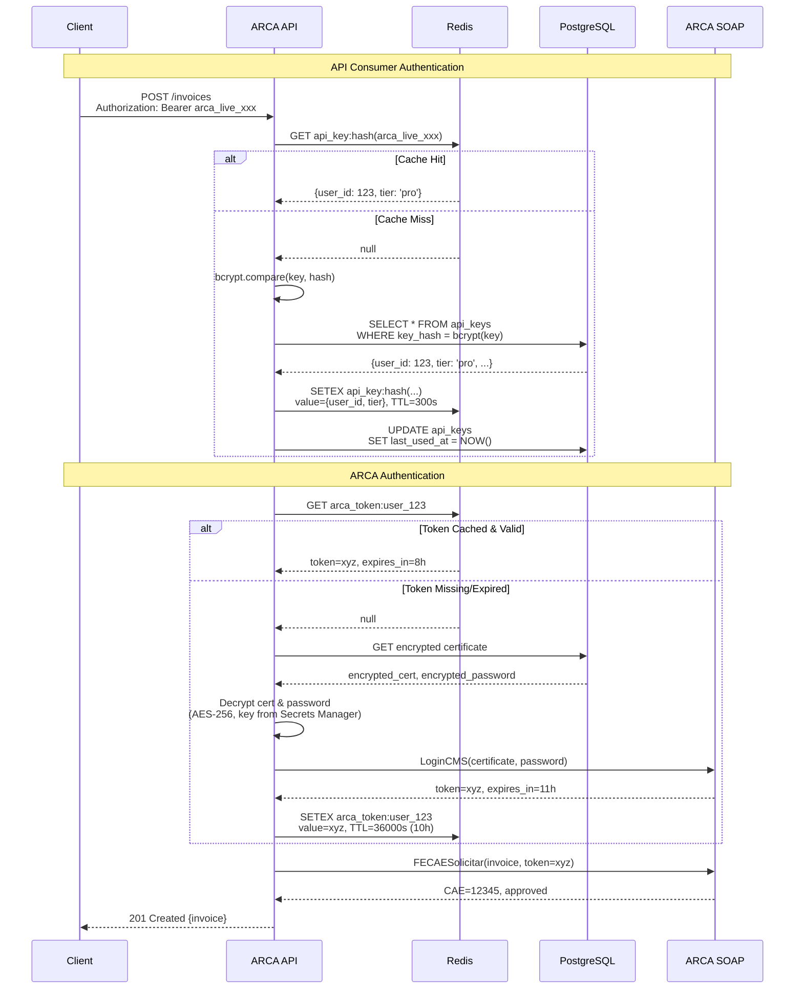

# ADR-002: Authentication Strategy for ARCA API

**Status**: Accepted
**Date**: 2025-10-15
**Author**: Tech Lead
**Reviewers**: Engineering Team, Security Team, Google Engineering Advisor

## Context

ARCA API has dual authentication requirements that must be solved:

1. **API Consumer Authentication**: Developers integrating ARCA API need secure, simple authentication for REST API calls
2. **ARCA/AFIP Integration**: Our platform must authenticate with government ARCA SOAP API using digital certificates (.pfx files)

**API Consumer Requirements:**
- Simple for developers to integrate (no OAuth complexity)
- Secure storage and transmission
- Rate limiting per tier (free vs pro)
- API key rotation support
- Revocation capability

**ARCA Integration Requirements:**
- Certificate-based authentication (.pfx files with passwords)
- Token caching (ARCA tokens expire after 12 hours)
- Automatic token renewal
- Secure certificate storage (encrypted at rest)
- Support for multiple certificates per user (different tax IDs)

## Decision

We will implement a **dual authentication system**:

### 1. API Consumer Authentication: Bearer Token (API Keys)

**Format**: `arca_live_1a2b3c4d5e6f7g8h9i0j` (prefix + random 24-char string)

**Implementation**:
- API keys stored as bcrypt hashes in PostgreSQL
- Prefix visible for debugging (`arca_live_` for production, `arca_test_` for sandbox)
- Bearer token authentication: `Authorization: Bearer arca_live_...`
- Rate limiting via Redis (sliding window)
- API key metadata: created_at, last_used_at, expires_at (optional)

**Tiers**:
- **Free tier**: 100 requests/minute, 500 invoices/month
- **Pro tier**: 1,000 requests/minute, unlimited invoices
- **Enterprise tier**: 10,000 requests/minute, dedicated support

### 2. ARCA Integration: Certificate-based with Token Caching

**Flow**:
1. User uploads .pfx certificate + password via Dashboard
2. Certificate encrypted with AES-256 (application-level) and stored in PostgreSQL (BYTEA column)
3. On first invoice creation: authenticate with ARCA using certificate → receive token (11-hour expiry)
4. Cache token in Redis with 10-hour TTL (1-hour buffer before expiry)
5. Subsequent requests use cached token
6. Auto-renewal: when token expires, re-authenticate with certificate

**Security**:
- Certificates never exposed in logs or API responses
- Encryption key stored in AWS Secrets Manager (rotated every 90 days)
- Certificate passwords stored separately (also encrypted)
- Audit logging for all certificate access

## Rationale

### Why API Keys over OAuth 2.0?

**API Keys chosen because:**
- ✅ Simpler for developers: copy-paste into code (no OAuth flow complexity)
- ✅ Suitable for server-to-server authentication (our primary use case)
- ✅ Easy to implement rate limiting and revocation
- ✅ Industry standard for API-to-API communication (Stripe, SendGrid, Twilio all use API keys)

**OAuth 2.0 rejected because:**
- ❌ Overkill for API-to-API communication (designed for delegated user access)
- ❌ Adds complexity: authorization server, token refresh flows, scopes
- ❌ Developers must implement OAuth client (higher integration barrier)
- ❌ Our use case doesn't require delegated access or multiple scopes

### Why bcrypt for API Key Hashing?

- ✅ Industry standard for password/secret hashing
- ✅ Slow by design (prevents brute-force attacks)
- ✅ Built-in salt (no separate salt storage needed)
- ✅ Configurable work factor (can increase as hardware improves)

**Alternatives considered:**
- **HMAC-SHA256**: Faster but no salt, vulnerable to rainbow tables
- **Argon2**: Newer, more secure, but less mature ecosystem in Node.js

### Why Certificate Caching for ARCA?

**Without caching:**
- Every invoice creation requires ARCA authentication (~500ms overhead)
- ARCA rate limits authentication requests (100/hour)
- Increased latency: P95 would be >3 seconds

**With caching:**
- ✅ Authentication overhead only once per 10 hours
- ✅ P95 latency reduced to <2 seconds
- ✅ Reduced load on ARCA authentication endpoints
- ✅ Cost savings: fewer ARCA calls

### Alternatives Considered

#### Alternative 1: JWT (JSON Web Tokens)

**Pros:**
- Stateless: no need to query database on every request
- Standard format with libraries in all languages
- Can include claims (user_id, tier, expires_at)

**Cons:**
- ❌ Complex rotation: JWT are stateless, so revocation requires blacklist (negates stateless benefit)
- ❌ Harder to revoke: must wait for expiry or maintain blacklist
- ❌ Token size larger than API key (sent on every request)
- ❌ Requires public/private key management for signing

**Verdict**: Statefulness (database lookup) is acceptable trade-off for simpler revocation and rotation.

#### Alternative 2: Basic Authentication

**Pros:**
- Extremely simple (username:password in header)
- No token management

**Cons:**
- ❌ Insecure over HTTP (requires HTTPS, but still visible in server logs)
- ❌ No built-in rate limiting
- ❌ Username/password sent on every request (vs bearer token)
- ❌ Not industry standard for modern APIs

**Verdict**: API keys provide better security and align with industry standards.

#### Alternative 3: Certificate Storage in AWS Secrets Manager

**Pros:**
- Dedicated secrets management service
- Automatic rotation support
- IAM-based access control

**Cons:**
- ❌ Higher cost: $0.40/secret/month + $0.05/10K API calls
- ❌ At 10K users with certificates: $4,000/month just for storage
- ❌ Additional latency (Secrets Manager API call on every invoice creation)
- ❌ Overkill: we already have encryption at rest in PostgreSQL

**Verdict**: Application-level encryption with key in Secrets Manager is cost-effective compromise.

## Implementation Details

### API Key Format

```
arca_live_1a2b3c4d5e6f7g8h9i0j
│    │    │
│    │    └─ 24-char random string (base62: a-z, A-Z, 0-9)
│    └────── environment (live/test)
└─────────── product prefix
```

**Generation**:
```typescript
import crypto from 'crypto';

function generateApiKey(env: 'live' | 'test'): string {
  const random = crypto.randomBytes(18).toString('base64')
    .replace(/[+/=]/g, '')
    .substring(0, 24);
  return `arca_${env}_${random}`;
}
```

**Storage**:
```sql
CREATE TABLE api_keys (
  id UUID PRIMARY KEY DEFAULT gen_random_uuid(),
  user_id UUID NOT NULL REFERENCES users(id),
  key_hash TEXT NOT NULL, -- bcrypt hash
  key_prefix TEXT NOT NULL, -- first 12 chars (e.g., "arca_live_1a")
  tier TEXT NOT NULL, -- 'free' | 'pro' | 'enterprise'
  created_at TIMESTAMPTZ NOT NULL DEFAULT NOW(),
  last_used_at TIMESTAMPTZ,
  expires_at TIMESTAMPTZ, -- NULL = never expires
  revoked_at TIMESTAMPTZ
);

CREATE INDEX idx_api_keys_user_id ON api_keys(user_id);
CREATE INDEX idx_api_keys_prefix ON api_keys(key_prefix); -- for debugging
```

### Authentication Flow



### Rate Limiting Implementation

**Sliding Window Algorithm** (via Redis):

```typescript
async function checkRateLimit(userId: string, tier: string): Promise<boolean> {
  const limits = { free: 100, pro: 1000, enterprise: 10000 };
  const limit = limits[tier];

  const key = `rate_limit:${userId}`;
  const now = Date.now();
  const windowMs = 60000; // 1 minute

  // Remove requests outside window
  await redis.zremrangebyscore(key, 0, now - windowMs);

  // Count requests in window
  const count = await redis.zcard(key);

  if (count >= limit) {
    return false; // Rate limited
  }

  // Add current request
  await redis.zadd(key, now, `${now}-${Math.random()}`);
  await redis.expire(key, 60); // Cleanup after 1 minute

  return true; // Allowed
}
```

### Certificate Encryption

**Encryption**:
```typescript
import crypto from 'crypto';

// Encryption key from AWS Secrets Manager (rotated every 90 days)
const ENCRYPTION_KEY = await getSecretFromSecretsManager('arca-cert-encryption-key');

function encryptCertificate(certBuffer: Buffer, password: string): {
  encryptedCert: Buffer;
  encryptedPassword: Buffer;
  iv: Buffer;
} {
  const iv = crypto.randomBytes(16);

  const certCipher = crypto.createCipheriv('aes-256-gcm', ENCRYPTION_KEY, iv);
  const encryptedCert = Buffer.concat([
    certCipher.update(certBuffer),
    certCipher.final()
  ]);

  const pwdCipher = crypto.createCipheriv('aes-256-gcm', ENCRYPTION_KEY, iv);
  const encryptedPassword = Buffer.concat([
    pwdCipher.update(Buffer.from(password, 'utf8')),
    pwdCipher.final()
  ]);

  return { encryptedCert, encryptedPassword, iv };
}
```

**Storage**:
```sql
CREATE TABLE arca_certificates (
  id UUID PRIMARY KEY DEFAULT gen_random_uuid(),
  user_id UUID NOT NULL REFERENCES users(id),
  tax_id TEXT NOT NULL, -- CUIT
  encrypted_cert BYTEA NOT NULL,
  encrypted_password BYTEA NOT NULL,
  iv BYTEA NOT NULL, -- Initialization vector for decryption
  created_at TIMESTAMPTZ NOT NULL DEFAULT NOW(),
  expires_at TIMESTAMPTZ, -- Certificate expiry (from .pfx metadata)
  UNIQUE(user_id, tax_id)
);

CREATE INDEX idx_arca_certs_user_id ON arca_certificates(user_id);
```

## Consequences

### Positive

- ✅ Simple developer experience: API keys easy to use and integrate
- ✅ Secure: bcrypt hashing prevents key leakage, certificate encryption protects sensitive data
- ✅ Performant: Redis caching reduces database load and ARCA authentication overhead
- ✅ Cost-effective: No expensive secrets management service for certificates
- ✅ Observable: API key prefix visible for debugging (last 4 chars in logs)
- ✅ Flexible: Easy to add new tiers or change rate limits
- ✅ Compliant: GDPR-ready with encryption at rest and audit logging

### Negative

- ⚠️ Stateful: API key validation requires database/cache lookup (vs stateless JWT)
- ⚠️ Certificate rotation manual: Users must upload new certificates when they expire
- ⚠️ Single point of failure: Redis cache down = slower auth (fallback to DB)
- ⚠️ Key management: Must securely manage encryption key in Secrets Manager

### Mitigation Strategies

**Stateful authentication overhead:**
- Use Redis caching (5-minute TTL) to minimize database lookups
- Monitor cache hit rate (target: >95%)
- Alert on cache misses >5%

**Certificate expiry:**
- Email notifications 30, 15, 7, 1 days before certificate expiry
- Dashboard warnings when certificate expires in <30 days
- API endpoint to check certificate expiry status

**Redis availability:**
- Use Redis Cluster or AWS ElastiCache with Multi-AZ
- Graceful degradation: if Redis down, fallback to database lookup
- Monitor Redis uptime (target: 99.9%)

**Encryption key rotation:**
- Rotate encryption key every 90 days via AWS Secrets Manager
- Re-encrypt all certificates with new key (background job)
- Zero-downtime rotation with dual-key support during transition

## Security Considerations

**API Key Security:**
- ❌ Never log full API keys (only prefix + last 4 chars)
- ❌ Never expose API keys in error messages or API responses
- ✅ Always transmit over HTTPS (TLS 1.3)
- ✅ Rate limit API key creation (max 5 keys per user)
- ✅ Audit log all API key creation, rotation, revocation

**Certificate Security:**
- ❌ Never expose certificates in logs, errors, or API responses
- ❌ Never decrypt certificates in frontend (only backend)
- ✅ Store encryption key in AWS Secrets Manager (not in code or env vars)
- ✅ Rotate encryption key every 90 days
- ✅ Audit log all certificate access (who decrypted when)
- ✅ Delete certificates immediately when user deletes account (GDPR)

**ARCA Token Security:**
- ✅ Store in Redis with TTL (auto-cleanup)
- ✅ Never expose in API responses
- ✅ Regenerate on token expiry (auto-renewal)

## Monitoring & Alerts

**Metrics to track:**
- API key validation latency (P50, P95, P99)
- Redis cache hit rate (target: >95%)
- Rate limit rejection rate (by tier)
- Certificate decryption errors
- ARCA token renewal failures
- Certificate expiry warnings sent

**Alerts:**
- Cache hit rate <90% (5-min window) → investigate Redis
- API key validation P95 >100ms (5-min window) → database/cache issue
- Certificate decryption failures >1% (1-min window) → encryption key issue
- ARCA token renewal failures >5% (5-min window) → ARCA API down

## Review & Revisit

**Review triggers:**
- Rate limiting inadequate (frequent user complaints)
- Cache hit rate consistently <90% (inefficient caching)
- Certificate rotation becomes major pain point (automate?)
- Security vulnerability discovered in bcrypt or AES-256
- Compliance requirements change (e.g., FIPS 140-2)

**Scheduled review**: End of Year 1 (Month 12, October 2026)

## References

- [OWASP API Security Top 10](https://owasp.org/www-project-api-security/)
- [Bcrypt NPM Package](https://www.npmjs.com/package/bcrypt)
- [AWS Secrets Manager](https://aws.amazon.com/secrets-manager/)
- [Redis Rate Limiting Patterns](https://redis.io/topics/distlock)
- [NIST Encryption Standards (AES-256)](https://csrc.nist.gov/publications/detail/fips/197/final)
- Internal: Security Architecture (`docs/security/security-architecture.md`)
- Internal: ARCA Integration Guide (`docs/architecture/02-services.md`)

---

**Approved by**: [Pending]
**Next review**: 2026-10-15
