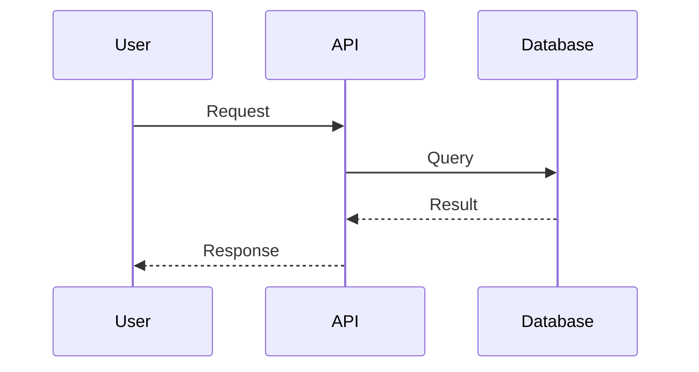
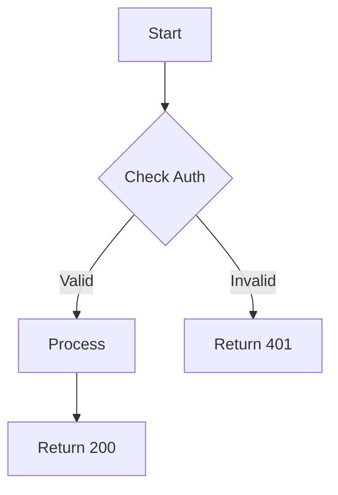
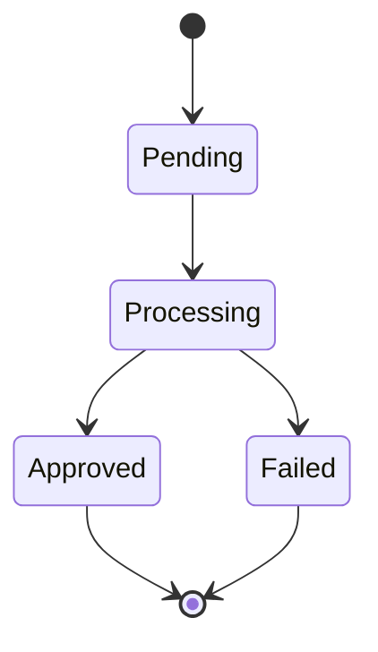

# Flow Documentation

Visual documentation of user flows, system flows, and data flows using Mermaid diagrams. This section helps engineers understand how the system works through visual representations.

## Overview

Flow documentation provides:
- **User Flows**: How end users interact with the system
- **System Flows**: How services interact internally
- **Data Flows**: How data moves through the system
- **Deployment Flows**: How code gets to production

All diagrams use Mermaid format for version control and GitHub rendering.

## Status

> **Status**: ✅ Complete - 5 Critical Flows Documented
>
> Completed in **Task #6: Create Critical Flow Diagrams**

## Flow Documents

### User Flows ✅

**Document**: [user-flows.md](./user-flows.md)

User interaction flows from client perspective:

1. **✅ Invoice Creation (Simple Mode)** - [View Flow](./user-flows.md#flow-1-invoice-creation-simple-mode)
   - Natural language input to AI Service
   - Invoice structure generation with IVA calculation
   - ARCA submission and CAE retrieval
   - Error handling and retry logic
   - **Target Latency**: P95 < 4 seconds

2. **✅ Invoice Creation (Advanced Mode)** - [View Flow](./user-flows.md#flow-2-invoice-creation-advanced-mode)
   - Structured data input (no AI processing)
   - Direct schema validation
   - ARCA submission
   - **Target Latency**: P95 < 2 seconds

3. **✅ Certificate Upload & Authentication Setup** - [View Flow](./user-flows.md#flow-3-certificate-upload--authentication-setup)
   - One-time certificate upload and encryption
   - Test authentication with ARCA
   - Token caching strategy (12h ARCA expiry, 10h cache TTL)
   - Automatic token renewal on cache miss
   - **Target Latency**: P95 < 3 seconds

### System Flows ✅

**Document**: [system-flows.md](./system-flows.md)

Internal service interaction flows:

1. **✅ ARCA Integration & Error Handling** - [View Flow](./system-flows.md#flow-4-arca-integration--error-handling)
   - Complete request validation pipeline (auth, rate limits, quotas)
   - Multi-layer error handling with proper HTTP status codes
   - Intelligent retry logic with exponential backoff
   - Circuit breaker pattern for ARCA outages
   - Background job processing for timeouts
   - **Includes**: Comprehensive flowchart with all decision points

2. **✅ Webhook Delivery with Retries** - [View Flow](./system-flows.md#flow-5-webhook-delivery-with-retries)
   - At-least-once delivery guarantee
   - HMAC-SHA256 signature for security
   - Exponential backoff retry strategy (1min, 5min, 15min)
   - Distinguishes client errors (4xx, no retry) vs server errors (5xx, retry)
   - Idempotency handling with delivery IDs
   - **Includes**: Detailed sequence diagram with all retry paths

### Planned Additional Flows (Future)

The following flows may be added in future documentation tasks:

- **User Registration & Onboarding** - Account creation and first API key
- **Webhook Configuration** - Dashboard-based webhook management
- **AI Invoice Generation Deep Dive** - Detailed AI processing internals
- **Background Job Processing** - PDF generation, email sending, analytics
- **Request Lifecycle Tracing** - Distributed tracing across services

### Data Flows (TODO - Task #5)

How data moves through the system:

1. **Invoice Data Persistence Pipeline**
   - Client request → Validation → Database
   - ARCA response → Update → Webhook
   - Audit log creation

2. **Analytics Aggregation Pipeline**
   - Real-time event streaming
   - Batch aggregation (hourly/daily)
   - Dashboard updates

3. **Compliance Alert Generation**
   - Monitoring rules
   - Alert triggers
   - Notification delivery

4. **Audit Log Collection & Storage**
   - Event capture
   - Structured logging
   - Long-term storage
   - Query interface

### Deployment Flows (TODO - Task #7)

How code gets to production:

1. **CI/CD Pipeline**
   - Commit → Test → Build → Deploy
   - Quality gates
   - Approval steps

2. **Database Migration Flow**
   - Schema change process
   - Rollback capability
   - Zero-downtime deployment

3. **Feature Flag Rollout**
   - Gradual rollout process
   - A/B testing
   - Rollback procedure

4. **Rollback Procedure**
   - Incident detection
   - Decision process
   - Rollback execution
   - Verification

## Flow Documentation Standards

### Diagram Format

All diagrams use Mermaid and include:

```markdown
## Flow Name

### Overview
[1-2 sentence description]

### Actors
- Actor 1: Description
- Actor 2: Description

### Preconditions
- Condition 1
- Condition 2

### Flow Diagram

```mermaid
[Mermaid diagram code]
```

### Step-by-Step

#### 1. Step Name (Timing)
[Detailed description]
- Success path
- Failure scenarios

[Continue for each step...]

### Success Criteria
[What defines success]

### Error Handling
[Table of errors and handling]

### Performance Targets
[Latency expectations]

### Monitoring
[What to monitor]
```

### Diagram Types

**Sequence Diagrams** (most common):


**Flowcharts** (for decision logic):


**State Diagrams** (for state machines):


## Flow Documentation Quality

All documented flows include:

✅ **Overview** - Clear 1-2 sentence description of what the flow does
✅ **Actors** - All participants in the flow (users, services, external systems)
✅ **Preconditions** - Required state before flow can execute
✅ **Mermaid Diagrams** - Visual sequence or flowchart diagrams
✅ **Step-by-Step Explanation** - Detailed narrative of each step
✅ **Error Scenarios** - Comprehensive table of errors and handling
✅ **Performance Targets** - P50, P95, P99 latency expectations
✅ **Security Considerations** - Authentication, encryption, signatures
✅ **Monitoring & Alerting** - Key metrics and alert thresholds

### Example: Flow 1 (Invoice Creation - Simple Mode)

View the complete flow: [user-flows.md#flow-1](./user-flows.md#flow-1-invoice-creation-simple-mode)

**Highlights**:
- 9-step detailed process from request to CAE
- Handles 3 response scenarios (success, validation error, timeout)
- HMAC signature verification
- Token caching with 10-hour TTL
- Background retry with exponential backoff

## Performance Expectations

Document performance for each flow:

- **Total Latency**: P50, P95, P99
- **Breakdown**: Per component/step
- **Bottlenecks**: Known slow components
- **Optimization**: Plans to improve

Example:
```
Invoice Creation Flow:
- Total: P50 2s, P95 4s, P99 6s
- Breakdown:
  - Auth + validation: 100ms
  - AI generation: 1s (P50), 2s (P95)
  - ARCA call: 1s (P50), 2s (P95)
  - Other: 100ms
```

## Error Scenarios

Document all error paths:

| Error | Status Code | Retry? | User Action |
|-------|-------------|--------|-------------|
| Invalid API key | 401 | No | Check API key |
| Rate limited | 429 | Yes | Wait or upgrade |
| Validation error | 400 | No | Fix request |
| Service down | 503 | Yes | Retry later |

## Using Flow Documentation

### For New Engineers

1. Start with user flows to understand product
2. Review system flows to understand implementation
3. Study error handling for each flow
4. Review performance expectations

### For Debugging

1. Identify which flow is failing
2. Follow step-by-step to locate failure point
3. Check error handling table for resolution
4. Review monitoring section for observability

### For Architecture Review

1. Evaluate flow complexity
2. Identify potential bottlenecks
3. Review error handling coverage
4. Assess scalability of design

## Related Documentation

- [Architecture](../architecture/README.md) - System design
- [API Specifications](../specifications/api/README.md) - API contracts
- [Operations](../operations/README.md) - Deployment and monitoring
- [Runbooks](../operations/runbooks/README.md) - Incident response

---

**Last Updated**: 2025-10-15
**Status**: ✅ Complete (5/5 critical flows documented in Task #6)
**Documentation Coverage**: User Flows (3), System Flows (2)
