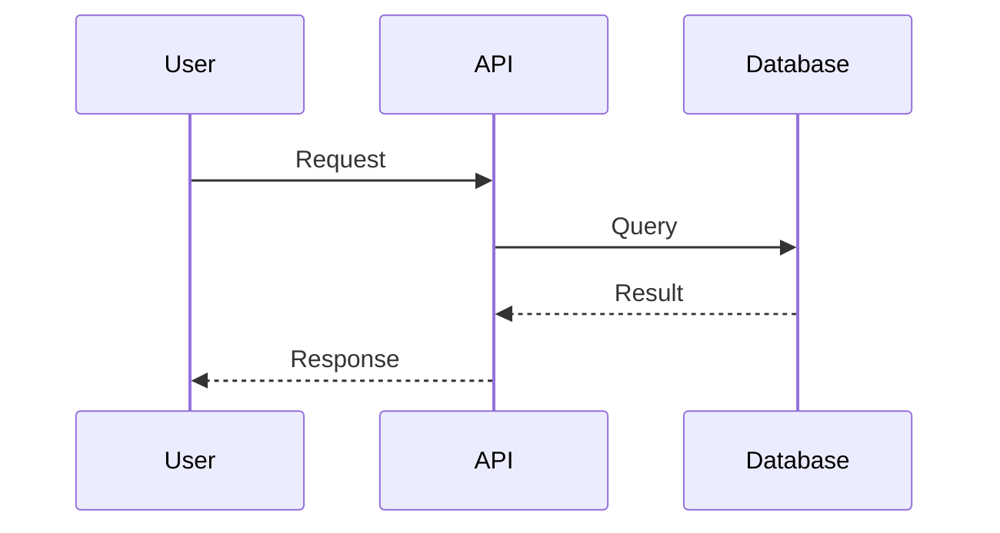
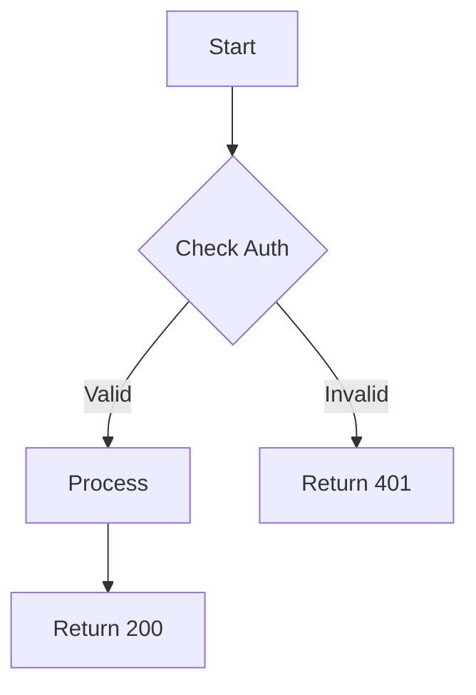
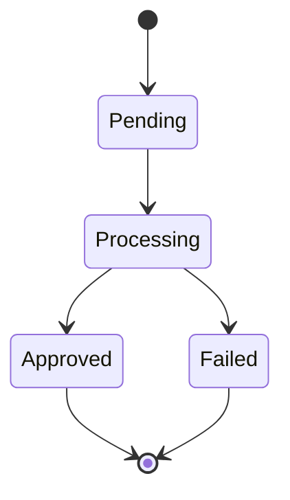

# Flow Documentation

Visual documentation of user flows, system flows, and data flows using Mermaid diagrams. This section helps engineers understand how the system works through visual representations.

## Overview

Flow documentation provides:
- **User Flows**: How end users interact with the system
- **System Flows**: How services interact internally
- **Data Flows**: How data moves through the system
- **Deployment Flows**: How code gets to production

All diagrams use Mermaid format for version control and GitHub rendering.

## Status

> **Status**: TODO - Pending completion in Task #5
>
> Flow diagrams will be created in **Task #5: Document System Flows** (Week 2-3)

## Planned Flow Documents

### User Flows (TODO - Task #5)

User interaction flows from client perspective:

1. **User Registration & Onboarding**
   - Account creation
   - Certificate upload
   - First API key generation
   - Sandbox testing

2. **Invoice Creation (Simple Mode)**
   - Natural language input
   - AI generation
   - ARCA submission
   - Result notification

3. **Invoice Creation (Advanced Mode)**
   - Structured data input
   - Validation
   - ARCA submission
   - CAE retrieval

4. **Webhook Configuration**
   - Create webhook endpoint
   - Configure events
   - Test delivery
   - Monitor status

5. **AI Invoice Generation**
   - Description parsing
   - Context enrichment
   - Structured output
   - Validation

### System Flows (TODO - Task #5)

Internal service interaction flows:

1. **Request Lifecycle**
   - Client → API Gateway → Auth → Service → Response
   - Error handling at each stage
   - Logging and tracing

2. **Authentication Flow**
   - API key validation
   - JWT generation
   - ARCA certificate authentication
   - Token caching and renewal

3. **Webhook Delivery Flow**
   - Event trigger
   - Queue processing
   - Delivery attempts
   - Retry logic with exponential backoff
   - Success/failure tracking

4. **Background Job Processing**
   - PDF generation
   - Email sending
   - Analytics aggregation
   - Cleanup tasks

5. **Error Handling & Circuit Breaker**
   - Error detection
   - Circuit breaker activation
   - Fallback behavior
   - Recovery

### Data Flows (TODO - Task #5)

How data moves through the system:

1. **Invoice Data Persistence Pipeline**
   - Client request → Validation → Database
   - ARCA response → Update → Webhook
   - Audit log creation

2. **Analytics Aggregation Pipeline**
   - Real-time event streaming
   - Batch aggregation (hourly/daily)
   - Dashboard updates

3. **Compliance Alert Generation**
   - Monitoring rules
   - Alert triggers
   - Notification delivery

4. **Audit Log Collection & Storage**
   - Event capture
   - Structured logging
   - Long-term storage
   - Query interface

### Deployment Flows (TODO - Task #7)

How code gets to production:

1. **CI/CD Pipeline**
   - Commit → Test → Build → Deploy
   - Quality gates
   - Approval steps

2. **Database Migration Flow**
   - Schema change process
   - Rollback capability
   - Zero-downtime deployment

3. **Feature Flag Rollout**
   - Gradual rollout process
   - A/B testing
   - Rollback procedure

4. **Rollback Procedure**
   - Incident detection
   - Decision process
   - Rollback execution
   - Verification

## Flow Documentation Standards

### Diagram Format

All diagrams use Mermaid and include:

```markdown
## Flow Name

### Overview
[1-2 sentence description]

### Actors
- Actor 1: Description
- Actor 2: Description

### Preconditions
- Condition 1
- Condition 2

### Flow Diagram

```mermaid
[Mermaid diagram code]
```

### Step-by-Step

#### 1. Step Name (Timing)
[Detailed description]
- Success path
- Failure scenarios

[Continue for each step...]

### Success Criteria
[What defines success]

### Error Handling
[Table of errors and handling]

### Performance Targets
[Latency expectations]

### Monitoring
[What to monitor]
```

### Diagram Types

**Sequence Diagrams** (most common):


**Flowcharts** (for decision logic):


**State Diagrams** (for state machines):


## Example Flow

> **Example**: Invoice Creation (Simple Mode)
>
> See PRD Appendix for complete example:
> - Location: `.claude/prds/engineering-documentation.md` lines 1246-1406
> - Includes: Overview, actors, preconditions, detailed diagram, step-by-step, error handling, performance targets

Key elements:
- Sequence diagram showing all actors
- Step-by-step breakdown with timings
- Error handling table
- Performance targets
- Monitoring recommendations

## Performance Expectations

Document performance for each flow:

- **Total Latency**: P50, P95, P99
- **Breakdown**: Per component/step
- **Bottlenecks**: Known slow components
- **Optimization**: Plans to improve

Example:
```
Invoice Creation Flow:
- Total: P50 2s, P95 4s, P99 6s
- Breakdown:
  - Auth + validation: 100ms
  - AI generation: 1s (P50), 2s (P95)
  - ARCA call: 1s (P50), 2s (P95)
  - Other: 100ms
```

## Error Scenarios

Document all error paths:

| Error | Status Code | Retry? | User Action |
|-------|-------------|--------|-------------|
| Invalid API key | 401 | No | Check API key |
| Rate limited | 429 | Yes | Wait or upgrade |
| Validation error | 400 | No | Fix request |
| Service down | 503 | Yes | Retry later |

## Using Flow Documentation

### For New Engineers

1. Start with user flows to understand product
2. Review system flows to understand implementation
3. Study error handling for each flow
4. Review performance expectations

### For Debugging

1. Identify which flow is failing
2. Follow step-by-step to locate failure point
3. Check error handling table for resolution
4. Review monitoring section for observability

### For Architecture Review

1. Evaluate flow complexity
2. Identify potential bottlenecks
3. Review error handling coverage
4. Assess scalability of design

## Related Documentation

- [Architecture](../architecture/README.md) - System design
- [API Specifications](../specifications/api/README.md) - API contracts
- [Operations](../operations/README.md) - Deployment and monitoring
- [Runbooks](../operations/runbooks/README.md) - Incident response

---

**Last Updated**: 2025-10-15
**Status**: Placeholder (Flows Pending Task #5)
**Next Task**: Task #5 - Document system flows (Week 2-3)
