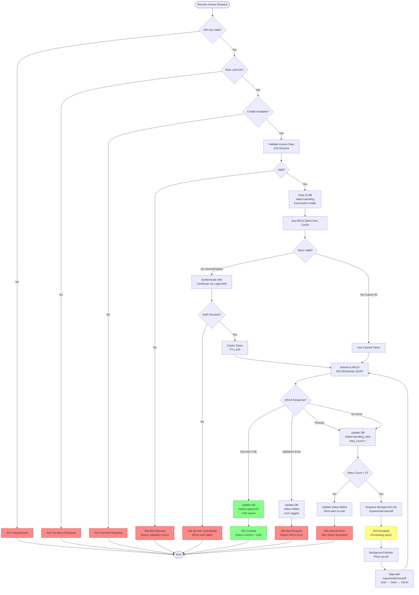

# System Flows

This document describes the two critical system-level flows for ARCA API, detailing backend processing, error handling strategies, and reliable webhook delivery mechanisms.

## Table of Contents

- [Flow 4: ARCA Integration & Error Handling](#flow-4-arca-integration--error-handling)
- [Flow 5: Webhook Delivery with Retries](#flow-5-webhook-delivery-with-retries)

---

## Flow 4: ARCA Integration & Error Handling

### Overview

This flow illustrates the complete request processing pipeline for invoice creation, including all validation gates, error scenarios, and retry logic. It demonstrates how the system handles various failure modes and ensures reliable invoice submission to ARCA/AFIP despite network issues, rate limits, and external service failures.

**Key Features**:
- Multi-layer validation (auth, rate limits, quotas, data)
- Intelligent retry logic for transient failures
- Circuit breaker pattern for ARCA outages
- Background job processing for timeouts

### Actors

- **REST API Core**: Main API gateway
- **Auth Service**: API key validation
- **Rate Limiter**: Redis-based rate limiting
- **Credit System**: Usage quota management
- **Validation Engine**: Schema validation (Zod)
- **ARCA Adapter**: SOAP/REST translation layer
- **ARCA SOAP API**: Government invoicing system
- **PostgreSQL**: Invoice storage
- **Redis**: Token cache, rate limit counters
- **Background Job Queue**: Async retry processing

### Preconditions

- User has valid API key
- ARCA API is deployed and operational
- Database and cache are available

### Decision Flow Diagram



### Step-by-Step Explanation

#### Phase 1: Request Validation (Pre-Processing)

1. **API Key Validation**
   - Lookup key in database (hashed comparison)
   - Check if key is revoked
   - **Fail → 401 Unauthorized**: Invalid or revoked key

2. **Rate Limit Check**
   - Increment Redis counter for user: `ratelimit:{user_id}:{minute}`
   - Check against plan limits (e.g., 100 requests/minute)
   - **Fail → 429 Too Many Requests**: Rate limit exceeded, includes `Retry-After` header

3. **Credit Availability**
   - Query user's remaining invoice quota from database
   - Compare against plan limit (e.g., Free tier: 500/month)
   - **Fail → 402 Payment Required**: Quota exceeded, prompts upgrade

4. **Invoice Data Validation**
   - Validate JSON against Zod schema
   - Check required fields (tipo_comprobante, items, amounts)
   - Verify data types and formats
   - **Fail → 400 Bad Request**: Returns detailed validation errors in response

#### Phase 2: Database Persistence

5. **Save Invoice (Pending State)**
   - INSERT invoice record with `status=pending`
   - Generate unique UUID for invoice_id
   - Decrement user's credit balance (atomic operation)
   - Store request timestamp and metadata

#### Phase 3: ARCA Authentication

6. **Token Cache Lookup**
   - Check Redis: `GET arca_token:{user_id}`
   - If hit: Extract token, validate TTL > 1 hour remaining
   - If miss: Proceed to certificate authentication

7. **Certificate-Based Authentication** (Cache Miss)
   - Retrieve encrypted certificate from PostgreSQL
   - Decrypt certificate using server key
   - Call ARCA LoginCMS SOAP endpoint with certificate
   - **Fail → 503 Service Unavailable**: ARCA auth service down or certificate invalid

8. **Cache Token**
   - Store token in Redis: `SET arca_token:{user_id} {token} EX 36000` (10 hours)
   - Token valid for 12 hours in ARCA, cached for 10 hours (safety margin)

#### Phase 4: ARCA Submission

9. **Submit Invoice to ARCA**
   - Convert JSON invoice to SOAP/XML format
   - Call FECAESolicitar endpoint with authentication token
   - Set timeout: 10 seconds
   - Handle three response scenarios:
     - **Success**: CAE received
     - **Validation Error**: ARCA rejected invoice (e.g., invalid CUIT)
     - **Timeout/Network Error**: No response

#### Phase 5: Response Handling

10. **Success Path (CAE Received)**
    - UPDATE invoice: `status=approved`, store CAE code
    - Generate PDF and QR code (background job)
    - Return **201 Created** with invoice details and CAE

11. **Validation Error Path (ARCA Rejected)**
    - UPDATE invoice: `status=failed`, store error message
    - Parse ARCA error code and translate to user-friendly message
    - Return **400 Bad Request** with actionable error details

12. **Timeout/Error Path (Transient Failure)**
    - UPDATE invoice: `status=pending_retry`, increment `retry_count`
    - Check retry count < 3
    - If yes: Enqueue background job with exponential backoff
    - If no: Mark as `status=failed`, send alert to user
    - Return **202 Accepted** (async processing) or **500** (max retries exceeded)

#### Phase 6: Background Retry Logic

13. **Background Job Processing**
    - Job picked up by worker from Redis queue
    - Wait according to backoff schedule:
      - Retry 1: Wait 1 minute
      - Retry 2: Wait 5 minutes
      - Retry 3: Wait 15 minutes
    - Re-submit invoice to ARCA (goto step 9)
    - Update invoice status based on result
    - If all retries fail: Send email notification to user

### Error Scenarios & HTTP Status Codes

| HTTP Status | Error Code | Scenario | Cause | Client Action |
|-------------|------------|----------|-------|---------------|
| **401** | `UNAUTHORIZED` | Invalid API key | Key doesn't exist, is revoked, or malformed | Regenerate API key in dashboard |
| **402** | `PAYMENT_REQUIRED` | Quota exceeded | User has no invoices remaining in plan | Upgrade plan or wait for monthly reset |
| **429** | `RATE_LIMIT_EXCEEDED` | Too many requests | More than 100 req/min (varies by plan) | Implement exponential backoff, reduce rate |
| **400** | `VALIDATION_ERROR` | Invalid invoice data | Missing fields, wrong types, or ARCA validation failed | Fix invoice data per error message |
| **400** | `ARCA_VALIDATION_FAILED` | ARCA rejected invoice | Invalid CUIT, wrong invoice type, tax calculation error | Verify customer data, recalculate taxes |
| **503** | `ARCA_UNAVAILABLE` | ARCA authentication failed | ARCA LoginCMS endpoint down or slow | Retry request, check ARCA status page |
| **503** | `ARCA_TIMEOUT` | ARCA didn't respond | Network issue or ARCA overloaded | System auto-retries in background |
| **500** | `MAX_RETRIES_EXCEEDED` | All retries failed | Persistent ARCA outage or configuration issue | Contact support, check ARCA status |
| **500** | `INTERNAL_ERROR` | Unexpected server error | Database failure, uncaught exception | Retry request, contact support if persists |

### Retry Strategy

```
Exponential Backoff Schedule:
┌──────────────────────────────────────────────────┐
│ Attempt 1 (Immediate): ARCA submission          │
│   ↓ Timeout/5xx Error                            │
│ Wait 1 minute                                    │
│   ↓                                              │
│ Attempt 2: Retry submission                     │
│   ↓ Timeout/5xx Error                            │
│ Wait 5 minutes                                   │
│   ↓                                              │
│ Attempt 3: Final retry                          │
│   ↓ Timeout/5xx Error                            │
│ Mark as Failed, Alert User                      │
└──────────────────────────────────────────────────┘
```

**Backoff Rationale**:
- **1 minute**: Catches brief network hiccups
- **5 minutes**: Allows ARCA services to recover from momentary overload
- **15 minutes**: Final attempt for extended outages
- **Total window**: ~21 minutes max before final failure

**No Retry Scenarios** (Immediate failure):
- 4xx client errors (bad data) - user must fix and re-submit
- 401 authentication errors - user must fix credentials
- 402 quota errors - user must upgrade or wait

### Circuit Breaker Pattern

To prevent overwhelming ARCA during outages:

```
Circuit States:
┌─────────────────────────────────────────────────┐
│ CLOSED (Normal): All requests proceed           │
│   ↓ 5 consecutive ARCA failures                 │
│ OPEN: Fail fast for 5 minutes, no ARCA calls   │
│   ↓ After 5 minutes                             │
│ HALF-OPEN: Try 1 request                       │
│   ↓ Success → CLOSED                            │
│   ↓ Failure → OPEN for 10 minutes              │
└─────────────────────────────────────────────────┘
```

When circuit OPEN:
- Return **503 Service Unavailable** immediately
- Don't waste time calling ARCA
- Reduces load on already struggling ARCA infrastructure

### Performance Targets

- **Auth + Validation**: < 200ms (P95)
- **Database Write**: < 50ms (P95)
- **ARCA Token Cache Hit**: < 10ms (P95)
- **ARCA Token Cache Miss** (auth): + 500ms
- **ARCA Submission**: 1-3 seconds (variable, depends on ARCA)
- **Total Latency (Happy Path)**: < 4 seconds (P95)
- **Background Job Pickup**: < 5 seconds after enqueue

### Monitoring & Alerting

**Key Metrics**:
- ARCA success rate (target: >98%)
- ARCA response time (P50, P95, P99)
- Retry rate (target: <5%)
- Circuit breaker state changes
- 5xx error rate (target: <0.5%)

**Alerts**:
- ARCA success rate < 95% (30-minute window)
- Circuit breaker OPEN state
- Retry rate > 10%
- Queue depth > 1000 jobs

---

## Flow 5: Webhook Delivery with Retries

### Overview

This flow demonstrates ARCA API's reliable webhook delivery system, ensuring that customers receive real-time notifications for invoice events (created, approved, failed) even when their endpoints are temporarily unavailable. The system implements at-least-once delivery with exponential backoff, HMAC signature verification, and intelligent retry logic.

**Key Features**:
- At-least-once delivery guarantee
- HMAC-SHA256 signature for security
- Exponential backoff (1min, 5min, 15min)
- Distinguishes client errors (no retry) vs server errors (retry)
- Delivery status tracking and monitoring

### Actors

- **REST API Core**: Triggers webhook events
- **Redis Queue**: Message broker for webhook jobs
- **Webhook Engine**: Background worker processing deliveries
- **Customer Server**: Client-provided webhook endpoint
- **PostgreSQL**: Logs delivery attempts and status

### Preconditions

1. User has configured webhook URL in dashboard
2. User has enabled webhook for specific events (e.g., `invoice.approved`)
3. Webhook secret configured for HMAC signature

### Sequence Diagram

```mermaid
sequenceDiagram
    participant API as REST API Core
    participant Queue as Redis Queue
    participant Webhook as Webhook Engine
    participant Customer as Customer Server
    participant DB as PostgreSQL

    Note over API,DB: Invoice Event Occurs

    API->>DB: Invoice approved (CAE received)
    DB-->>API: ✓ Updated

    API->>Queue: Publish webhook job<br/>{event: "invoice.approved",<br/>url, payload, secret}
    Queue-->>API: ✓ Enqueued (job_id=123)

    Note over Webhook,Queue: Background Worker

    Webhook->>Queue: Consume job (BLPOP)
    Queue-->>Webhook: job_id=123, payload

    Webhook->>Webhook: Generate HMAC signature<br/>SHA256(secret + payload)

    Webhook->>Customer: POST {webhook_url}<br/>Headers:<br/>  X-ARCA-Signature: sha256=abc...<br/>  X-ARCA-Event: invoice.approved<br/>  X-ARCA-Delivery: job_id<br/>Body: {invoice JSON}

    alt 2xx Success Response
        Customer-->>Webhook: 200 OK
        Webhook->>DB: INSERT webhook_deliveries<br/>status=success, attempts=1
        DB-->>Webhook: ✓ Logged
        Note over Webhook: ✅ Delivery complete
    else 4xx Client Error (No Retry)
        Customer-->>Webhook: 400 Bad Request
        Webhook->>DB: INSERT webhook_deliveries<br/>status=failed_permanent<br/>attempts=1, no_retry=true
        DB-->>Webhook: ✓ Logged
        Note over Webhook: ❌ Permanent failure<br/>(won't retry 4xx)
    else 5xx Server Error (Retry)
        Customer-->>Webhook: 500 Internal Server Error
        Webhook->>DB: INSERT webhook_deliveries<br/>status=failed_retrying<br/>attempts=1, retry_count=1
        DB-->>Webhook: ✓ Logged

        Webhook->>Queue: Re-queue job<br/>delay=60s (1 minute)
        Queue-->>Webhook: ✓ Scheduled

        Note over Webhook,Queue: Wait 1 minute (Attempt 2)

        Webhook->>Queue: Consume retry job
        Queue-->>Webhook: job_id=123 (retry 1)

        Webhook->>Customer: POST {webhook_url}<br/>(Attempt 2)

        alt Still Failing (5xx/Timeout)
            Customer--xWebhook: 503 Service Unavailable
            Webhook->>DB: UPDATE webhook_deliveries<br/>attempts=2, retry_count=2
            DB-->>Webhook: ✓ Updated

            Webhook->>Queue: Re-queue job<br/>delay=300s (5 minutes)
            Queue-->>Webhook: ✓ Scheduled

            Note over Webhook,Queue: Wait 5 minutes (Attempt 3)

            Webhook->>Queue: Consume retry job
            Queue-->>Webhook: job_id=123 (retry 2)

            Webhook->>Customer: POST {webhook_url}<br/>(Attempt 3)

            alt Final Attempt Fails
                Customer--xWebhook: Timeout (30s)
                Webhook->>DB: UPDATE webhook_deliveries<br/>status=failed_max_retries<br/>attempts=3
                DB-->>Webhook: ✓ Updated

                Webhook->>API: Alert user via email<br/>{webhook_url unreachable}
                Note over Webhook: ❌ Max retries exceeded
            else Finally Succeeds
                Customer-->>Webhook: 200 OK
                Webhook->>DB: UPDATE webhook_deliveries<br/>status=success, attempts=3
                DB-->>Webhook: ✓ Updated
                Note over Webhook: ✅ Success on retry 3
            end
        else Success on Retry 2
            Customer-->>Webhook: 200 OK
            Webhook->>DB: UPDATE webhook_deliveries<br/>status=success, attempts=2
            DB-->>Webhook: ✓ Updated
            Note over Webhook: ✅ Success on retry 2
        end
    else Timeout (Connection/Read)
        Customer--xWebhook: Timeout after 30s
        Webhook->>DB: INSERT webhook_deliveries<br/>status=failed_retrying<br/>attempts=1, retry_count=1
        Webhook->>Queue: Re-queue job<br/>delay=60s
        Note over Webhook: Same retry logic as 5xx
    end
```



### Step-by-Step Explanation

#### Phase 1: Event Trigger

1. **Invoice Event Occurs**
   - Invoice approved by ARCA (CAE received)
   - API updates invoice status in database
   - Triggers webhook event: `invoice.approved`

2. **Check Webhook Configuration**
   - Query user's webhook settings: `SELECT * FROM webhook_configs WHERE user_id=123 AND event='invoice.approved'`
   - If webhook enabled, proceed; otherwise skip

3. **Enqueue Webhook Job**
   - Create job payload: `{event, url, payload, secret, user_id, invoice_id}`
   - Push to Redis queue: `RPUSH webhook_jobs {job_json}`
   - Job includes: webhook URL, HMAC secret, full invoice JSON, event type

#### Phase 2: Webhook Delivery (Attempt 1)

4. **Worker Consumes Job**
   - Background worker calls: `BLPOP webhook_jobs 0` (blocking pop)
   - Receives job with all necessary data

5. **Generate HMAC Signature**
   - Create canonical string: `timestamp + event + payload`
   - Compute HMAC: `HMAC-SHA256(secret, canonical_string)`
   - Signature format: `sha256=abc123...`

6. **Send HTTP POST to Customer**
   - URL: Customer-provided webhook endpoint
   - Method: `POST`
   - Headers:
     - `Content-Type: application/json`
     - `X-ARCA-Signature: sha256={hmac}` (for verification)
     - `X-ARCA-Event: invoice.approved`
     - `X-ARCA-Delivery: {job_id}` (for idempotency)
     - `X-ARCA-Timestamp: {unix_timestamp}`
   - Body: Full invoice JSON
   - Timeout: 30 seconds (connection + read)

#### Phase 3: Response Handling

7. **Success (2xx Response)**
   - Customer returns 200/201/204
   - Log delivery: `INSERT webhook_deliveries (status=success, attempts=1, response_code=200)`
   - Job complete, no further action

8. **Client Error (4xx Response)**
   - Customer returns 400/401/404/422
   - Interpretation: Client doesn't want this webhook (wrong endpoint, validation failed, etc.)
   - Log delivery: `status=failed_permanent, no_retry=true`
   - **No retries** for 4xx errors (client issue, not transient)
   - User can view failed delivery in dashboard

9. **Server Error (5xx Response)**
   - Customer returns 500/502/503/504
   - Interpretation: Temporary customer server issue
   - Log delivery: `status=failed_retrying, attempts=1, retry_count=1`
   - Re-queue job with **1-minute delay**

10. **Timeout (No Response)**
    - Customer doesn't respond within 30 seconds
    - Treat same as 5xx: Log as failed_retrying, re-queue with 1-minute delay

#### Phase 4: Retry Logic

11. **Retry Attempt 2 (After 1 Minute)**
    - Worker picks up delayed job from queue
    - Increment attempt counter
    - Send same POST request to customer
    - If success: Log and complete
    - If fail: Re-queue with **5-minute delay**

12. **Retry Attempt 3 (After 5 Minutes)**
    - Final retry attempt
    - Send POST request
    - If success: Log and complete
    - If fail: Mark as `status=failed_max_retries`, send alert to user

13. **User Notification (Max Retries)**
    - Email sent to user: "Webhook delivery failed for {event} after 3 attempts"
    - Dashboard shows delivery failure with error details
    - User can manually retry from dashboard if desired

### HMAC Signature Verification

**Webhook Receiver (Customer) Should**:

```javascript
// Node.js example
const crypto = require('crypto');

function verifyWebhookSignature(req, webhookSecret) {
  const signature = req.headers['x-arca-signature']; // "sha256=abc123..."
  const timestamp = req.headers['x-arca-timestamp'];
  const payload = JSON.stringify(req.body);

  // Recreate canonical string
  const canonical = `${timestamp}.${payload}`;

  // Compute HMAC
  const expectedSignature = 'sha256=' + crypto
    .createHmac('sha256', webhookSecret)
    .update(canonical)
    .digest('hex');

  // Constant-time comparison (prevents timing attacks)
  return crypto.timingSafeEqual(
    Buffer.from(signature),
    Buffer.from(expectedSignature)
  );
}

// In webhook endpoint
app.post('/webhooks/arca', (req, res) => {
  if (!verifyWebhookSignature(req, process.env.ARCA_WEBHOOK_SECRET)) {
    return res.status(401).json({ error: 'Invalid signature' });
  }

  // Process webhook...
  const event = req.headers['x-arca-event'];
  const invoice = req.body;

  // Process async if possible, return 200 quickly
  processWebhookAsync(event, invoice);

  res.status(200).json({ received: true });
});
```

### Retry Strategy Details

| Attempt | Delay Before | Total Time Elapsed | Retry After Status |
|---------|--------------|--------------------|--------------------|
| 1 | 0s (immediate) | 0s | Any 5xx, timeout |
| 2 | 60s (1 min) | ~1 min | Any 5xx, timeout |
| 3 | 300s (5 min) | ~6 min | Any 5xx, timeout |
| Final | - | ~6 min | Give up, alert user |

**No Retry Cases**:
- 4xx client errors (400, 404, 422) - permanent failures
- 401 Unauthorized - user needs to fix authentication
- Customer explicitly returns `X-ARCA-No-Retry: true` header

**Immediate Retry Cases** (no delay):
- None - all retries use exponential backoff to be respectful of customer infrastructure

### Idempotency Handling

Customers should use `X-ARCA-Delivery` header for idempotency:

```javascript
// Customer's webhook handler
const processedDeliveries = new Set(); // or Redis/database

app.post('/webhooks/arca', (req, res) => {
  const deliveryId = req.headers['x-arca-delivery'];

  // Check if already processed
  if (processedDeliveries.has(deliveryId)) {
    console.log('Duplicate delivery, already processed');
    return res.status(200).json({ received: true, duplicate: true });
  }

  // Process webhook...
  processWebhook(req.body);

  // Mark as processed
  processedDeliveries.add(deliveryId);

  res.status(200).json({ received: true });
});
```

This prevents duplicate processing if webhook is retried.

### Event Types

| Event | Trigger | Payload |
|-------|---------|---------|
| `invoice.created` | Invoice saved to database | Full invoice object (status=pending) |
| `invoice.approved` | CAE received from ARCA | Full invoice + CAE code |
| `invoice.failed` | ARCA rejected invoice | Invoice + error details |
| `invoice.retry` | Background retry initiated | Invoice + retry attempt number |
| `certificate.expiring` | Certificate expires in 30 days | Certificate info + expiry date |
| `quota.warning` | 90% of quota used | Usage stats + plan limits |

### Performance Targets

- **Job Enqueue Time**: < 50ms
- **First Delivery Attempt**: Within 5 seconds of event
- **Webhook HTTP Timeout**: 30 seconds
- **Retry Delays**: 1min, 5min, 15min (exponential backoff)
- **Processing Rate**: > 1000 webhooks/second

### Monitoring & Alerting

**Key Metrics**:
- Delivery success rate (target: >99%)
- Average delivery time (target: <2s P95)
- Retry rate (target: <10%)
- Failed deliveries (target: <1%)

**Alerts**:
- Delivery success rate < 95% (for specific customer URL)
- Customer endpoint consistently timing out (>50% of requests)
- Queue depth > 10,000 jobs (backlog building up)

### Webhook Delivery Dashboard

Users can view in dashboard:
- Recent deliveries (last 100)
- Success/failure rates
- Average response times
- Failed deliveries with error details
- Manual retry button for failed deliveries

### Security Best Practices for Customers

1. **Always Verify Signature**: Reject webhooks without valid HMAC
2. **Use HTTPS**: Webhook URLs must use TLS 1.2+
3. **Process Async**: Return 200 quickly, process in background
4. **Implement Idempotency**: Use `X-ARCA-Delivery` to prevent duplicates
5. **Rate Limit**: Protect your webhook endpoint from abuse
6. **Log Deliveries**: Keep audit trail of received webhooks

---

## Related Documentation

- [User Flows](./user-flows.md) - User-facing flows (invoice creation, authentication)
- [Architecture - Services](../architecture/02-services.md) - Service architecture details
- [Architecture - Infrastructure](../architecture/04-infrastructure.md) - Infrastructure and deployment
- [API Specifications](../specifications/api/README.md) - API contracts
- [Operations - Runbooks](../operations/runbooks/README.md) - Troubleshooting procedures

---

**Last Updated**: 2025-10-15
**Status**: Complete (2/2 system flows documented)
