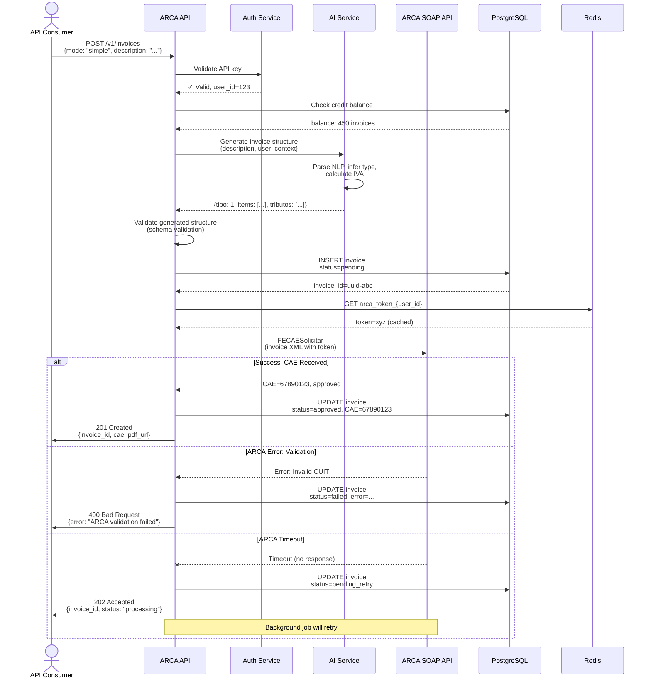
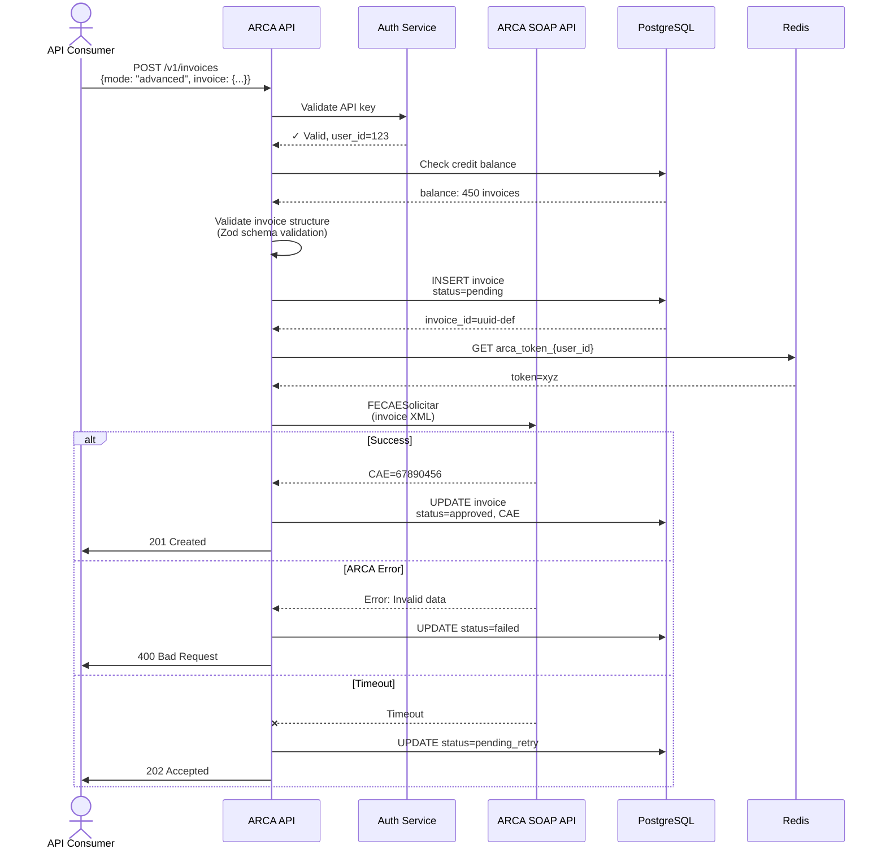
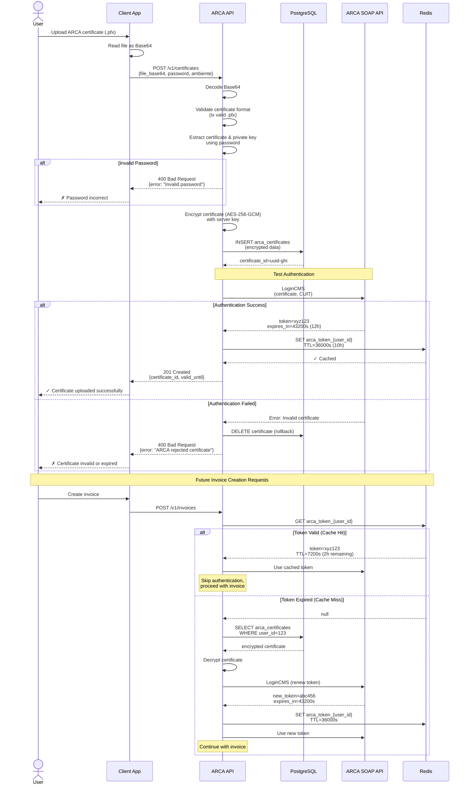

# User Flows

This document describes the three primary user flows for ARCA API, illustrating how API consumers interact with the system for invoice creation and authentication setup.

## Table of Contents

- [Flow 1: Invoice Creation (Simple Mode)](#flow-1-invoice-creation-simple-mode)
- [Flow 2: Invoice Creation (Advanced Mode)](#flow-2-invoice-creation-advanced-mode)
- [Flow 3: Certificate Upload & Authentication Setup](#flow-3-certificate-upload--authentication-setup)

---

## Flow 1: Invoice Creation (Simple Mode)

### Overview

The Simple Mode flow enables API consumers to create ARCA/AFIP-compliant invoices using natural language input. The AI Service interprets the user's description, infers invoice type, calculates appropriate taxes (IVA), and generates a complete invoice structure that is then submitted to ARCA for authorization.

**Target Latency**: P95 < 4 seconds end-to-end

### Actors

- **API Consumer**: Developer or application using ARCA API
- **ARCA API (REST API Core)**: Main API gateway handling requests
- **Auth Service**: Validates API keys and manages user authentication
- **AI Service**: Processes natural language, infers invoice structure, calculates taxes
- **PostgreSQL**: Stores invoice records and user data
- **ARCA SOAP API**: Argentina's government invoicing system (AFIP)
- **Redis**: Caches ARCA authentication tokens

### Preconditions

1. User has a valid API key
2. User has uploaded ARCA certificate (see Flow 3)
3. User has sufficient credit balance (invoices remaining in quota)
4. ARCA SOAP API is available

### Sequence Diagram



### Step-by-Step Explanation

1. **Request Receipt**: API Consumer sends POST request with `mode: "simple"` and natural language `description`
   - Example: `"Invoice Juan Pérez for consulting services, $50,000 ARS"`

2. **Authentication**: Auth Service validates the API key
   - Checks if key exists and is not revoked
   - Returns user_id for downstream operations
   - **Failure**: Returns 401 Unauthorized if invalid

3. **Credit Check**: System verifies user has invoices remaining in their quota
   - Checks current balance against plan limits
   - **Failure**: Returns 402 Payment Required if quota exceeded

4. **AI Processing**: AI Service interprets natural language input
   - Extracts customer information (name, tax ID if mentioned)
   - Infers invoice type (A, B, C) based on customer context
   - Identifies line items and amounts
   - Calculates appropriate IVA rates (21%, 10.5%, or exempt)
   - Generates structured invoice data matching ARCA requirements

5. **Schema Validation**: API validates AI-generated structure
   - Ensures all required ARCA fields are present
   - Validates data types and formats
   - **Failure**: Returns 400 Bad Request if validation fails

6. **Database Insert**: Invoice saved with `status=pending`
   - Creates invoice record with generated UUID
   - Stores AI-generated structure
   - Decrements user's credit balance

7. **Token Retrieval**: System retrieves cached ARCA authentication token
   - Checks Redis cache for valid token (TTL: 10 hours)
   - **Cache Miss**: Authenticates with ARCA using certificate (see Flow 3)

8. **ARCA Submission**: Invoice submitted to ARCA's FECAESolicitar endpoint
   - Converts JSON to SOAP/XML format
   - Includes authentication token
   - Sends to ARCA testing or production environment

9. **Response Handling**:
   - **Success (201)**: CAE received, invoice approved, PDF generated, user notified
   - **Validation Error (400)**: ARCA rejected invoice, user receives detailed error
   - **Timeout (202)**: Accepted for background processing, will retry with exponential backoff

### Error Scenarios

| HTTP Status | Scenario | Cause | User Action |
|-------------|----------|-------|-------------|
| **401** | Unauthorized | Invalid/revoked API key | Verify API key, regenerate if needed |
| **402** | Payment Required | Quota exceeded | Upgrade plan or wait for quota reset |
| **429** | Rate Limited | Too many requests | Implement backoff, reduce request rate |
| **400** | Bad Request | Invalid input or ARCA validation failed | Check error message, fix invoice data |
| **500** | Internal Server Error | AI Service failure or database error | Retry request, contact support if persists |
| **503** | Service Unavailable | ARCA SOAP API down | Retry later, check ARCA status |

### Performance Targets

- **P50 Latency**: < 2 seconds
- **P95 Latency**: < 4 seconds
- **P99 Latency**: < 6 seconds
- **AI Processing Time**: < 1.5 seconds
- **ARCA API Time**: 1-3 seconds (variable, depends on ARCA)
- **Timeout Threshold**: 10 seconds (triggers background retry)

### Success Rate Targets

- **Overall Success Rate**: > 95%
- **AI Accuracy**: > 90% (invoices generated correctly without manual edits)
- **ARCA Approval Rate**: > 98% (assuming correct input data)

---

## Flow 2: Invoice Creation (Advanced Mode)

### Overview

The Advanced Mode flow allows API consumers to create invoices by providing structured invoice data directly, bypassing the AI Service. This mode is faster, offers more control over exact field values, and is preferred by developers who already have structured data.

**Target Latency**: P95 < 2 seconds end-to-end

### Actors

- **API Consumer**: Developer or application using ARCA API
- **ARCA API (REST API Core)**: Main API gateway
- **Auth Service**: Validates API keys
- **PostgreSQL**: Stores invoice records
- **ARCA SOAP API**: Government invoicing system
- **Redis**: Caches authentication tokens

### Preconditions

Same as Flow 1, except:
- User must provide complete, structured invoice data (JSON)
- No natural language processing required

### Sequence Diagram



### Key Differences from Simple Mode

1. **No AI Processing**: User provides complete structured data
   - Invoice type explicitly specified (1=A, 6=B, 11=C)
   - IVA rates and amounts calculated by user
   - Line items fully detailed

2. **Faster Processing**: 1-2 seconds typical latency
   - Eliminates AI Service call (~1.5s savings)
   - Direct validation and submission

3. **More Control**: User has precise control over all fields
   - Exact IVA percentages
   - Specific tributos (taxes) and percepciones (withholdings)
   - Custom concepts and observations

4. **Higher Complexity**: Requires understanding of ARCA requirements
   - User must know invoice type mapping (A=1, B=6, etc.)
   - Must calculate tax amounts correctly
   - Must follow ARCA field requirements exactly

### Step-by-Step Explanation

1. **Request Receipt**: POST with `mode: "advanced"` and complete invoice object
2. **Authentication**: Same as Flow 1
3. **Credit Check**: Same as Flow 1
4. **Schema Validation**: Validates structured data against Zod schema
   - Checks required fields (tipo_comprobante, punto_venta, items)
   - Validates data types (amounts as numbers, dates as ISO strings)
   - Ensures IVA calculations are correct
5. **Database Insert**: Same as Flow 1
6. **Token Retrieval**: Same as Flow 1
7. **ARCA Submission**: Same as Flow 1
8. **Response Handling**: Same as Flow 1

### Error Scenarios

Same as Flow 1, with additional validation errors:
- **400**: Missing required fields (e.g., `tipo_comprobante`, `items`)
- **400**: Invalid IVA calculations (total doesn't match sum of items + IVA)
- **400**: Invalid ARCA invoice type code

### Performance Targets

- **P50 Latency**: < 1 second
- **P95 Latency**: < 2 seconds
- **P99 Latency**: < 3 seconds
- **ARCA API Time**: 1-3 seconds (variable)

---

## Flow 3: Certificate Upload & Authentication Setup

### Overview

This flow describes the one-time setup process where users upload their ARCA/AFIP digital certificate (.pfx file) to enable automated authentication. Once configured, the system automatically handles ARCA authentication for all future invoice requests using cached tokens.

**Target Latency**: P95 < 3 seconds for upload and validation

### Actors

- **User**: End user configuring their account
- **Client App**: Web dashboard or mobile app
- **ARCA API**: Backend API
- **PostgreSQL**: Stores encrypted certificates
- **ARCA SOAP API**: Validates certificate by test authentication
- **Redis**: Caches authentication tokens

### Preconditions

1. User has obtained ARCA digital certificate (.pfx) from AFIP
2. User knows certificate password
3. User is authenticated in ARCA API dashboard

### Sequence Diagram



### Step-by-Step Explanation

#### Initial Setup

1. **Certificate Upload**: User selects .pfx file from AFIP in dashboard
   - Client converts file to Base64 for JSON transmission
   - Includes certificate password and environment (testing/production)

2. **Format Validation**: API validates file is a valid PKCS#12 certificate
   - Checks magic bytes and file structure
   - **Failure**: Returns 400 if not a valid .pfx

3. **Password Verification**: API attempts to extract certificate using password
   - Decrypts .pfx container
   - Extracts X.509 certificate and RSA private key
   - **Failure**: Returns 400 if password incorrect

4. **Encryption**: Certificate encrypted before database storage
   - Uses AES-256-GCM with server-managed encryption key
   - Private key never stored in plaintext
   - Encryption key stored in environment variables (AWS Secrets Manager)

5. **Database Insert**: Encrypted certificate saved to `arca_certificates` table
   - Links to user account
   - Stores validity period (valid_from, valid_until dates)
   - Records environment (testing vs production)

6. **Test Authentication**: System validates certificate with ARCA
   - Calls ARCA's LoginCMS SOAP endpoint
   - Passes certificate and user's CUIT
   - Verifies ARCA accepts the certificate

7. **Token Caching**: On successful authentication, token cached
   - ARCA token valid for 12 hours
   - Cached in Redis with 10-hour TTL (safety margin)
   - Key format: `arca_token_{user_id}`

8. **Success Response**: Returns certificate ID and validity period
   - User dashboard shows "Certificate Active" status
   - Displays expiration date warning

#### Future Invoice Requests

9. **Token Retrieval**: When creating invoice, check Redis cache first
   - **Cache Hit**: Use existing token (saves ~500ms authentication time)
   - **Cache Miss**: Retrieve certificate from DB, authenticate, cache new token

10. **Auto-Renewal**: If token expired, system automatically renews
    - Transparent to user
    - No manual intervention required
    - Adds ~500ms to request on renewal

### Certificate Lifecycle

- **Validity Period**: ARCA certificates typically valid for 1-3 years
- **Renewal Notification**: Email sent 30 days before expiration
- **Expiration Handling**: API returns 403 if certificate expired, prompts re-upload
- **Revocation**: User can delete certificate from dashboard (revokes all tokens)

### Security Considerations

1. **Encryption at Rest**: All certificates encrypted with AES-256-GCM
2. **Encryption in Transit**: HTTPS/TLS 1.3 for all API calls
3. **Password Handling**: Certificate password never stored (only used for extraction)
4. **Token Security**: Redis tokens have limited TTL, auto-expire
5. **Audit Logging**: All certificate operations logged with timestamps

### Error Scenarios

| HTTP Status | Scenario | Cause | User Action |
|-------------|----------|-------|-------------|
| **400** | Invalid File Format | File is not a valid .pfx certificate | Download correct certificate from AFIP |
| **400** | Invalid Password | Password doesn't decrypt certificate | Verify password, check CAPS LOCK |
| **400** | ARCA Rejected | Certificate invalid or expired | Renew certificate with AFIP |
| **403** | Certificate Expired | Certificate past valid_until date | Upload new certificate |
| **500** | Encryption Failed | Server-side encryption error | Retry, contact support if persists |
| **503** | ARCA Unavailable | ARCA SOAP API down | Retry later (certificate saved, will retry auth) |

### Performance Targets

- **Upload + Validation**: < 2 seconds
- **ARCA Test Authentication**: 1-2 seconds
- **Total Setup Time**: < 3 seconds (P95)
- **Token Cache Hit Rate**: > 95% (most requests use cached token)
- **Authentication Overhead**: < 100ms (cache hit), ~500ms (cache miss + renewal)

### Token Caching Strategy

```
ARCA Token Lifecycle:
┌─────────────────────────────────────────────┐
│ ARCA issues token (expires in 12 hours)    │
└─────────────────────────────────────────────┘
                    ↓
┌─────────────────────────────────────────────┐
│ Cache in Redis with 10-hour TTL            │
│ (2-hour safety margin before ARCA expiry)  │
└─────────────────────────────────────────────┘
                    ↓
┌─────────────────────────────────────────────┐
│ Hours 0-10: Use cached token               │
│ Hour 10: Token expires from cache          │
│ Hours 10-12: Token still valid in ARCA     │
│              but cache miss triggers       │
│              early renewal                  │
└─────────────────────────────────────────────┘
```

This strategy ensures:
- Tokens renewed before ARCA expiration (avoids authentication errors)
- High cache hit rate (>95%)
- Automatic recovery if Redis cache cleared

---

## Related Documentation

- [System Flows](./system-flows.md) - Backend system flows (ARCA integration, webhooks)
- [Architecture - Services](../architecture/02-services.md) - Service architecture details
- [API Specification - Invoices](../specifications/api/invoices.md) - Invoice API contract
- [API Specification - Certificates](../specifications/api/certificates.md) - Certificate API contract

---

**Last Updated**: 2025-10-15
**Status**: Complete (3/3 user flows documented)
