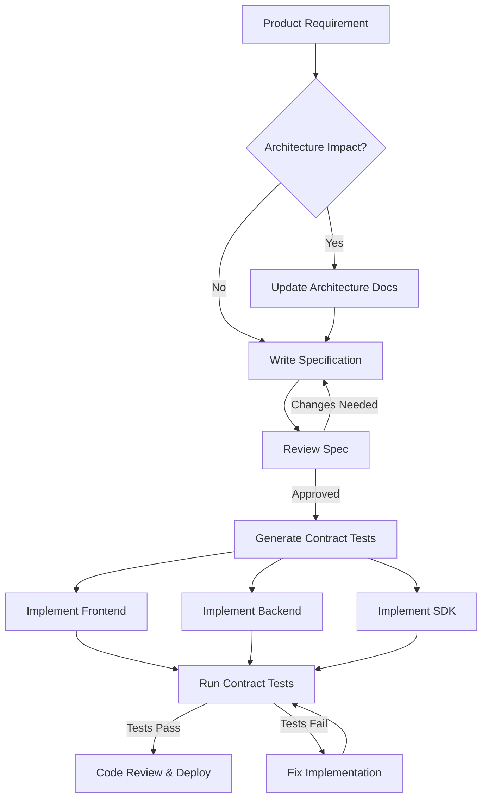

# Specifications

This section contains detailed technical specifications for all APIs, services, and contracts in the ARCA API platform. Following a spec-driven development (SDD) approach, these specifications are written before implementation and serve as executable contracts.

## Overview

Specifications define the contracts between:
- **External clients** and the REST API (OpenAPI)
- **Services** communicating internally (service contracts)
- **System components** and external dependencies (integration specs)
- **SDKs** in different languages (SDK design specs)

All specifications are versioned, reviewed, and validated before implementation begins.

## Specification Categories

### [API Specifications](./api/README.md)

OpenAPI 3.1 specifications for all REST API endpoints:

- [Complete REST API specification](./api/openapi.yaml) - OpenAPI 3.1 YAML file
- Request/response schemas
- Authentication and authorization
- Rate limiting policies
- Error response standards (RFC 7807)
- API versioning strategy

**Status**: In Progress - Task #4 (Streams A-D active)

### [Service Contracts](./services/README.md)

Internal service-to-service communication contracts:

- AI Service contract (invoice generation)
- Webhook Engine contract (event delivery)
- Analytics Service contract (data aggregation)
- MCP Server contract (LLM tool integration)
- Message queue event schemas (CloudEvents standard)

**Status**: Planned for Task #4 (Week 3)

## Spec-Driven Development Workflow



## Specification Principles

### 1. Contract-First Design

- Specifications written **before** implementation code
- Both producer and consumer teams agree on spec
- No implementation starts without approved spec
- Specs serve as source of truth for all teams

### 2. Technology Agnostic

- Specs describe **what**, not **how**
- Implementation language/framework not specified in contract
- Multiple implementations possible from same spec
- Focus on behavior and data structures

### 3. Versioned & Immutable

- All specs include version numbers
- Breaking changes require new version (v2, v3)
- Old versions maintained for backward compatibility
- Deprecation policy: 6 months notice minimum

### 4. Validated & Tested

- OpenAPI specs validated with Spectral/Swagger
- Contract tests generated from specs
- Examples tested in CI pipeline
- Breaking changes detected automatically

### 5. Self-Documenting

- Clear descriptions for all fields
- Examples provided for complex schemas
- Error scenarios documented
- Links to related documentation

## Specification Standards

### OpenAPI (REST APIs)

- **Version**: OpenAPI 3.1.0
- **Format**: YAML (primary), JSON (generated)
- **Structure**:
  - Info: API metadata, version, contact
  - Servers: Environments (production, sandbox)
  - Paths: All endpoints with operations
  - Components: Reusable schemas, responses, parameters
  - Security: Authentication schemes
- **Validation**: Spectral linter rules
- **Documentation**: Auto-generated with Redocly/Swagger UI

### Service Contracts

- **Format**: Markdown with JSON Schema
- **Structure**:
  - Service overview and responsibility
  - Input/output contracts (JSON Schema)
  - Error handling and retry policies
  - Performance expectations (latency, throughput)
  - Authentication requirements
  - Examples and test cases

### Event Schemas

- **Standard**: CloudEvents 1.0
- **Format**: JSON Schema
- **Structure**:
  - Event type and version
  - Payload schema
  - Metadata (source, timestamp, correlation ID)
  - Delivery guarantees (at-least-once, exactly-once)

## Quality Checklist

Before approving any specification:

- [ ] All fields documented with clear descriptions
- [ ] Examples provided for all complex schemas
- [ ] All error responses documented
- [ ] Authentication/authorization specified
- [ ] Rate limiting documented (if applicable)
- [ ] Versioning strategy clear
- [ ] Backward compatibility maintained
- [ ] Validation rules pass
- [ ] Reviewed by at least 2 engineers
- [ ] Contract tests written

## Tools & Validation

### Recommended Tools

- **Swagger Editor**: https://editor.swagger.io/ - OpenAPI editing and validation
- **Stoplight Studio**: https://stoplight.io/ - API design and documentation
- **Spectral**: OpenAPI/JSON Schema linter
- **Redocly**: Beautiful API documentation
- **Prism**: Mock server from OpenAPI specs

### CI/CD Integration

All specifications validated in CI:

```bash
# OpenAPI validation
spectral lint docs/specifications/api/openapi.yaml

# JSON Schema validation
ajv validate -s schema.json -d example.json

# Link validation
markdown-link-check docs/specifications/**/*.md
```

## Getting Started

### For API Consumers

1. Review [API Specifications](./api/README.md) for REST API contracts
2. Check authentication requirements
3. Review rate limiting policies
4. Test in sandbox environment
5. Use SDK if available for your language

### For Backend Engineers

1. Review [Service Contracts](./services/README.md) for internal APIs
2. Understand input/output schemas
3. Implement contract tests first
4. Implement service against contract
5. Validate with contract tests

### For Frontend Engineers

1. Review [API Specifications](./api/README.md)
2. Use OpenAPI spec to generate TypeScript types
3. Mock API responses for development
4. Implement against spec
5. Validate with contract tests

## Related Documentation

- [Architecture](../architecture/README.md) - System design context
- [Flows](../flows/README.md) - Visual flow diagrams
- [Development](../development/README.md) - Implementation guidelines
- [API Specifications](./api/README.md) - REST API contracts
- [Service Contracts](./services/README.md) - Internal service APIs

---

**Last Updated**: 2025-10-15
**Status**: Index Only (Specs Pending)
**Next Task**: Task #4 - Create API specifications
